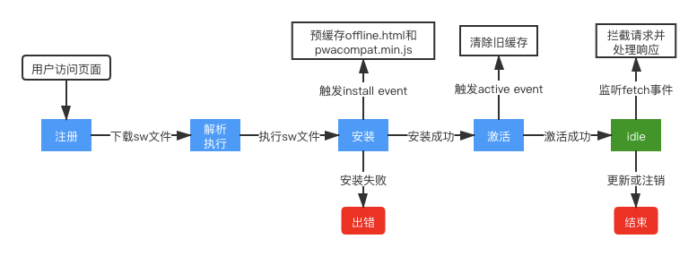

# PWA

[渐进式网页应用（PWA）：它究竟解决了Web应用的哪些问题？](https://time.geekbang.org/column/article/144983)

[现代化 Web 开发实践之 PWA](https://zhuanlan.zhihu.com/p/299469913)

[《PWA 应用实战》— 百度](https://lavas-project.github.io/pwa-book/)

[使用Service Worker做一个PWA离线网页应用]()

> 真正决定 PWA 能否崛起的还是底层技术，比如页面渲染效率、对系统设备的支持程度、WebAssembly


## 1. 什么是PWA

> 缓和的渐进式策略，没有上来就说“替代”

**是什么**

Progressive Web App，渐进式网页应用

渐进式体现在：

* Web 应用逐步具有本地应用的能力，降低成本
* 技术层面会一点点演进，逐渐提供更好的设备支持特性等

**为什么**

本地应用相比传统页面：

* 支持离线使用，更可靠，响应速度更快
* 能进行消息推送
* 可作为桌面图标，具有一级入口，有助于提高用户粘性

同时，传统页面相比本地应用：

* 上手更容易
* 开发成本低
* 具有跨平台的能力

PWA 能将两者的优点结合在一起。首要目的还是提升用户体验

**怎么做**

引入 manifest.json 来解决一级入口的问题

引入 Service Worker 来解决离线存储的问题

基于  Service Worker 的 Notification API 和  PushAPI 提供消息推送的能力


## 2. ServiceWoker

> 引申 [Service Worker 和 Web Worker 的区别](http://localhost:3000/#/browser/基础?id=service-worker-和-web-worker-的区别-？)

> 在没有安装 Service Worker 之前，WebApp 都是直接通过网络模块来请求资源的。
>
> 安装了 Service Worker 模块之后，WebApp 请求资源时，会先通过 Service Worker，让它判断是返回 Service Worker 缓存的资源还是重新去网络请求资源。
>
> 一切的控制权都交由 Service Worker 来处理。


**是什么**

Service Worker 是一种**独立于浏览器主线程且可以在离线环境下运行**的工作线程，与当前的浏览器主线程是完全隔离的，并有自己独立的执行上下文。

主要思想是在页面和网络之间增加一个拦截器，用来缓存和拦截请求

主要功能是拦截请求和缓存资源

**为什么**

> 为什么这么设计（设计思路） => 从需求出发

* 不能阻塞主线程

  借鉴 [Web Worker](browser/基础?id=六、-web-worker) 的核心思想，**运行在主线程外**

* 不是临时的

  需要加上**存储**功能

* 需要为多个页面提供服务，不能和单个页面绑定

  浏览器进程生命周期最长，**运行在浏览器进程中**

* 消息推送

  浏览器页面不一定启动，需要 Service Worker 来**接收服务器推送**的消息，并能展示给用户

* 安全

  采用 HTTPS，提供机密性，完整性等保障

* 支持 Web 页面默认的安全策略、储入同源策略、内容安全策略（CSP）等

**特点**

* Service Worker 一旦被安装成功就永远存在，除非线程被程序主动解除
* 在访问页面的时候可以直接被激活，如果关闭浏览器或者浏览器标签的时候会自动睡眠，以减少资源损耗

**收益**

* 缓存更新频率低的静态资源，减少页面加载时间


### 生命周期

[Service Worker 生命周期](https://developers.google.com/web/fundamentals/primers/service-workers/lifecycle)



* 在调用 `.register()` 时，将下载您的第一个 Service Worker

* **`install` 事件**是 Service Worker 获取的**第一个事件**，并且**只发生一次**

* 文件修改后，浏览器将其视为一个不同的 Service Worker

* 传递到 `installEvent.waitUntil()` 的一个 promise 可表明安装的持续时间以及安装是否成功，可在此时进行资源缓存

  ```javascript
  self.addEventListener('install', event => {
    console.log('V2 installing…');
  
    // cache a horse SVG into a new cache, static-v2
    event.waitUntil(
      caches.open('static-v2').then(cache => cache.add('/horse.svg'))
    );
  });
  ```

* 在成功完成安装并处于“活动状态”之前，Service Worker 不会收到 `fetch` 和 `push` 等事件

* 激活 Service Worker 后，您可以通过在其中调用 `clients.claim()` 控制未受控制的客户端

* Service Worker 注册的**默认作用域是与脚本网址相对的 `./`**。这意味着如果您在 `//example.com/foo/bar.js` 注册一个 Service Worker，则它的默认作用域为 `//example.com/foo/`

* 成功安装 Service Worker 后，更新的 Service Worker 将**延迟激活**，直到现有 Service Worker 不再控制任何客户端。此状态称为**“waiting”**，这是浏览器确保每次**只运行一个 Service Worker 版本**的方式

* 清除旧缓存

  ```javascript
  self.addEventListener('activate', event => {
    // delete any caches that aren't in expectedCaches
    // which will get rid of static-v1
    event.waitUntil(
      caches.keys().then(keys => Promise.all(
        keys.map(key => {
          if (!expectedCaches.includes(key)) {
            return caches.delete(key);
          }
        })
      )).then(() => {
        console.log('V2 now ready to handle fetches!');
      })
    );
  });
  ```

* 可以通过调用 `self.skipWaiting()` 尽快将新 Service Worker 激活。

  ```javascript
  self.addEventListener('install', event => {
    self.skipWaiting();
  
    event.waitUntil(
      // caching etc
    );
  });
  ```

### 可以实现的功能

* 预缓存 offline 页面（`install` > `e.waitUntil` 中）
* 拦截请求，缓存特定页，或设置部分页面离线时显示 offline 页


### 在浏览器缓存中的优先级

memory cache > **service worker cache** > http cache > push cache


## 3. App Manifest

App Manifest 是一个 JSON 格式的文件，用于配置网站应用的相关信息。

通过该文件，我们可以配置桌面留存图标、安装弹窗和启动动画的相关信息。

**和创建快捷方式的区别**

1. 屏幕留存图标拥有**独立的图标和名称**。
2. 点击图标打开网站，资源加载的过程并不会像普通网页那样出现白屏，取而代之的是一个展示应用图标和名称的**启动页面**，资源加载结束时加载页消失。
3. 当网页最终展现时，地址栏、工具栏等**浏览器元素将不会展现出来**，网页内容占满屏幕，看起来与 Native App 一样。

**收益**

* 添加到主屏幕，桌面图标显示与原生无异。不需要下载 App
* 启动动画相比白屏，更友好


## 4. Push API & Notification API

Notification 和 Push API 构建在 **[Service Worker API](https://link.zhihu.com/?target=https%3A//developer.mozilla.org/en-US/docs/Web/API/Service_Worker_API)** 之上，该 API 在后台响应推送消息事件并将它们中继到应用程序


## 5. React 中的配置解读

[Adaptive icon support in PWAs with maskable icons](https://web.dev/maskable-icon/)

[How to build a custom PWA with Workbox in create-react-app](https://www.freecodecamp.org/news/how-to-build-a-custom-pwa-with-workbox-in-create-react-app-be580686cf73/)

[图标转换工具](https://maskable.app/editor)

### Workbox

[Workbox](https://developers.google.com/web/tools/workbox/guides/get-started) 是 Google Chrome 团队推出的一套 **PWA 的解决方案**

Workbox 很好的规避了很多 Service Worker 潜在的问题，也大大减小了 Service Worker 的维护成本

[动态缓存策略](https://developers.google.com/web/tools/workbox/modules/workbox-strategies#using_strategies)（v5）

- NetworkFirst：网络优先
- CacheFirst：缓存优先
- NetworkOnly：仅使用正常的网络请求
- CacheOnly：仅使用缓存中的资源
- StaleWhileRevalidate：从缓存中读取资源的同时发送网络请求更新本地缓存

### manifest.json

脚手架创建项目时，public 文件夹下就有该文件

注意点：

* 图标格式需要为 **maskable**，以支持不同设备型号上以各种形状显示（不然图片可能加载不出来）
* iOS不支持 manifest 配置，需要通过 meta 标签添加到 head 中

```
{
  "short_name": "React App", // 用于主屏幕显示
  "name": "Create React App Sample", // 用于安装横幅、启动画面显示
  // 浏览器会根据有效图标的 sizes 字段进行选择
  "icons": [
    {
      "src": "favicon.ico",
      "sizes": "64x64 32x32 24x24 16x16",
      "type": "image/x-icon"
    },
    {
      "src": "logo192.png",
      "type": "image/png",
      "sizes": "192x192"
    },
    {
      "src": "logo512.png",
      "type": "image/png",
      "sizes": "512x512"
    }
  ],
  "start_url": ".", // 启动网址，相对于manifest.json所在路径
  "display": "standalone", 
  "theme_color": "#000000",
  "background_color": "#ffffff" // 启动时的背景色
}
```


### service-worker.js

打包后，自动生成，使用 Workbox

* precache

  > save a set of files to the cache when the service worker is installing

* 自带的配置就能完成离线缓存，关闭窗口后自动更新

```javascript
// 引入 Workbox，引入后获得全局对象 workbox
importScripts("https://storage.googleapis.com/workbox-cdn/releases/4.3.1/workbox-sw.js");

// 打包时自动生成，包含所有静态资源
importScripts(
  "./precache-manifest.a355abaa3468fcb44fac75e1cb377964.js"
);

self.addEventListener('message', (event) => {
  if (event.data && event.data.type === 'SKIP_WAITING') {
    // 如果检测到新的service worker文件，就会立即替换掉旧的
    self.skipWaiting();
  }
});

workbox.core.clientsClaim();

/**
 * The workboxSW.precacheAndRoute() method efficiently caches and responds to
 * requests for URLs in the manifest.
 * See https://goo.gl/S9QRab
 */
// 在第一次访问网站时便会预缓存, 这里为设置动态缓存
self.__precacheManifest = [].concat(self.__precacheManifest || []);
workbox.precaching.precacheAndRoute(self.__precacheManifest, {});

// 采用路由注册的组织形式，以此来规范化动态缓存 v4 用法（v5 中已经变更）
workbox.routing.registerNavigationRoute(workbox.precaching.getCacheKeyForURL("./index.html"), {
  blacklist: [/^\/_/,/\/[^/?]+\.[^/]+$/],
});
```