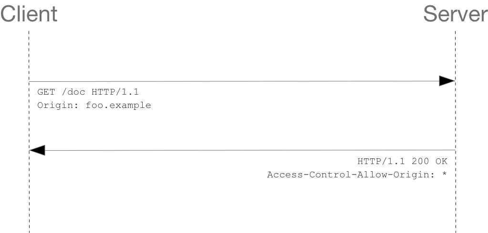

# 跨域

> 解决问题是关键！
>
> 别整成”茴“的 n 种写法


[浏览器同源政策及其规避方法 - 阮一峰](https://www.ruanyifeng.com/blog/2016/04/same-origin-policy.html)

[10种跨域解决方案（附终极大招）](https://juejin.cn/post/6844904126246027278)

[九种跨域方式实现原理（完整版）](https://juejin.cn/post/6844903767226351623)

[不就是跨域么。。。慌个xx](https://github.com/Nealyang/YOU-SHOULD-KNOW-JS/blob/master/doc/basic_js/JavaScript%E4%B8%AD%E7%9A%84%E8%B7%A8%E5%9F%9F%E6%80%BB%E7%BB%93.md)

[浏览器的同源策略 - MDN](https://developer.mozilla.org/zh-CN/docs/Web/Security/Same-origin_policy)

[关于跨域与 csrf 的那些小事](https://juejin.cn/post/6844903934310498312)

[为什么给你设置重重障碍？讲一讲Web开发中的跨域](https://zhuanlan.zhihu.com/p/39466226)


## 什么是跨域？

跨域主要指，受浏览器的同源策略影响，浏览器不能与其他源网站的进行资源交互的问题。

其中，**同源策略**，是出于安全考虑产生的，主要用来**防范 `CSRF` 攻击（**跨站请求伪造），即利用用户身份信息发起恶意请求。

> 浏览器的同源策略会导致跨域，这里同源策略又分为以下两种
>
> 1. DOM同源策略：禁止对不同源页面DOM进行操作。这里主要场景是iframe跨域的情况，不同域名的iframe是限制互相访问的。
> 2. XmlHttpRequest同源策略：禁止使用XHR对象向不同源的服务器地址发起HTTP请求。

当两个 URL 的协议，端口或域名不同时，即为不同源，可能发生跨域，会出现：

> （1） Cookie、LocalStorage 和 IndexDB 无法读取。
>
> （2） DOM 无法获得：典型的例子是`iframe`窗口和`window.open`方法打开的窗口
>
> （3） AJAX 请求不能发送。

- 数据存储限制：Cookie, LocalStorage, IndexDB 无法读取
  - LocalStorage、IndexedDB **每个源**都拥有自己单独的存储空间，一个源中的脚本不能对其他源的数据进行读写操作
  - cookie 的同源限制只要体现在**域**方面，与端口，协议无关。用户可以获取和设置当前域以及当前域对应父域下的 cookie
- 脚本 API 限制：DOM 无法操作
  - 脚本的“源”指的是加载该脚本页面的源，与存储该脚本的地址无关
- 网络请求限制：XHR 请求无法接收响应，Ajax 请求被拦截（**禁止跨域读**操作）


但同时，有些行为是允许的如：

- 通常允许**跨域写**操作（link、redirect、表单提交）

- 通常允许跨域资源嵌入（script、img、video...）

  - **浏览器的同源策略不对`src`属性做限制**

- 可以正常发送请求，可以携带 Cookie ( `withCredentials` )，但是浏览器会限制来自于不同域的资源的接收

  

## 有几种方式可以解决跨域问题？


### 1. JSONP

> JSONP 跨域其实也是JavaScript设计模式中的一种代理模式
>
> 请求的资源的MIME类型(Network 面板中的 type)：script

**原理**

> JSONP 属于跨域请求，AJAX属于同源策略

利用浏览器的同源策略不对 `src` 属性做限制，**`script` 标签**没有跨域限制的特点

将接口视为动态嵌入的脚本，将对应的 URL 设在 `script` 标签的 `src` 属性上

因此，这种方式**只能用于解决 GET 方法**的跨域问题

```html
// GET http://localhost:8080/api/getInfo?type=1

// JSONP 形式类似于
<script>  
    window.jsonpCallback = function(res) {    
        console.log(res);  
    };
</script>
<script src="http://localhost:8080/api/getInfo.js"></script>

// http://localhost:8080/api/getInfo.js 
// 内容即为该接口此时返回的值，具体数值用传入的回调函数包裹
// 形如 jsonpCallback(data), 根据 JS 的特性，最后会找到 window.jsonpCallback
```

**特点**

> JSONP 都是 **GET** 和异步请求的，不存在其他的请求方式和同步请求

优点是**支持老式浏览器**，兼容性好

缺点是仅支持 GET 方法具有**局限性**

**设置方式**

需要客户端和服务端同时支持

客户端以 JSONP 的形式发起请求，服务端也使用传入的回调函数名称包裹结果

[模拟 JSONP](handwrite/cross-origin-hw.md?id=一、jsonp)


### 2. CORS

> 请求的资源的MIME类型：xhr

[跨源资源共享（CORS）- MDN](https://developer.mozilla.org/zh-CN/docs/Web/HTTP/CORS)

[跨域资源共享 CORS 详解 - 阮一峰](https://www.ruanyifeng.com/blog/2016/04/cors.html)

[Cross-Origin Resource Sharing - caniuse](https://www.caniuse.com/cors)

[XDomainRequest vs XMLHTTPRequest](https://stackoverflow.com/questions/25141650/xdomainrequest-vs-xmlhttprequest)

**原理**

客户端向跨源服务器，发出 `XMLHttpRequest`请求

服务端通过标识源，使得这部分资源可以被浏览器访问

主要为在响应首部中添加 `Access-Control-Allow-Origin`

客户端不需要多做配置，浏览器会自动进行 CORS 通信，关键在于服务端的配置

**特点**

优点为支持**所有类型的HTTP请求**

缺点为兼容性不及 JSONP，如**IE 8 和 9 需要通过 XDomainRequest 来实现**，老式浏览器不支持

**配置方式**

需要浏览器和后端同时支持，客户端由 `XMLHttpRequest` 或 `Fetch` 发起的跨源 HTTP 请求，服务端进行了相关配置

**相关头信息字段**

* 响应

  * `Access-Control-Allow-Origin`：允许访问该资源的外域 URI 或通配符 `*` 

    如果服务端指定了具体的域名而非 `*`，那么响应首部中的 `Vary` 字段的值必须包含 `Origin`。这将告诉客户端：服务器对不同的源站返回不同的内容

  * `Access-Control-Allow-Credentials`：表示是否允许发送Cookie，一般不设为 `false`，如表示不要 Cookie，直接删除该字段即可

  * `Access-Control-Expose-Headers`：把允许浏览器访问的头放入白名单

    在跨源访问时，`XMLHttpRequest`对象的`getResponseHeader()`方法只能拿到一些最基本的响应头，`Cache-Control`、`Content-Language`、`Content-Type`、`Expires`、`Last-Modified`、`Pragma`

  * `Access-Control-Allow-Methods`：

  * `Access-Control-Allow-Headers`：

  * `Access-Control-Max-Age`：

* 请求

  * `Access-Control-Request-Method`：
  * `Access-Control-Request-Headers`：

**请求分类**

浏览器对两类请求的处理不同

* 简单请求

  * 客户端直接发出 CORS 请求：在头信息中，添加 `Origin` 字段，标识本次请求来自的源，包含协议、域名 及端口

  * 服务端响应的头信息携带 `Access-Control-Allow-Origin` 字段，且值为通配符 `*` 或 请求源

    

  * 判断条件

```
（1) 请求方法是以下三种方法之一：
HEAD
GET
POST
（2）HTTP的头信息不超出以下几种字段：
Accept
Accept-Language
Content-Language
Last-Event-ID
Content-Type：只限于三个值application/x-www-form-urlencoded、multipart/form-data、text/plain
```

* 非简单请求
  * 先发起预检请求，验证当前所在域名/使用的HTTP方法/头信息字段是否满足服务端的要求

    再正式发起跨域请求

  * 预检请求：浏览器使用 `OPTIONS` 方法，先询问服务器，当前网页所在的域名是否在服务器的许可名单之中，以及可以使用哪些HTTP动词和头信息字段

  * 正式的请求形如简单请求的步骤

    

* 如何传递 Cookie 

  > CORS请求默认不发送Cookie和HTTP认证信息

  [CORS 跨域发送 Cookie](https://harttle.land/2016/12/28/cors-with-cookie.html)

  * 客户端将请求的**`withCredentials` 字段设为`true`**，表示携带 Cookie

  * 服务端指定 **`Access-Control-Allow-Credentials` 字段为 `true`**，同意发送 Cookie

  * 同时，服务端 `Access-Control-Allow-Origin` 字段**不能为 `*`**，且只能指定单一域名。

  * 因此，服务器可能需要维护一个接受 Cookie 的 Origin 列表， 验证 `Origin` 请求头字段后直接将其设置为`Access-Control-Allow-Origin`的值

    


### 3. websocket

> 请求的资源的MIME类型：websocket

> 因为 `websocket` 使用类似 `ws://` 这样的方式进行连接，并不是使用 `http` 协议进行数据传输。所以浏览器的 `SOP` 无法限制它。而且 `websocket` 本来就是设计成支持跨域访问的协议的。在 `websocket` 请求的请求头中会像 `cors` 一样加入 `origin` 字段，服务端可以根据这个字段来判断是否通过该请求。
>
> —— [websocket为什么没有同源限制？](https://www.zhihu.com/question/358708132/answer/918866174)

**WebSocket 是一种双向通信协议，在建立连接之后，WebSocket 的 server 与 client 都能主动向对方发送或接收数据**。同时，WebSocket 在建立连接时需要借助 HTTP 协议，连接建立好了之后 client 与 server 之间的双向通信就与 HTTP 无关了。

这种方式本质没有使用了 HTTP 的响应头, 因此也没有跨域的限制。

```html
    <div>输入框失焦即向服务端发送数据</div>
    <div>user input：<input type="text"></div>
    <script>
        var socket = new WebSocket('ws://localhost:8080');

        // 连接成功处理
        socket.onmessage =  function (e) {
            console.log('data from server: ---> ' + e.data);
        }

        document.getElementsByTagName('input')[0].onblur = function () {
            socket.send(this.value);
        };
    </script>
```

```javascript
let WebSocket = require('ws');//记得安装ws
let wss = new WebSocket.Server({ port: 8080 });
wss.on('connection', function (ws) {
    ws.on('message', function (data) {
        console.log(data);
        ws.send('ok')
    });
})
```


### 4. Node 中间件代理

> 实例：[create-react-app proxy](https://create-react-app.dev/docs/proxying-api-requests-in-development/#configuring-the-proxy-manually)

node中间件实现跨域代理，是通过启一个代理服务器，实现数据的转发，也可以通过设置cookieDomainRewrite参数修改响应头中cookie中域名，实现当前域的cookie写入，方便接口登录认证。

**同源策略是浏览器需要遵循的标准，而如果是服务器向服务器请求就无需遵循同源策略。** 代理服务器，需要做以下几个步骤：

- 接受客户端请求 。
- 将请求 转发给服务器。
- 拿到服务器 响应 数据。
- 将 响应 转发给客户端。


### 5. Nginx 反向代理

只需要修改nginx的配置即可解决跨域问题，支持所有浏览器，支持session，不需要修改任何代码，并且不会影响服务器性能。

**实现思路**

通过nginx配置一个代理服务器（域名与domain1相同，端口不同）做跳板机，反向代理访问domain2接口，并且可以顺便修改cookie中domain信息，方便当前域cookie写入，实现跨域登录。


```
server {
    listen       81;
    server_name  www.domain1.com;
    location / {
        proxy_pass   http://www.domain2.com:8080;  #反向代理
        proxy_cookie_domain www.domain2.com www.domain1.com; #修改cookie里域名
        index  index.html index.htm;

        # 当用webpack-dev-server等中间件代理接口访问nignx时，此时无浏览器参与，故没有同源限制，下面的跨域配置可不启用
        add_header Access-Control-Allow-Origin http://www.domain1.com;  #当前端只跨域不带cookie时，可为*
        add_header Access-Control-Allow-Credentials true;
    }
}
```

```javascript
// index.html
var xhr = new XMLHttpRequest();
// 前端开关：浏览器是否读写cookie
xhr.withCredentials = true;
// 访问nginx中的代理服务器
xhr.open('get', 'http://www.domain1.com:81/?user=admin', true);
xhr.send();


// server.js
var http = require('http');
var server = http.createServer();
var qs = require('querystring');
server.on('request', function(req, res) {
    var params = qs.parse(req.url.substring(2));
    // 向前台写cookie
    res.writeHead(200, {
        'Set-Cookie': 'l=a123456;Path=/;Domain=www.domain2.com;HttpOnly'   // HttpOnly:脚本无法读取
    });
    res.write(JSON.stringify(params));
    res.end();
});
server.listen('8080');
console.log('Server is running at port 8080...');
```


### 6. window.postMessage

[window.postMessage - MDN](https://developer.mozilla.org/zh-CN/docs/Web/API/Window/postMessage)

`postMessage` 是 HTML5 XMLHttpRequest Level 2中的API，且是为数不多可以跨域操作的window属性之一

它可用于解决以下方面的问题：

- 页面和其打开的新窗口的数据传递
- 多窗口之间消息传递
- 页面与嵌套的iframe消息传递
- 上面三个场景的跨域数据传递

**postMessage()方法允许来自不同源的脚本采用异步方式进行有限的通信，可以实现跨文本档、多窗口、跨域消息传递**。

```
otherWindow.postMessage(message, targetOrigin, [transfer]);
```

- otherWindow: 其他窗口的一个引用，比如 iframe 的 contentWindow 属性、执行[window.open](https://developer.mozilla.org/en-US/docs/DOM/window.open)返回的窗口对象、或者是命名过或数值索引的[window.frames](https://developer.mozilla.org/en-US/docs/DOM/window.frames)。
- message: 将要发送到其他 window 的数据。
- targetOrigin: 通过窗口的 origin 属性来指定哪些窗口能接收到消息事件.
- transfer(可选) : 是一串和 message 同时传递的 [`Transferable`](https://developer.mozilla.org/zh-CN/docs/Web/API/Transferable) 对象. 这些对象的所有权将被转移给消息的接收方，而发送一方将不再保有所有权

```html
// a.html
<iframe id="iframe" src="http://www.neal.cn/b.html" style="display:none;"></iframe>
<script>       
    var iframe = document.getElementById('iframe');
    iframe.onload = function() {
        var data = {
            name: 'aym'
        };
        // 向neal传送跨域数据
        iframe.contentWindow.postMessage(JSON.stringify(data), 'http://www.neal.cn');
    };

    // 接受domain2返回数据
    window.addEventListener('message', function(e) {
        alert('data from neal ---> ' + e.data);
    }, false);
</script>
```

```html
// b.html
<script>
    // 接收domain1的数据
    window.addEventListener('message', function(e) {
        alert('data from nealyang ---> ' + e.data);

        var data = JSON.parse(e.data);
        if (data) {
            data.number = 16;

            // 处理后再发回nealyang
            window.parent.postMessage(JSON.stringify(data), 'http://www.nealyang.cn');
        }
    }, false);
</script>
```


### 7. document.domain + Iframe

> **该方式只能用于二级域名相同的情况下，比如 `a.test.com` 和 `b.test.com` 适用于该方式**

**原理**

两个页面都通过 js 强制设置 `document.domain` 为基础主域，就实现了同域。

```html
// a.nealyang.cn
<!DOCTYPE html>
<html lang="en">
<head>
    <meta charset="UTF-8">
    <title>html</title>
    <script type="text/javascript" src = "jquery-1.12.1.js"></script>
</head>
<body>
    <div>A页面</div>
    <iframe 
    style = "display : none" 
    name = "iframe1" 
    id = "iframe" 
    src="http://b.nealyang.cn/1.html" frameborder="0"></iframe>
    <script type="text/javascript">
        $(function(){
            try{
                document.domain = "nealyang.cn"
            }catch(e){}
            $("#iframe").load(function(){
                var jq = document.getElementById('iframe').contentWindow.$
                jq.get("http://nealyang.cn/test.json",function(data){
                    console.log(data);
                });
            })
        })
    </script>
</body>
</html>

```

```html
// b.html
<!DOCTYPE html>
<html lang="en">
<head>
    <meta charset="UTF-8">
    <title>html</title>
    <script type="text/javascript" src = "jquery-1.12.1.js"></script>
    <script type="text/javascript">
        $(function(){
            try{
                document.domain = "nealyang.com"
            }catch(e){}
        })
    </script>
</head>
<body>
    <div id = "div1">B页面</div>
</body>
</html>
```


### 8. window.name + iframe

`window.name` 属性的独特之处：无论是否同源，只要在同一个窗口里，前一个网页设置了这个属性，后一个网页可以读取它，并且可以支持非常长的 name 值（2MB）。

其中 `a.html` 和 `b.html` 是同域的，都是`http://localhost:3000`;而 `c.html` 是 `http://localhost:4000`

```html
 // a.html(http://localhost:3000/b.html)
  <iframe src="http://localhost:4000/c.html" frameborder="0" onload="load()" id="iframe"></iframe>
  <script>
    let first = true
    // onload事件会触发2次，第1次加载跨域页，并留存数据于window.name
    function load() {
      if(first){
      // 第1次onload(跨域页)成功后，切换到同域代理页面
        let iframe = document.getElementById('iframe');
        iframe.src = 'http://localhost:3000/b.html';
        first = false;
      }else{
      // 第2次onload(同域b.html页)成功后，读取同域window.name中数据
        console.log(iframe.contentWindow.name);
      }
    }
  </script>
```

`b.html` 为中间代理页，与 `a.html` 同域，内容为空。

```html
 // c.html(http://localhost:4000/c.html)
  <script>
    window.name = 'ok'  
  </script>
```

总结：通过 `iframe` 的 `src` 属性由外域转向本地域，跨域数据即由 `iframe` 的 `window.name` 从外域传递到本地域。这个就巧妙地绕过了浏览器的跨域访问限制，但同时它又是安全操作。


### 9. location.hash + iframe

**实现原理**

原理就是通过 `url` 带 `hash` ，通过一个非跨域的中间页面来传递数据。

**实现步骤**

一开始 `a.html` 给`c.html` 传一个 `hash` 值，然后 `c.html` 收到 `hash` 值后，再把 `hash` 值传递给 `b.html`，最后 `b.html` 将结果放到 `a.html` 的 `hash` 值中。 

同样的，`a.html` 和 `b.html` 是同域的，都是`http://localhost:3000`;而 `c.html` 是 `http://localhost:4000`

```html
 // a.html
  <iframe src="http://localhost:4000/c.html#iloveyou"></iframe>
  <script>
    window.onhashchange = function () { //检测hash的变化
      console.log(location.hash);
    }
  </script>


 // b.html
  <script>
    window.parent.parent.location.hash = location.hash 
    //b.html将结果放到a.html的hash值中，b.html可通过parent.parent访问a.html页面
  </script>


 // c.html
<script>
  console.log(location.hash);
  let iframe = document.createElement('iframe');
  iframe.src = 'http://localhost:3000/b.html#idontloveyou';
  document.body.appendChild(iframe);
</script>
```


