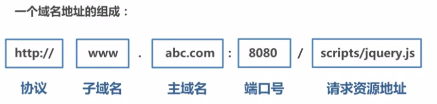

# 跨域

> 解决问题是关键！
>
> 别整成”茴“的 n 种写法


[10种跨域解决方案（附终极大招）](https://juejin.cn/post/6844904126246027278)

[九种跨域方式实现原理（完整版）](https://juejin.cn/post/6844903767226351623)

[不就是跨域么。。。慌个xx](https://github.com/Nealyang/YOU-SHOULD-KNOW-JS/blob/master/doc/basic_js/JavaScript%E4%B8%AD%E7%9A%84%E8%B7%A8%E5%9F%9F%E6%80%BB%E7%BB%93.md)

[浏览器的同源策略 - MDN](https://developer.mozilla.org/zh-CN/docs/Web/Security/Same-origin_policy)

[关于跨域与 csrf 的那些小事](https://juejin.cn/post/6844903934310498312)


## 什么是跨域？

跨域主要指，受浏览器的同源策略影响，浏览器不能获取其他网站的资源的问题。

其中，**同源策略**，是出于安全考虑产生的，主要用来**防范 `CSRF` 攻击（**跨站请求伪造），即利用用户身份信息发起恶意请求。

当两个 URL 的协议，端口或域名不同时，即为不同源，发生跨域，可能会出现：

- 数据存储限制：Cookie, LocalStorage, IndexDB 无法读取
  - LocalStorage、IndexedDB **每个源**都拥有自己单独的存储空间，一个源中的脚本不能对其他源的数据进行读写操作
  - cookie 的同源限制只要体现在**域**方面，与端口，协议无关。用户可以获取和设置当前域以及当前域对应父域下的 cookie
- 脚本 API 限制：DOM 无法操作
  - 脚本的“源”指的是加载该脚本页面的源，与存储该脚本的地址无关
- 网络请求限制：XHR 请求无法接收响应，Ajax 请求被拦截（**禁止跨域读**操作）



但同时，有些行为是允许的如：

- 通常允许**跨域写**操作（link、redirect、表单提交）

- 通常允许跨域资源嵌入（script、img、video...）

  - **浏览器的同源策略不对`src`属性做限制**

- 可以正常发送请求，可以携带 Cookie ( `withCredentials` )，但是浏览器会限制来自于不同域的资源的接收

  

## 有几种方式可以解决跨域问题？

> 原理 优点 局限

### 1. JSONP

**原理**

> JSONP 属于跨域请求，AJAX属于同源策略

利用浏览器的同源策略不对 `src` 属性做限制，**`script` 标签**没有跨域限制的特点

将接口视为动态嵌入的脚本，将对应的 URL 设在 `script` 标签的 `src` 属性上

因此，这种方式**只能用于解决 GET 方法**的跨域问题

```html
// GET http://localhost:8080/api/getInfo?type=1

// JSONP 形式类似于
<script>  
    window.jsonpCallback = function(res) {    
        console.log(res);  
    };
</script>
<script src="http://localhost:8080/api/getInfo.js"></script>

// http://localhost:8080/api/getInfo.js 
// 内容即为该接口此时返回的值，具体数值用传入的回调函数包裹
```

**特点**

> JSONP 都是 **GET** 和异步请求的，不存在其他的请求方式和同步请求

优点是**简单兼容性好**，可用于解决主流浏览器的跨域数据访问的问题。

缺点是仅支持 GET 方法具有**局限性**，**不安全**可能会遭受 XSS 攻击

### 2. CORS


### 3. websocket


### 4. window.postMessage


### 5. Nginx 反向代理


### 6. Node中间件代理(两次跨域)


