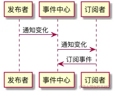
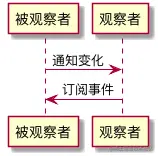

# 设计模式

[观察者模式 vs 发布-订阅模式](https://juejin.cn/post/6844903513009422343)

[结合实例理解](https://github.com/YvetteLau/Step-By-Step/issues/41#issuecomment-508324255)

观察者模式/发布订阅模式区别：

* 观察者模式中，<u>观察者会订阅发布者</u>，当发布者改变时，会通知观察者

  通常体现为发布者会保存一数组，记录订阅它的观察者，在发生改变时，触发订阅它的观察者对应的方法

  观察者模式大多时候为<u>同步</u>

* 发布订阅模式中，发布/订阅任务会借助调度中心，彼此<u>没有直接交流</u>

  通常体现为，维护一个 `events` 对象，里面的每个属性名为任务名（事件），属性值为由订阅该事件的回调函数构成的数组

  发布订阅模式大多时候为<u>异步</u>






## 1. 观察者模式

[JavaScript 设计模式核⼼原理与应⽤实践 - 观察者模式](https://juejin.cn/book/6844733790204461070/section/6844733790275813390)

```javascript
// 定义发布者类
class Publisher {
  constructor() {
    this.observers = []
    console.log('Publisher created')
  }
  // 增加订阅者
  add(observer) {
    console.log('Publisher.add invoked')
    this.observers.push(observer)
  }
  // 移除订阅者
  remove(observer) {
    console.log('Publisher.remove invoked')
    this.observers.forEach((item, i) => {
      if (item === observer) {
        this.observers.splice(i, 1)
      }
    })
  }
  // 通知所有订阅者
  notify() {
    console.log('Publisher.notify invoked')
    this.observers.forEach((observer) => {
      observer.update(this)
    })
  }
}
```

```javascript
// 定义订阅者类
class Observer {
    constructor() {
        console.log('Observer created')
    }

    update() {
        console.log('Observer.update invoked')
    }
}
```


## 2. 发布订阅 Emitter

* 事件和监听函数的对应关系如何处理？
* 如何实现订阅？
* 如何实现发布？

```javascript
class EventEmitter {
    constructor() {
        this.events = {};
    }

    // 添加订阅
    on(type, listener) {
        if(typeof listener !== 'function') {
            throw new TypeError('listener must be a function');
        }
        if(!this.events[type]) {
            this.events[type] = [];
        }
        this.events[type].push(listener);
    }

    // 触发事件
    emit(type, ...args) {
        if(this.events[type]){
            this.events[type].forEach(cb => cb(...args));
        }
    }

    // 移除订阅
    off(type, listener) {
        if(this.events[type]) {
            this.events[type].splice(this.events[type].indexOf(listener), 1);
        }
    }
}
```


## 3. 单例模式

[JavaScript 设计模式核⼼原理与应⽤实践 - 单例模式](https://juejin.cn/book/6844733790204461070/section/6844733790267375630)

> 实现Storage，使得该对象为单例，基于 localStorage 进行封装。实现方法 `setItem(key,value)` 和 ` getItem(key)`。

静态方法版

```javascript
class Storage {
    static getInstance() {
        // 判断是否已经new过1个实例
        if (!Storage.instance) {
            // 若这个唯一的实例不存在，那么先创建它
            Storage.instance = new Storage()
        }
        // 如果这个唯一的实例已经存在，则直接返回
        return Storage.instance
    }
    getItem (key) {
        return localStorage.getItem(key)
    }
    setItem (key, value) {
        return localStorage.setItem(key, value)
    }
}
```

闭包版

```javascript
// StorageBase ...

// 以闭包的形式创建一个引用自由变量的构造函数
const Storage = (function(){
    let instance = null
    return function(){
        // 判断自由变量是否为null
        if(!instance) {
            // 如果为null则new出唯一实例
            instance = new StorageBase()
        }
        return instance
    }
})()

// ...
```


> 全局模态框
