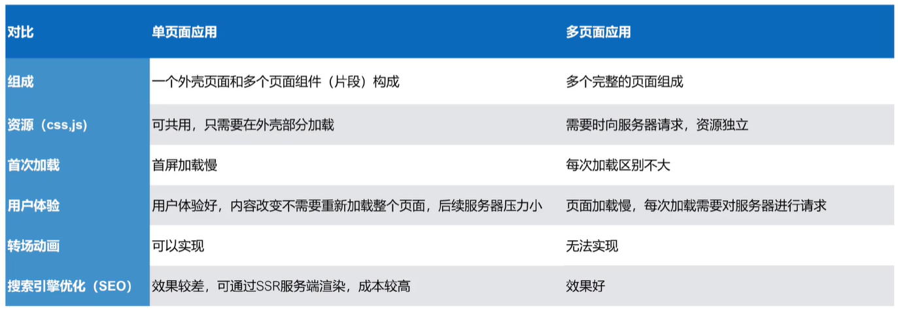
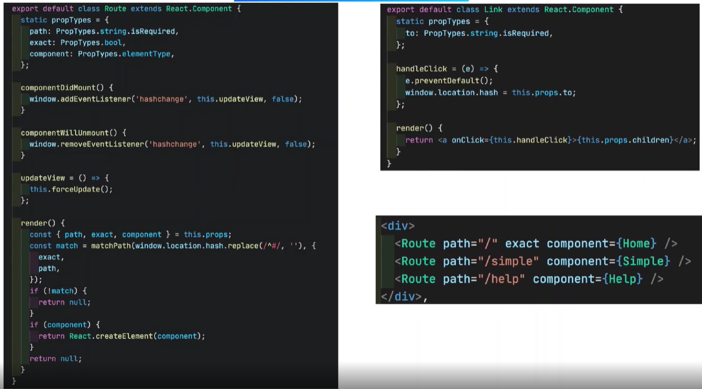

# 前端路由

[龙归：Web前端路由](https://file.hujingo.top/ali/3iIhti3Ydr3nI5hcjtU_293858483986___hd.mp4)

[从vue-router开始解剖前端路由基本实现](https://www.geekschool.org/2020/10/15/40083.html)

[深入探索前端路由，手写 react-mini-router](https://ssh-blog.vercel.app/702742757/)

[前端路由原理及实现](https://hytonightyx.github.io/fedoc/04-%E6%B8%B8%E8%A7%88%E5%99%A8%E4%B8%8EBOM/%E5%89%8D%E7%AB%AF%E8%B7%AF%E7%94%B1%E7%9A%84%E5%8E%9F%E7%90%86.html)


## 一、SPA VS MPA

### 概念

多页面应用：一个完整的网页应用有多个完整的html构成，通过 a 标签对应到不同 url ，服务器端来根据URL的不同返回不同的页面单页面应用：一个WEB项目只有一个 HTML 页面，利用 JS 动态的变换 HTML 的内容，从而来模拟多个视图间跳转

### 请求到渲染过程

* **多页面**应用由后端控制路由，即**后端路由**：
  输入url -> 请求发送到服务器 -> 服务器解析请求路径 -> 拿到对应的页面 -> 返回给浏览器

* **单页面**应用由前端控制路由，即**前端路由**：
  输入url -> js解析地址 -> 找到对应地址的页面 -> 执行页面生成的js -> 渲染页面

### 综合对比

MPA 可能会出现白屏，因为每次需要重复加载资源

SPA 切换速度更快，不会白屏




## 二、前端路由原理

[window.location — MDN](https://developer.mozilla.org/zh-CN/docs/Web/API/Window/location)

路由，本质为建立 URL 和页面间的映射关系，通过某种方式使得可以根据不同的 URL 显示不同的内容

主要解决两个问题

* 改变 url 且不让浏览器向服务器发送请求

* 可以监听到 url 变化

### 1. 基于 Hash 

[Window: hashchange event — MDN](https://developer.mozilla.org/zh-CN/docs/Web/API/Window/hashchange_event)

> https://www.domain.com/#/page1

Hash 变化不会触发页面跳转和刷新

监听 **hashchange** 事件获取 hash（`window.location.hash`） 变化

后端没法获取 `#` 后内容

```javascript
class HashRouter {
    constructor() {
        this.routers = {}
        // 挂载事件
        window.addEventListener('hashchange', this.load.bind(this), false)
    }

    // 用于注册每个视图
    register(hash, cb) {
        if (typeof cb !== 'function') cb = () => { }
        this.routers[hash] = cb
    }

    // 不存在hash值时，认为是首页
    registerIndex(cb) {
        if (typeof cb !== 'function') cb = () => { }
        this.routers['index'] = cb
    }

    //用于处理视图未找到的情况
    registerNotFound(cb) {
        if (typeof cb !== 'function') cb = () => { }
        this.routers['404'] = cb
    }

    //用于处理异常情况
    registerError(cb) {
        if (typeof cb !== 'function') cb = () => { }
        this.routers['error'] = cb
    }

    load() {
        // 去掉开头 # 号，如果没有 hash 说明是首页
        let hash = location.hash.slice(1)
        let cb

        console.log('hash: ', hash)
        if (hash === '') {
            cb = this.routers['index']
        } else if (!this.routers.hasOwnProperty(hash)) {
            cb = this.routers['404'] || (() => { })
        } else {
            cb = this.routers[hash]
        }

        try {
            console.log(cb)
            cb()
        } catch (error) {
            console.dir(error.message)
            let errorCb = this.routers['error'] || function (e) { }
            errorCb(error)
        }
    }
}
```

```html
<body>
    <div id="nav">
        <a href="#/page1">page1</a>
        <a href="#/page2">page2</a>
        <a href="#/page3">page3</a>
        <a href="#/404">404</a>
        <a href="#/error">Error</a>
    </div>
    <div id="container"></div>
</body>
<script src="hash-router.js"></script>
<script>
    let router = new HashRouter()
    let container = document.getElementById('container')
    // 注册首页
    router.registerIndex(() => (container.innerHTML = '我是首页'))
    // 注册其他视图
    router.register('/page1', () => (container.innerHTML = '我是page1'))
    router.register('/page2', () => (container.innerHTML = '我是page2'))
    router.register('/page3', () => (container.innerHTML = '我是page3'))
    router.register('/error', () => {
        throw new Error('我是报错信息')
    })
    // 注册 404 事件
    router.registerNotFound(() => (container.innerHTML = '404，页面找不到了'))
    // 注册hash回调函数异常
    router.registerError(
        err => (container.innerHTML = '页面异常，错误消息：<br>' + err.message)
    )
    // 先执行一次，加载出首页
    window.onload = router.load()
</script>
```




### 2. 基于 History API

[history — MDN](https://developer.mozilla.org/zh-CN/docs/Web/API/History)

[history — caniuse](https://www.caniuse.com/history)

> https://www.domain.com/page1

浏览器提供 **pushState / replaceState** 改变 url

- `history.pushState()` 在保留现有历史记录的同时，将 url 加入到历史记录中。
- `history.replaceState()` 会将历史记录中的当前页面历史替换为 url。

监听 popstate 事件获取浏览器前进 / 后退状态

history 的改变并不会触发任何事件，需要进行拦截从而实现监听 history 的改变

1. 点击浏览器的前进或后退按钮
2. 点击 `a` 标签
3. 在 JS 代码中触发 `history.pushState` 函数
4. 在 JS 代码中触发 `history.replaceState` 函数

后端可以获取当前的位置

```javascript
class HistoryRouter {
    constructor() {
        //用于存储不同path值对应的回调函数
        this.routers = {}
        this.listenPopState()
        this.listenLink()
    }

    // 监听返回按钮
    listenPopState() {
        window.addEventListener('popstate', (e) => {
            console.log('popstate', e)
            let state = e.state || {}
            let path = state.path || ''
            this.handleCallback(path)
        }, false)
    }

    // 阻止 a 跳转，调用我们自己的 go 函数改变 dom 内容
    listenLink() {
        window.addEventListener('click', (e) => {
            let dom = e.target
            if (dom.tagName.toUpperCase() === 'A' && dom.getAttribute('href')) {
                console.log('click a', e)
                e.preventDefault()
                this.go(dom.getAttribute('href'))
            }
        }, false)
    }

    // 用于首次load
    load() {
        let path = location.pathname
        this.handleCallback(path)
    }

    //用于注册每个视图
    register(path, cb = function () { }) {
        this.routers[path] = cb
    }

    //用于注册首页
    registerIndex(cb = function () { }) {
        this.routers['/'] = cb
    }

    //用于处视图未找到的情况
    registerNotFound(cb = function () { }) {
        this.routers['404'] = cb
    }

    //用于处理异常情况
    registerError(cb = function () { }) {
        this.routers['error'] = cb
    }

    // 跳转到 path
    go(path) {
        // 关键是 pushState 函数
        history.pushState({ path }, null, path)
        this.handleCallback(path)
    }

    handleCallback(path) {
        let cb
        if (!this.routers.hasOwnProperty(path)) {
            cb = this.routers['404'] || function () { }
        } else {
            cb = this.routers[path]
        }

        try {
            cb()
        } catch (error) {
            let errorCb = this.routers['error'] || function (e) { }
            errorCb(error)
        }
    }
}
```

```html
<body>
    <div id="nav">
        <a href="/page1">page1</a>
        <a href="/page2">page2</a>
        <a href="/page3">page3</a>
        <a href="/404">404</a>
        <a href="/error">Error</a>
        <button id="btn">page2</button>
    </div>
    <div id="container"></div>
</body>
<script src="history-router.js"></script>
<script>
    let router = new HistoryRouter()
    let container = document.getElementById('container')
    // 注册首页
    router.registerIndex(() => (container.innerHTML = '我是首页'))
    // 注册其他视图
    router.register('/page1', () => (container.innerHTML = '我是page1'))
    router.register('/page2', () => (container.innerHTML = '我是page2'))
    router.register('/page3', () => (container.innerHTML = '我是page3'))
    router.register('/error', () => {
        throw new Error('我是报错信息')
    })
    document.getElementById('btn').onclick = () => router.go('/page2')
    // 注册 404 事件
    router.registerNotFound(() => (container.innerHTML = '404，页面找不到了'))
    // 注册hash回调函数异常
    router.registerError(
        err => (container.innerHTML = '页面异常，错误消息：<br>' + err.message)
    )
    // 先执行一次，加载出首页
    window.onload = router.load()
</script>
```

