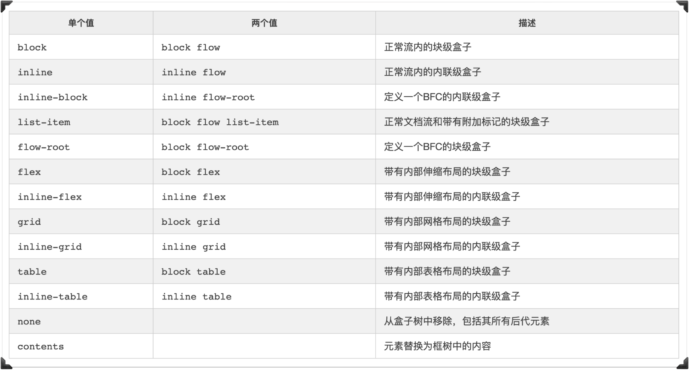
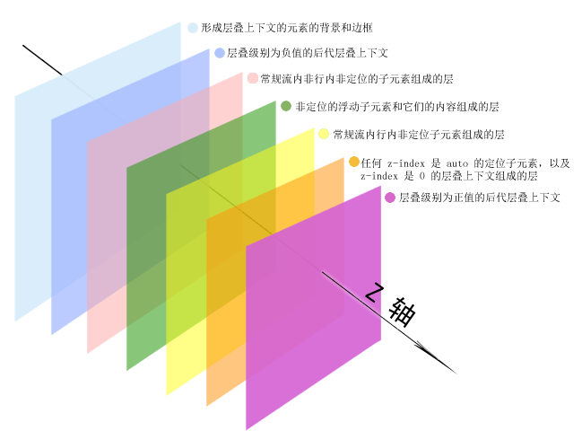
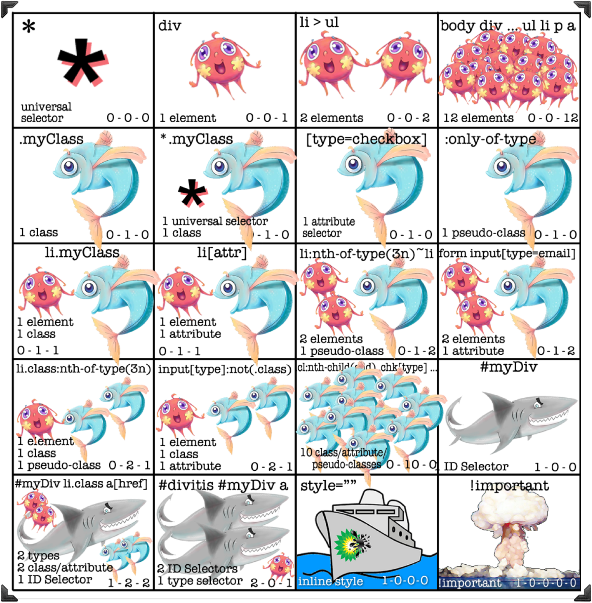
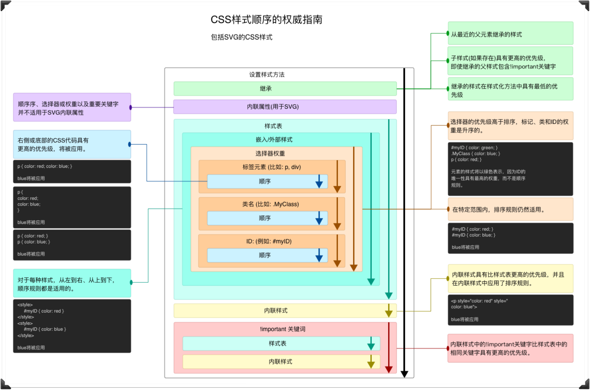

# CSS

> 《深入解析 CSS》

CSS 样式来源主要有三种：

* 通过 link 引用的外部 CSS 文件
* `<style>` 标记内的 CSS
* 元素的 style 属性内嵌的 CSS

CSS 优化：

> 选择符从右向左进行匹配

* 避免使用通配符，只对需要用到的元素进行选择
* 关注可以通过继承实现的属性，避免重复匹配重复定义
* 少用标签选择器。如果可以，用类选择器替代
* 少用嵌套，降低选择器深度

## 一、层叠

### 1. 文档流

[normal flow - W3C](https://www.w3.org/TR/CSS2/visuren.html#normal-flow)

[CSS现状和如何学习](https://www.w3cplus.com/css/learning-css.html)

* 文档流，又称普通流（normal flow），指的是**网页元素的默认布局行为**
* 在对应的块格式化上下文中，块级元素按照其在HTML源码中出现的顺序，在其容器盒子里从左上角开始，从上到下垂直地依次分配空间层叠（Stack），并且独占一行，边界紧贴父盒子边缘。两相邻元素间的距离由margin属性决定，在同一个块格式化上下文中的垂直边界将被重叠（Collapse margins）。除非创建一个新的块格式化上下文，否则块级元素的宽度不受浮动元素的影响。

* 在对应的行内格式化上下文中，行内元素从容器的顶端开始，一个接一个地水平排列，当到达容器边缘时会换行。

### 2. 脱离文档流的方式

> 文档流，相对于盒子模型
>
> 文本流，相对于文本段落而言

* `float`

  脱离文档流，但没脱离文本流，会出现文字

* `position: absolute`

  脱离文档流，且脱离文本流

* `position: fixed`

  脱离文档流，且脱离文本流

### 2. BFC 与 IFC

> 格式化上下文指**初始元素定义的环境**

> 网页的根元素也创建了一顶级 BFC

#### BFC

BFC，block formatting context，**块格式化上下文**

它会将内部内容与外部上下文隔开来，不会和外部的元素重叠或相互影响

BFC 的好处为 ① 可以包含浮动元素，② 防止外边距折叠，③ 防止文档流围绕浮动元素排列

<u>新建 BFC</u>：

(浮动，绝对定位，溢出，块级容器)

* `float` 设为非 `none` 的值，如 `left`，`right`
* `overflow` 设为非 `visible` 的值，如 `hidden`，`auto`，`scroll`
* `position: absolute` 或 `position:fixed`
* 块级容器，如 `display: inline-block`, `table-cell`，`table-caption`，`flex`，`inline-flex`，`grid`，`inline-grid`

通常使用 `overflow: auto` 创建；

使用浮动或者 `inline-block` 方式创建 BFC 的元素宽度会变成 `100%`，因此需要限制一下元素的宽度，防止因为过宽而换行；`table-cell` 则反之

#### IFC

IFC，inline formatting contexts，**行内格式化上下文**

### 3. 层叠 z-index

### 4. 优先级

> `!important > id > class > tag`

首先，从**样式表的来源**看，优先级从高到低分别为<u>开发人员定义的样式，用户定义的样式，浏览器自带的样式</u>

其次，从**选择器**的角度看，最先处理 <u>id 选择器</u>最多的样式，再处理<u>类/伪类/属性选择器</u>个数多的样式，最后处理标签选择器。通用选择器（＊）和组合器（>、+、~）对优先级没有影响

优先级还受**源码中的声明顺序**影响，因此在写链接相关的伪类选择器是，要严格按照（LoVe/HAte）`:link`，`:visited`，`:hover`，`:active` 的顺序，否则会出现样式没有按预期渲染的情况

需要注意的是，依据就近原则，同权重情况下样式定义最近者为准，**内联样式的优先级比外部样式表的要高，但 `!important` 声明的样式的优先级比内联样式还高**

**在实际使用过程中**：

* 尽量压低选择器的优先级
* 尽量少使用 id 选择器
* 尽量避免使用 `!important`

## 二、继承

> 继承属性会顺序传递给后代元素，直到它被层叠值覆盖

> inherit，继承父元素的属性值；
>
> initial，重置为属性的初始值

### 1. 能被继承的属性

> 不可被继承的属性，如 display，margin，border，padding ...

* 文本相关的属性：color、font、font-family、font-size、font-weight、font-variant、font-style、line-height、letter-spacing、text-align、text-indent、text-transform、white-space以及word-spacing
* 列表属性：list-style、list-style-type、list-style-position以及list-style-image

* 表格的边框属性 border-collapse 和 border-spacing 也能被继承

## 三、相对单位

### 1. `em` 与 `rem` 区别

> `%` 是相对父元素的单位。因此，要想让百分比高度生效，必须给父元素明确定义一个高度。

* `em` 是相当于当前元素的字号的单位；`rem` 是相当于根元素的单位
* 使用 `em` 需要注意的是，当字号使用 `em` 时，根据继承的字号计算；当其他属性使用 `em` 时，根据当前的字号来计算

**在实际使用过程中**：

* 在 `:root`（也可为 `html`） 中使用 `em` 设置字号

  有响应式需求的话，可借助媒体查询，或设置字号为 `calc(0.5em + 1vw)`，实现相对平滑的缩放

* 在其他元素中使用 `rem` 设置字号

* 使用 `px` 设置边框

* 使用 `em` 设置除字号外的其他属性

* 有缩放单个组件的需求时，外部再包裹一层，使用 `rem` 设置字号

  组件内元素均使用 `em` 设置，即继承外部字号大小以实现缩放

## 五、盒模型

[盒模型 - MDN](https://developer.mozilla.org/zh-CN/docs/Learn/CSS/Building_blocks/The_box_model)

### 1. 盒模型有哪些

* 块级盒子

* 内联盒子

### 2. 盒模型标准与非标准有什么不同

* 在标准模型中，如果你给盒设置 `width` 和 `height`，实际设置的是 *content box*。 padding 和 border 再加上设置的宽高一起决定整个盒子的大小

### 3. 怎么设置盒子模型标准，具体的属性值

## 六、布局

### 1. 等高列

如果你不用支持 IE9 及其以下的浏览器，建议使用 Flexbox 而不是表格布局。

* 使用表格布局
  * 容器设 `display:table`
  * 为容器指定宽度，如 100%
  * 两列设为 `display:table-cell`，按比例分配宽度
  * 使用 `border-spacing` 设置间隔
  * 在容器外再包裹一层 `div`，设置负外边距，使得两端对齐
* flexbox
  * 容器设置 `display:flex`
  * 直接使用外边距设置间隔

[codepen](https://codepen.io/flashhu/pen/mdrxyPW)

### 2. 垂直居中

* 自然高度的容器：相等的上下内边距 `padding`
* 指定高度的容器或无法使用边距： `display: table-cell` 配合 `vertical-align: middle`
* 不需要支持 IE9 ：`display:flex` 配合 `align-item：center`
* 只有一行文本：设置`line-height`为`height`值
* 已知容器和内容的高度：`position:absolute` 配合 `top: calc(50% - height)` 或者 `top: 50%`，`margin: - height / 2`
* 只知容器高度：`position: absolute` 配合 `transform: translate(0,-100%)`
* 容器和内容的高度都知道吗？将内容绝对定位
* 不知道内部元素的高度？用绝对定位结合变形（`transform`）

[codepen](https://codepen.io/flashhu/pen/RwoOGmE)

### 3. 水平居中

### 4. flex

### 5. grid

## 七、动画

