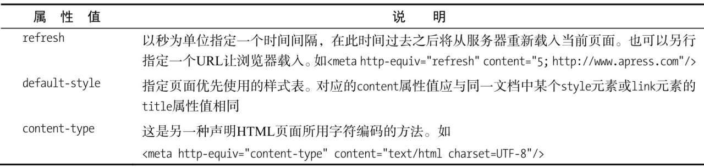

# HTML

```html
<!-- 声明文档类型，确保浏览器按最佳的相关规范进行渲染 -->
<!DOCTYPE html>
<!-- 声明网页语言 -->
<html lang="en">
<head>
    <!-- 指定页面内容的编码格式 -->
	<meta charset="UTF-8">
    <!-- 移动端的视口大小/缩放比 -->
	<meta name="viewport" content="width=device-width, initial-scale=1.0">
    <!-- 文档标题 -->
	<title>Document</title>
</head>
<body>
	
</body>
</html>
```


## 0. 常见的浏览器内核

浏览器内核由渲染引擎和 JS 引擎组成

> 常见的内核有Trident、 Gecko、 Webkit、 Presto、 Blink五种

> Chromium + 集成 Google 产品 = Google Chrome。

IE：`trident`内核 

Edge：`Chromium` 内核

Firefox：`gecko`内核

Safari：`webkit`内核

Opera：以前是`presto`内核，`Opera`现已改用`Chrome`的`Blink`内核

Chrome：先使用 `webkit` 引擎后使用 `Blink`(基于`webkit`，Google与Opera Software共同开发)

国内的大部分双核浏览器都采用 `Chromium` 内核


## 1. 元素分类

### 行内元素

> 一个行内元素只占据它对应标签的边框所包含的空间
>
> 行内元素只能包含数据和其他行内元素
>
> 行内元素不会以新行开始

- [b](https://developer.mozilla.org/zh-CN/docs/Web/HTML/Element/b), [big](https://developer.mozilla.org/zh-CN/docs/Web/HTML/Element/big), [i](https://developer.mozilla.org/zh-CN/docs/Web/HTML/Element/i), [small](https://developer.mozilla.org/zh-CN/docs/Web/HTML/Element/small), [tt](https://developer.mozilla.org/zh-CN/docs/Web/HTML/Element/tt)
- [abbr](https://developer.mozilla.org/zh-CN/docs/Web/HTML/Element/abbr), [acronym](https://developer.mozilla.org/zh-CN/docs/Web/HTML/Element/acronym), [cite](https://developer.mozilla.org/zh-CN/docs/Web/HTML/Element/cite), [**code**](https://developer.mozilla.org/zh-CN/docs/Web/HTML/Element/code), [dfn](https://developer.mozilla.org/zh-CN/docs/Web/HTML/Element/dfn), [em](https://developer.mozilla.org/zh-CN/docs/Web/HTML/Element/em), [kbd](https://developer.mozilla.org/zh-CN/docs/Web/HTML/Element/kbd), [strong](https://developer.mozilla.org/zh-CN/docs/Web/HTML/Element/strong), [samp](https://developer.mozilla.org/zh-CN/docs/Web/HTML/Element/samp), [var](https://developer.mozilla.org/zh-CN/docs/Web/HTML/Element/var)
- [a](https://developer.mozilla.org/zh-CN/docs/Web/HTML/Element/a), [bdo](https://developer.mozilla.org/zh-CN/docs/Web/HTML/Element/bdo), [**br**](https://developer.mozilla.org/zh-CN/docs/Web/HTML/Element/br), [**img**](https://developer.mozilla.org/zh-CN/docs/Web/HTML/Element/img), [map](https://developer.mozilla.org/zh-CN/docs/Web/HTML/Element/map), [object](https://developer.mozilla.org/zh-CN/docs/Web/HTML/Element/object), [q](https://developer.mozilla.org/zh-CN/docs/Web/HTML/Element/q), [**script**](https://developer.mozilla.org/zh-CN/docs/Web/HTML/Element/script), [**span**](https://developer.mozilla.org/zh-CN/docs/Web/HTML/Element/span), [sub](https://developer.mozilla.org/zh-CN/docs/Web/HTML/Element/sub), [sup](https://developer.mozilla.org/zh-CN/docs/Web/HTML/Element/sup)
- [**button**](https://developer.mozilla.org/zh-CN/docs/Web/HTML/Element/button), [**input**](https://developer.mozilla.org/zh-CN/docs/Web/HTML/Element/Input), [**label**](https://developer.mozilla.org/zh-CN/docs/Web/HTML/Element/label), [**select**](https://developer.mozilla.org/zh-CN/docs/Web/HTML/Element/select), [**textarea**](https://developer.mozilla.org/zh-CN/docs/Web/HTML/Element/textarea)

### 块级元素

> `*` 表示 HTML5
>
> 块级元素占据其父元素（容器）的整个空间
>
> 块级元素可以包含行内元素和其他块级元素
>
> 块级元素会新起一行

> IE有一个bug，它会默认将<main\>元素渲染成行内元素，而不是块级元素

* [h1](https://developer.mozilla.org/zh-CN/docs/Web/HTML/Element/h1)**,** [h2](https://developer.mozilla.org/zh-CN/docs/Web/HTML/Element/h2)**,** [h3](https://developer.mozilla.org/zh-CN/docs/Web/HTML/Element/h3)**,** [h4](https://developer.mozilla.org/zh-CN/docs/Web/HTML/Element/h4)**,** [h5](https://developer.mozilla.org/zh-CN/docs/Web/HTML/Element/h5)**,** [h6](https://developer.mozilla.org/zh-CN/docs/Web/HTML/Element/h6)
* [*footer](https://developer.mozilla.org/zh-CN/docs/Web/HTML/Element/footer),  [*header](https://developer.mozilla.org/zh-CN/docs/Web/HTML/Element/header) , [*hgroup](https://developer.mozilla.org/zh-CN/docs/Web/HTML/Element/hgroup), [*aside](https://developer.mozilla.org/zh-CN/docs/Web/HTML/Element/aside), [*article](https://developer.mozilla.org/zh-CN/docs/Web/HTML/Element/article), [*section](https://developer.mozilla.org/zh-CN/docs/Web/HTML/Element/section)
* [*vedio](https://developer.mozilla.org/zh-CN/docs/Web/HTML/Element/video), [*audio](https://developer.mozilla.org/zh-CN/docs/Web/HTML/Element/audio)
* [**div**](https://developer.mozilla.org/zh-CN/docs/Web/HTML/Element/div), [**p**](https://developer.mozilla.org/zh-CN/docs/Web/HTML/Element/p), [**form**](https://developer.mozilla.org/zh-CN/docs/Web/HTML/Element/form), [**table**](https://developer.mozilla.org/zh-CN/docs/Web/HTML/Element/table), [pre](https://developer.mozilla.org/zh-CN/docs/Web/HTML/Element/pre), [hr](https://developer.mozilla.org/zh-CN/docs/Web/HTML/Element/hr), [blockquote](https://developer.mozilla.org/zh-CN/docs/Web/HTML/Element/blockquote), [**noscript**](https://developer.mozilla.org/zh-CN/docs/Web/HTML/Element/noscript)
* [ul](https://developer.mozilla.org/zh-CN/docs/Web/HTML/Element/ul), [ol](https://developer.mozilla.org/zh-CN/docs/Web/HTML/Element/ol), [li](https://developer.mozilla.org/zh-CN/docs/Web/HTML/Element/li)
* ... 详见 [MDN](https://developer.mozilla.org/zh-CN/docs/Web/HTML/Block-level_elements)

### 空元素

> 通常在一个空元素上使用一个闭标签是无效的

* [**br**](https://developer.mozilla.org/zh-CN/docs/Web/HTML/Element/br), [**img**](https://developer.mozilla.org/zh-CN/docs/Web/HTML/Element/img), [**input**](https://developer.mozilla.org/zh-CN/docs/Web/HTML/Element/Input), 
* [hr](https://developer.mozilla.org/zh-CN/docs/Web/HTML/Element/hr)
* [link](https://developer.mozilla.org/zh-CN/docs/Web/HTML/Element/link), [meta](https://developer.mozilla.org/zh-CN/docs/Web/HTML/Element/meta)
* ... 详见 [MDN](https://developer.mozilla.org/zh-CN/docs/Glossary/Empty_element)


## 2. HTML 全局属性

[全局属性 - MDN](https://developer.mozilla.org/zh-CN/docs/Web/HTML/Global_attributes)

* `class`:为元素设置类标识
* `data-*`: 为元素增加自定义属性
* `draggable`: 设置元素是否可拖拽
* `id`: 元素`id`，文档内唯一
* `lang`: 元素内容的的语言
* `style`: 行内`css`样式
* `title`: 元素相关的建议信息


## 3. meta 标签

[HTML5 权威指南]()

[meta - MDN](https://developer.mozilla.org/zh-CN/docs/Web/HTML/Element/meta)

> HTML `<meta>` 元素表示那些不能由其它 HTML 元相关（meta-related）元素（([`<base>`](https://developer.mozilla.org/zh-CN/docs/Web/HTML/Element/base)、[`<link>`](https://developer.mozilla.org/zh-CN/docs/Web/HTML/Element/link), [`<script>`](https://developer.mozilla.org/zh-CN/docs/Web/HTML/Element/script)、[`<style>`](https://developer.mozilla.org/zh-CN/docs/Web/HTML/Element/style) 或 [`<title>`](https://developer.mozilla.org/zh-CN/docs/Web/HTML/Element/title)）之一表示的任何[元数据](https://developer.mozilla.org/en-US/docs/Glossary/Metadata)信息

> 元数据，简单的来说就是描述数据的数据。例如, 一个 [HTML](https://developer.mozilla.org/en-US/docs/Glossary/HTML) 文件是一种数据, 但 HTML 文件也能在 [``](https://developer.mozilla.org/zh-CN/docs/Web/HTML/Element/head) 元素中包含描述该文档的元数据，比如该文件的作者和概要

meta 标签可以用来定义文档的各种元数据。

### 作用

1. 使用 `name`，`content` 指定名/值元数据对

   * 设置 `description`，`keywords` 提高点击率

     并不一定能促进 SEO（Search Engine Optimization，搜索引擎优化）

     需要看不同搜索引擎的搜索策略

   * 设置 `viewport` 控制视口大小及比例

   * 设置 HTTP [`Referer`](https://developer.mozilla.org/zh-CN/docs/Web/HTTP/Headers/Referer) 请求头是否发送（具体应用，参见[安全](https://flashhu.github.io/#/browser/%E5%AE%89%E5%85%A8?id=_1%ef%bc%89%e9%98%bb%e6%ad%a2%e4%b8%8d%e6%98%8e%e5%a4%96%e5%9f%9f%e7%9a%84%e8%ae%bf%e9%97%ae)）等

2. 使用 `charset` 声明字符编码

3. 使用 [`http-equiv`](https://developer.mozilla.org/zh-CN/docs/Web/HTML/Element/meta#attr-http-equiv) ，`content`模拟 HTTP 标头字段

   * `content-type` 属性只能用于 [MIME type](https://wiki.developer.mozilla.org/en-US/docs/Web/HTTP/Basics_of_HTTP/MIME_types) 为 `text/html` 的文档，不能用于MIME类型为XML的文档。

   

   

### 用meta标签如何强制360浏览器使用chromium内核

[浏览器内核控制标签meta说明 - 360](http://se.360.cn/v6/help/meta.html)

浏览器默认内核的指定只需在head标签中添加一行代码即可：

若页面需默认用极速核，增加标签：`<meta name="renderer" content="webkit">`

若页面需默认用ie兼容内核，增加标签：`<meta name="renderer" content="ie-comp">`

若页面需默认用ie标准内核，增加标签：`<meta name="renderer" content="ie-stand">`

content 的取值为 webkit , ie-comp , ie-stand 之一，区分大小写

分别代表用webkit内核，IE兼容内核，IE标准内核。


### 相关设置示例

```html
<meta charset="UTF-8"> 
<meta http-equiv="refresh" content="5;url=" /> 
<link rel="copyright" href="copyright.html" 　/> 
<!-- 模拟 IE edge 渲染 -->
<meta http-equiv="X-UA-Compatible" content="IE=edge" /> 
<meta name="viewport" content="width=device-width, initial-scale=1" /> 
<meta name="description" content="150 words" /> 
<meta name="keywords" content="your tags" /> 
<!-- 
	robots 元数据类型的值：
	all：文件将被检索，且页面上的链接可以被查询； 
	none：文件将不被检索，且页面上的链接不可以被查询； 
	index：文件将被检索； 
	follow：页面上的链接可以被查询； 
	noindex：文件将不被检索； 
	nofollow：页面上的链接不可以被查询。
--> 
<meta name="robots" content="index,follow" /> 
<meta name="author" content="author name" /> 
<meta name="google" content="index,follow" /> 
<meta name="googlebot" content="index,follow" /> 
<meta name="verify" content="index,follow" /> 
<!-- 启用 WebApp 全屏模式 --> 
<meta name="apple-mobile-web-app-capable" content="yes" /> 
<!-- 
	隐藏状态栏/设置状态栏颜色：
	只有在开启WebApp全屏模式时才生效。content的值为default | black | black-translucent 
--> 
<meta name="apple-mobile-web-app-status-bar-style" content="black-translucent" /> 
<!-- 添加到主屏后的标题 --> 
<meta name="apple-mobile-web-app-title" content="标题"> 
<!-- 忽略数字自动识别为电话号码 --> 
<meta name="format-detection" content="telephone=no" /> 
<!-- 忽略识别邮箱 --> 
<meta name="format-detection" content="email=no" /> 
<meta name="apple-itunes-app" content="app-id=myAppStoreID, affiliate-data=myAffiliateData, app-argument=myURL" /> 
<!-- 添加智能 App 广告条 Smart App Banner：告诉浏览器这个网站对应的app，并在页面上显示下载banner:https://developer.apple.com/library/ios/documentation/AppleApplications/Reference/SafariWebContent/PromotingAppswithAppBanners/PromotingAppswithAppBanners.html --> 
<!-- 针对手持设备优化，主要是针对一些老的不识别viewport的浏览器，比如黑莓 --> 
<meta name="HandheldFriendly" content="true"> 
<!-- 微软的老式浏览器 --> 
<meta name="MobileOptimized" content="320"> 
<!-- uc强制竖屏 --> 
<meta name="screen-orientation" content="portrait"> 
<!-- QQ强制竖屏 --> 
<meta name="x5-orientation" content="portrait"> 
<!-- UC强制全屏 --> 
<meta name="full-screen" content="yes"> 
<!-- QQ强制全屏 --> 
<meta name="x5-fullscreen" content="true"> 
<!-- UC应用模式 --> 
<meta name="browsermode" content="application"> 
<!-- QQ应用模式 --> 
<meta name="x5-page-mode" content="app"> 
<!-- windows phone 点击无高光 --> 
<meta name="msapplication-tap-highlight" content="no">
```


## 4. meta viewport

[meta name - MDN](https://developer.mozilla.org/zh-CN/docs/Web/HTML/Element/meta/name)

```html
<meta name="viewport" content="width=device-width,initial-scale=1.0,minimum-scale=1.0,maximum-scale=1.0,user-scalable=no"/>
<!-- width    设置viewport宽度，为一个正整数，或字符串‘device-width’ -->
<!-- height   设置viewport高度，一般设置了宽度，会自动解析出高度，可以不用设置 -->
<!-- initial-scale    默认缩放比例（初始缩放比例），为一个数字，可以带小数, 0~10 -->
<!-- minimum-scale    允许用户最小缩放比例，为一个数字，可以带小数, 0~10 -->
<!-- maximum-scale    允许用户最大缩放比例，为一个数字，可以带小数, 0~10 -->   
<!-- user-scalable    是否允许手动缩放 -->    
<!-- viewport-fit     自适应，可取值‘auto’，‘contain’或‘cover’ -->  
```


## 5. 怎样处理 移动端 `1px` 被渲染成 `2px` 问题

局部处理

* `mate`标签中的`viewport`属性 ，`initial-scale`设置为`1`
* `rem`按照设计稿标准走，外加利用`transfrome`的`scale(0.5)`缩小一倍即可；

全局处理

* `mate`标签中的`viewport`属性 ，`initial-scale`设置为`0.5`
* `rem`按照设计稿标准走即可


## 6. head

[HEAD - joshbuchea](https://github.com/joshbuchea/HEAD)

**基础**

```html
<meta charset="utf-8">
<meta name="viewport" content="width=device-width, initial-scale=1">
<!--
  The above 2 meta tags *must* come first in the <head>
  to consistently ensure proper document rendering.
  Any other head element should come *after* these tags.
 -->
<title>Page Title</title>
```


```html
<!DOCTYPE html>  <!--H5标准声明，使用 HTML5 doctype，不区分大小写-->
<head lang=”en”> <!--标准的 lang 属性写法-->
<meta charset=’utf-8′>    <!--声明文档使用的字符编码-->
<meta http-equiv=”X-UA-Compatible” content=”IE=edge,chrome=1″/>   <!--优先使用 IE 最新版本和 Chrome-->
<meta name=”description” content=”不超过150个字符”/>       <!--页面描述-->
<meta name=”keywords” content=””/>     <!-- 页面关键词-->
<meta name=”author” content=”name, email@gmail.com”/>    <!--网页作者-->
<meta name=”robots” content=”index,follow”/>      <!--搜索引擎抓取-->
<meta name=”viewport” content=”initial-scale=1, maximum-scale=3, minimum-scale=1, user-scalable=no”> <!--为移动设备添加 viewport-->
<meta name=”apple-mobile-web-app-title” content=”标题”> <!--iOS 设备 begin-->
<meta name=”apple-mobile-web-app-capable” content=”yes”/>  <!--添加到主屏后的标题（iOS 6 新增）
是否启用 WebApp 全屏模式，删除苹果默认的工具栏和菜单栏-->
<meta name=”apple-itunes-app” content=”app-id=myAppStoreID, affiliate-data=myAffiliateData, app-argument=myURL”>
<!--添加智能 App 广告条 Smart App Banner（iOS 6+ Safari）-->
<meta name=”apple-mobile-web-app-status-bar-style” content=”black”/>
<meta name=”format-detection” content=”telphone=no, email=no”/>  <!--设置苹果工具栏颜色-->
<meta name=”renderer” content=”webkit”> <!-- 启用360浏览器的极速模式(webkit)-->
<meta http-equiv=”X-UA-Compatible” content=”IE=edge”>     <!--避免IE使用兼容模式-->
<meta http-equiv=”Cache-Control” content=”no-siteapp” />    <!--不让百度转码-->
<meta name=”HandheldFriendly” content=”true”>     <!--针对手持设备优化，主要是针对一些老的不识别viewport的浏览器，比如黑莓-->
<meta name=”MobileOptimized” content=”320″>   <!--微软的老式浏览器-->
<meta name=”screen-orientation” content=”portrait”>   <!--uc强制竖屏-->
<meta name=”x5-orientation” content=”portrait”>    <!--QQ强制竖屏-->
<meta name=”full-screen” content=”yes”>              <!--UC强制全屏-->
<meta name=”x5-fullscreen” content=”true”>       <!--QQ强制全屏-->
<meta name=”browsermode” content=”application”>   <!--UC应用模式-->
<meta name=”x5-page-mode” content=”app”>   <!-- QQ应用模式-->
<meta name=”msapplication-tap-highlight” content=”no”>    <!--windows phone 点击无高亮
设置页面不缓存-->
<meta http-equiv=”pragma” content=”no-cache”>
<meta http-equiv=”cache-control” content=”no-cache”>
<meta http-equiv=”expires” content=”0″>
```


## 7. `src` 与 `href` 区别

[Difference between SRC and HREF](https://stackoverflow.com/questions/3395359/difference-between-src-and-href)

> src：I want to load up this resource for myself.
>
> href：I want to refer to this resource for someone else.

`src` （Source）用于替换元素，资源嵌入

`href` （Hypertext Reference）用于建立文档与外部资源间的关系（锚点），不需要将资源本身加入文档

```html
<a href="http://www.mozilla.com/">link</a>
<link href="main.css" rel="stylesheet">

<video src="/media/cc0-videos/flower.mp4" controls></video>
<script src="javascript.js"></script>
<iframe title="Wiki" src="https://en.wikipedia.org/wiki/Avocado"></iframe>

```


## 8. 什么是 DOM

[DOM - MDN](https://developer.mozilla.org/zh-CN/docs/Web/API/Document_Object_Model/Introduction)

[浏览器工作原理与实践 —— 极客时间](https://time.geekbang.org/column/article/140140)

DOM 提供了**对 HTML 文档结构化的表述**。

在渲染引擎中，DOM 有三个层面的作用。

从页面的视角来看，DOM 是生成页面的基础数据结构。

从 JavaScript 脚本视角来看，DOM 提供给 JavaScript 脚本操作的接口，通过这套接口，JavaScript 可以对 DOM 结构进行访问，从而改变文档的结构、样式和内容。

从安全视角来看，DOM 是一道安全防护线，一些不安全的内容在 DOM 解析阶段就被拒之门外了。

简言之，DOM 是表述 HTML 的内部数据结构，它会**将 Web 页面和 JavaScript 脚本连接起来，并过滤一些不安全的内容**。