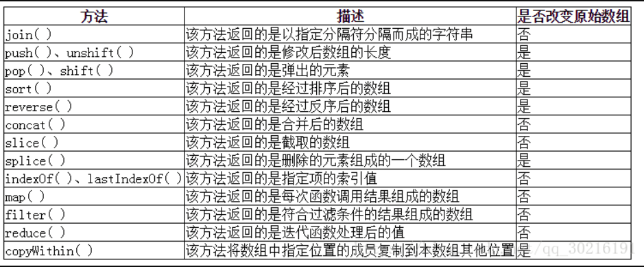
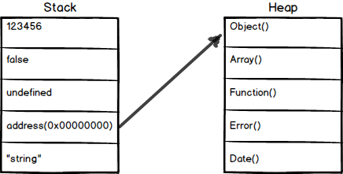
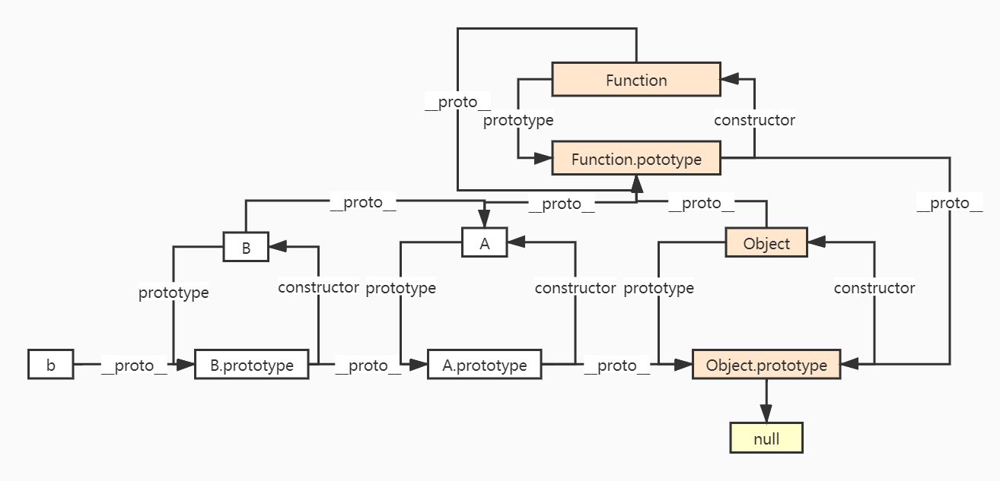
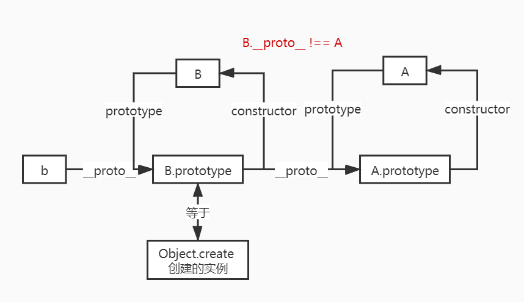
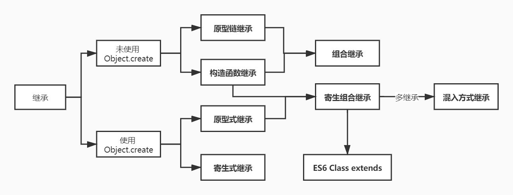

> 知识是有关联的 ：）

> 《你不知道的 JS》
>
> 《JavaScript 高级程序设计》
>
> 《现代 JavaScript 教程》

[ES2021](https://tc39.es/ecma262/2021/)

## 一、数据类型

### 1. 基础类型有哪些

> ES5：5 + 1；ES6 / ES2015：6 + 1；ES11 / 2020：7 + 1

* 在 ES5 中，基础数据类型有 `boolean`，`null`，`undefined`，`number`，`string`
* ES6 新增了 `symbol`
* ES10 新增 `BigInt`


### 2. `null` 和 `undefined` 啥区别

[undefined与null的区别](http://www.ruanyifeng.com/blog/2014/03/undefined-vs-null.html)

[为什么js中要用void 0 代替undefined，还是有特别的含义呢](https://segmentfault.com/q/1010000007406985#)

首先，两个都是基础类型。区别主要在于：

* 在语义上，`null` 指已定义但值为空，`undefined` 指未赋值的自然状态，如声明未赋值的变量；

* 另一方面，`null` 为保留关键字，不能被当成标识使用，`undefined` 不是保留关键字，可能被重写，因此部分规范中要求用 `void 0` 代替 `undefined`；

> ES5之后，规定了全局变量下的`undefined`值为只读，不能改写，但局部变量中依然可以改写
>
> 非严格模式下，`undefined`是可以重写的，严格模式则不能重写

```javascript
undefined === void 0
// true
```

受历史设计原因影响：

* 在转换为数值类型时，`null` 会被转为 0，`undefined` 会转为`NaN`；

```javascript
Number(null)
// 0
Number(undefined)
// NaN
```

* 在使用`typeof`操作符时，`null` 会得到 `object`，`undefined` 会得到 `undefined`；

```javascript
typeof null
// "object"
typeof undefined
// "undefined"
```

```javascript
null == null
// true
undefined == undefined
// true
null == undefined
// true
null === undefined
// false
```


### 3. `0.1 + 0.2 !== 0.3` 为什么

[JavaScript 浮点数陷阱及解法](https://github.com/camsong/blog/issues/9)

[(建议收藏)原生JS灵魂之问, 请问你能接得住几个？(上)](https://juejin.cn/post/6844903974378668039#heading-5)

[JavaScript 深入之浮点数精度](https://github.com/mqyqingfeng/Blog/issues/155)

> 0.1和0.2在转换成二进制后会无限循环，
>
> 由于标准位数的限制后面多余的位数会被截掉，此时就已经出现了精度的损失，
>
> 相加后因浮点数小数位的限制而截断的二进制数字在转换为十进制就会变成0.30000000000000004。

浮点数运算的精度问题导致等式左右的结果并不是严格相等，而是相差了个微小的值

```javascript
console.log(0.1 + 0.2 == 0.3); // false
console.log(Math.abs(0.1 + 0.2 - 0.3) <= Number.EPSILON); // true
```

**浮点数进度问题**

JS 采用双精确度，用 64 位字节来储存一个浮点数

0.1 转成二进制时是一个无限循环的数， 0.00011001100110011……

在存储时就已经发生精度丢失

`0.1 + 0.2` 实际发生了三次精度丢失，两次存储，一次运算


### 4. `string` 类型的长度

[【JS迷你书】String类型与UTF-16](https://juejin.cn/post/6844903841817690119)

首先，`string` 类型指的是字符串的 UTF16 编码。

我们常用的如 `length` 方法等都是针对 UTF16 编码的，把每个`UTF16`单元当作是一个字符来处理。

因此，字符串的最大长度实际受字符串的编码长度影响，通常说最大长度为 2^53 - 1。


### 5. 说说 `symbol`  ？

[MDN - Symbol](https://developer.mozilla.org/zh-CN/docs/Glossary/Symbol)

[ECMAScript 6 入门 - Symbol](https://es6.ruanyifeng.com/#docs/symbol)

[现代 JavaScript 教程 - Symbol](https://zh.javascript.info/symbol)

原有对象属性名只能是 `string` 类型时，容易出现**标识符冲突**，造成造成意外访问或重写；

而 `symbol` 的值是**唯一**的，可以作为对象的属性名，避免上述情况；

```javascript
Symbol() === Symbol()
// false
```

我们可以通过调用 **`Symbol()`** 函数创建，函数中可以选择传入描述，也可称为 `key`；

```javascript
var sym1 = Symbol();
var sym2 = Symbol('test');
console.log(sym1, sym2); // Symbol() Symbol(test)
```

需要注意的是，`symbol` 类型的值**不可以使用 `new`**  运算符来创建，因为 `Symbol` 函数返回的为 symbol 值，非对象，会抛出`TypeError`，提示此时非构造函数；

> 待解决疑问：`new` 调用构造函数时，如返回值不是对象但为基本类型，不是会忽略返回值吗？为何此处抛出错误？

同时，`symbol` 类型作为属性名时，该属性是**匿名，不可枚举**的。

因此，它不会在 `for...in`、`for...of` 等循环中出现，也不会通过`Object.keys()`、`Object.getOwnPropertyNames()`、`JSON.stringify()` 返回；

作为对象的属性名使用时，可以使用 **`Object.getOwnPropertySymbols`** 取到

```javascript
var obj = {
    a: 1,
    [Symbol('b')]: 2
}

for (let i in obj) {
    console.log(i); // a
}

console.log(Object.keys(obj)) // [ 'a' ]
console.log(Object.getOwnPropertyNames(obj))  // [ 'a' ]
console.log(Object.getOwnPropertySymbols(obj)) // [ Symbol(b) ]
```

`symbol` 还提供了 `Symbol.for(key)`，`Symbol.keyFor(sym)` 方法，可用于使用同一 `symbol` 值。

 **`Symbol.for()`** 方法，根据传入值，在**全局环境**中先查找是否已存在，如未存在，则新建一个值；

**`Symbol.keyFor(sym)`** 方法，可以获取某一值对应的 `key` 描述

```javascript
let sym1 = Symbol.for('day')

function f(sym) {
    let sym2 = Symbol.for('day')
    return sym === sym2
}

console.log(f(sym1), Symbol.keyFor(sym1))
// true day
```


### 6. 聊聊 `BigInt` 

[tc39 - BigInt](https://tc39.es/proposal-bigint/)

[MDN - 数字类型](https://developer.mozilla.org/zh-CN/docs/Web/JavaScript/Data_structures#%E6%95%B0%E5%AD%97%E7%B1%BB%E5%9E%8B)

[caniuse - BigInt](https://www.caniuse.com/mdn-javascript_builtins_bigint_asintn)    大部分均支持

原先 `number` 类型是双精度 64 位二进制格式的值，只能安全地表示-9007199254740991(-(2^53-1))和9007199254740991（(2^53-1)），任何超出此范围的整数值都可能**丢失精度**，并无法保证**安全性**。

而 `BigInt` 允许我们安全地存储和操作大整数，通过在整数末尾附加 `n `或调用构造函数就可以创建 `BigInt`。

注意，使用构造函数创建时，如直接传递数字，有可能出现精度的损失，需要**传递数字字符串**；和 `Symbol` 相似，**不可以使用 `new`**  运算符来创建

```javascript
console.log(9999999999999999999999999998)  // 1e+28
console.log(9999999999999999999999999998n) // 9999999999999999999999999998n
console.log(BigInt('9999999999999999999999999998')) // 9999999999999999999999999998n
console.log(BigInt(9999999999999999999999999998)) // 9999999999999999583119736832n
```

同时，`BigInt` 类型**不能与 `number` 类型混用**，会抛出 `TypeError`，提示不要混用；同理，`BigInt` 类型的数字不能直接传入需要 `number` 类型的函数，如`Math.max`；如有需要，需要进行显示转换。

而且，`BigInt` 不支持使用一元加法运算法转换为 `number` 类型


### 7. 类型判断的方法 

[JavaScript专题之类型判断(上)](https://github.com/mqyqingfeng/Blog/issues/28)

[判断数据类型的那些坑](https://zhuanlan.zhihu.com/p/26061496)

[javascript中的类型判断](https://zhuanlan.zhihu.com/p/38249035)

[极客时间-重学前端](https://time.geekbang.org/column/article/78884)

#### 总结

`null`，`undefined` 直接使用严格相等 `===` 判断

非 `null`，`undefined` 的基本类型及函数使用 `typeof` 判断

剩余内置类型使用 `Object.prototype.toString` 判断

自定义类型使用`instanceof`


#### typeof

> typeof 是一元操作符，放在其单个操作数的前面，操作数可以是任意类型。返回值为表示操作数类型的一个字符串。

注意 `typeof` 对 **`null`** 的返回值为 `object`，对**函数**的返回值为 `function`

对于`Array` 等对象子类型，返回 `object`

因此，**`typeof` 适合用于除 `null` 和对象外的类型判断**


#### instanceof

> instanceof 运算符用来测试一个对象在其**原型链**中是否存在一个构造函数的 prototype 属性。

```
obj.__proto__.__proto__ ... = Obj.prototype
```

**`instanceof` 适合用于对非 `Function`，`Object`的引用类型进行类型判断（是不是某一类的实例）**

还可以使用 [`Symbol.hasInstance`](https://developer.mozilla.org/zh-CN/docs/Web/JavaScript/Reference/Global_Objects/Symbol/hasInstance)，自定义`instanceof`在某一类上的行为

```javascript
console.log([1, 2] instanceof Array) // true
console.log(new Date() instanceof Date) // true
console.log(1 instanceof Number) // false
console.log(Symbol() instanceof Symbol) // false
console.log(BigInt('111') instanceof BigInt) // false
console.log(new Number(1) instanceof Number) // true
```

```javascript
// 一些特殊的例子
console.log( Function instanceof Function ); // true
console.log( Function instanceof Object ); // true
console.log( Object instanceof Function ); // true
console.log( Object instanceof Object ); // true
```

[原型链图例](language/JavaScript?id=_7-原型链)

```javascript
class MyArray {
  static [Symbol.hasInstance](instance) {
    return Array.isArray(instance);
  }
}
console.log([] instanceof MyArray); // true
```

[模拟 instanceof 实现](handwrite/JavaScript-hw.md?id=_2-如何模拟instanceof)

**缺点**

instanceof操作符的问题在于，它假定只有一个全局环境。如果网页中包含多个框架，那实际上就存在两个以上不同的全局执行环境，从而存在两个以上不同版本的Array构造函数。
 如果你从一个框架向另一个框架传入一个数组，那么传入的数组与在第二个框架中原生创建的数组分别具有各自不同的构造函数。

#### constructor

`constructor` 属性，会返回实例对象的原型上构造函数的引用。该属性值是函数本身。

`constructor` 可以手动修改，所以**不可靠且不稳定**，不推荐使用

如为基础数据类型，会调用它们对应的构造函数，如 `Number`。

如为 `null`，`undefined`，会抛出 `TypeError`，提示没有对应的构造函数

**`constructor` 适合用于除 `null` 和 `undefined` 外的类型判断**

```javascript
console.log((3).constructor === Number) // true
console.log(true.constructor === Boolean) // true
console.log('abc'.constructor === String) // true
console.log((new Number(3)).constructor === Number) // true
console.log((new Boolean(true)).constructor === Boolean) // true
console.log((new String('abc')).constructor === String) // true
```

#### Object.prototype.toString

[MDN - Object.prototype.toString](https://developer.mozilla.org/zh-CN/docs/Web/JavaScript/Reference/Global_Objects/Object/toString)

使用 `Object.prototype.toString` 是因为，其他类可能根据使用需要改写了 `toString` 方法

`toString()` 方法返回一个表示该对象的字符串，步骤主要有：

1. 如果 this 值是 undefined，就返回 [object Undefined]
2. 如果 this 的值是 null，就返回 [object Null]
3. 令 O 为以 this 作为参数调用 ToObject 的结果（转化为对象）
4. 令 class 为 O 的 [[Class]] 内部属性的值
5. 返回三个字符串 "[object ", class, and "]" 连起来的字符串

```javascript
function Test() {}

var t = new Test()

console.log(Object.prototype.toString.call(undefined)) // [object Undefined]
console.log(Object.prototype.toString.call(null)) // [object Null]
console.log(Object.prototype.toString.call([])) // [object Array]
console.log(Object.prototype.toString.call(Test)) // [object Function]
console.log(Object.prototype.toString.call(t)) // [object Object]
```

在 IE6 / Edge 中，null 和 undefined 会被 Object.prototype.toString 识别成 [object Object]！

> 实际测试时，Edge 可正常返回，IE 返回 [object Window]

**`Object.prototype.toString` 适合用于内置类型的类型判断**


### 8. `null` 是不是对象

 `null` 不是对象。

> 在 JavaScript 最初的实现中，JavaScript 中的值是由一个表示类型的标签和实际数据值表示的。对象的类型标签是 0。由于 `null` 代表的是空指针（大多数平台下值为 0x00），因此，null 的类型标签是 0，`typeof null` 也因此返回 `"object"`。     —— [MDN](https://developer.mozilla.org/zh-CN/docs/Web/JavaScript/Reference/Operators/typeof#typeof_null)

`typeof null` 得到的返回值为 `object`是由于：

`typeof` 根据类型标签判断，对象的类型标签为 `000`

而 `null` 的机器码全为0，刚好符合对象的判断规则，所以被误判为 `object`。


### 9. `typeof (function() {})` 为什么不为 `object`

[ECMA262 - The `typeof` Operator](https://tc39.es/ecma262/#sec-typeof-operator)

函数是对象的子类型，`typeof` 的返回值主要和其判断逻辑有关

根据标准可知，当对象中包含 `[[Call]]` 时，判断为 `function`，如未包含，则返回 `object`

函数包含`[[call]]` 属性，所以它是可调用的，即使是使用 `new` 运算符新建的函数也具有该属性


### 10. 显式类型转换

[JavaScript 深入之头疼的类型转换(上) ](https://github.com/mqyqingfeng/Blog/issues/159)

[极客时间-重学前端](https://time.geekbang.org/column/article/78884)


#### 转为 Boolean

> **有一些 [“falsy” 值](https://developer.mozilla.org/en-US/docs/Glossary/Falsy)，如数字 `0`，仍然会被 React 渲染**

如果省略或值`0`，`-0`，`0n`， [`null`](https://developer.mozilla.org/zh-CN/docs/Web/JavaScript/Reference/Global_Objects/null)，`false`，[`NaN`](https://developer.mozilla.org/zh-CN/docs/Web/JavaScript/Reference/Global_Objects/NaN)，[`undefined`](https://developer.mozilla.org/zh-CN/docs/Web/JavaScript/Reference/Global_Objects/undefined)，或空字符串（`""`），该对象具有的初始值`false`。

其他均为 `true`，易混淆的如`{}`，`[]`，`"false"`

```javascript
console.log(Boolean()) // false
console.log(Boolean(0)) // false
console.log(Boolean(-0)) // false
console.log(Boolean(NaN)) // false
console.log(Boolean(null)) // false
console.log(Boolean(undefined)) // false
console.log(Boolean("")) // false
console.log(Boolean(false)) // false
console.log(Boolean([])) // true
console.log(Boolean({})) // true
console.log(Boolean("false")) // true
```

#### 转为 Number

> ToNumber

`null` 会转为 0， `undefined` 会转为 NaN

字符串转换时，首先会忽略前导空格及前导0，尝试转换为整数或浮点数，如确定非数字，则结果为 NaN

`symbol` 类型不能转换为数字，会抛出`TypeError`，提示不能进行转换

`BigInt` 类型如数值太大，转换后会损失精度

```javascript
console.log(Number()) // +0
console.log(Number(null)) // +0
console.log(Number(undefined)) // NaN
console.log(Number(true)) // 1
console.log(Number(false)) // +0
console.log(Number("0")) // +0
console.log(Number("-123")) // -123
console.log(Number("1.2")) // 1.2
console.log(Number("000123")) // 123
console.log(Number("   123")) // 123
console.log(Number("0x11")) // 17
console.log(Number("0o11")) // 9
console.log(Number("0b11")) // 3
console.log(Number("")) // +0
console.log(Number(" ")) // +0
console.log(Number("123 123")) // NaN
console.log(Number("foo")) // NaN
console.log(Number(Number(101351135999999999999991n))) // 101351135999999999999991n
```

#### 转为字符

> ToString

`null`，`undefined` 值转换后，转为类型名称的字符串形式

布尔类型转换为对应的`"false"`，`"true"`

数字转字符较复杂，常见项基本为转换成数字字符串

`symbol` 类型不能转换为字符，会抛出`TypeError`，提示不能进行转换

`BigInt` 类型转换后为去后缀 `n` 的数字字符串

```javascript
console.log(String()) // ""
console.log(String(null)) // "null"
console.log(String(undefined)) // "undefined"
console.log(String(false)) // "false"
console.log(String(true)) // "true"
console.log(String(0)) // "0"
console.log(String(-0)) // “0”
console.log(String(NaN)) // “NaN”
console.log(String(Infinity)) // “Infinity"
console.log(String(-Infinity)) // "-Infinity"
console.log(String(1)) // "1"
console.log(String(0n)) // "0"
console.log(String(101351135999999999999999991n)) // "101351135999999999999999991"
```

#### 转为 object

>  装箱操作，把基本类型转换为对应的对象

`null`，`undefined` 类型不能转换为字符，会抛出`TypeError`

原始值调用 String()、Number() 或者 Boolean() 构造函数即可

`symbol` 类型的转换可以通过 `call` 方法来强迫产生装箱，或使用内置的 `Object` 函数显式调用

`BigInt` 类型的装箱操作与 `symbol` 相似

```javascript
var symObj1 = (function () { return this; }).call(Symbol("a"))
var symObj2 = Object(Symbol('a'))
console.log(symObj1, symObj2) 
// [Symbol: Symbol(a)] [Symbol: Symbol(a)]

var bIntObj1 = (function () { return this; }).call(BigInt("1111111"))
var bIntObj2 = Object(BigInt("1111111"))
console.log(bIntObj1, bIntObj2) 
// [BigInt: 1111111n] [BigInt: 1111111n]
```

#### object 转为各类值

> 拆箱操作，把对象转换为对应的基本类型

> 所有的对象除了 null 和 undefined 之外的任何值都具有 `toString` 方法

> 内部相关的方法为 ToPrimitive  [ES5 9.8](http://es5.github.io/#x9.8)

* 所有对象转为布尔类型，均为 `true`

* 转字符串，使用 [`toString` ](https://developer.mozilla.org/zh-CN/docs/Web/JavaScript/Reference/Global_Objects/Object/toString)。

  默认返回由 "[object " 和 class 和 "]" 三个部分组成的字符串，但不同类型存在改写方法的情况，如：

  * 数组的 toString 方法将每个数组元素转换成一个字符串，并在元素之间添加逗号后合并成结果字符串。
  * 函数的 toString 方法返回源代码字符串。
  * 日期的 toString 方法返回一个可读的日期和时间字符串。
  * RegExp 的 toString 方法返回一个表示正则表达式直接量的字符串。

  先 `toString`, 再 `valueOf`，转为原始值，再转为字符串（参考数字转字符串）

* 转数字，使用 [`valueOf`](https://developer.mozilla.org/zh-CN/docs/Web/JavaScript/Reference/Global_Objects/Object/valueOf)

  默认返回对象本身，数组、函数、正则、布尔、数字、字符串也会返回本身。

  日期是一个例外，它会返回从 1970 年 1 月 1 日午夜开始计的毫秒数 UTC

  先`valueOf` , 再 `toString`，转为原始值，再转为数字（参考字符串转数字）

```javascript
console.log(Number({})) // NaN
console.log(Number({ a: 1 })) // NaN
console.log(Number([])) // 0
console.log(Number([0])) // 0
console.log(Number([1, 2, 3])) // NaN
console.log(Number(function () { var a = 1; })) // NaN
console.log(Number(/\d+/g)) // NaN
console.log(Number(new Date(2010, 0, 1))) // 1262275200000
console.log(Number(new Error('a'))) // NaN
console.log(Number(Number(Object(BigInt(99999999999999999999999)))) // 1e+23
console.log(Number(String(Object(BigInt(99999999999999999999999)))) // "99999999999999991611392"
```


### 11. '1'.toString()为什么可以调用？

> 引用类型与基本包装类型的主要区别就是对象的生存期。
>
> 自动创建的基本包装类型的对象，只存在于一行代码的执行瞬间，然后立即被销毁。
>
> —— 《JavaScript高级程序设计（第三版）》

首先，每读取一个基本类型值时，后台会**创建一个与它对应的基本包装类型的对象**，因此我们可以调用一些方法来处理数据，如此处的`'1'.toString()`，或更常见的 `'abc'.length`

这一语句包含的处理有：

```javascript
// 1. 创建 String 类型实例
var s1 = new String("1");
// 2. 调用指定方法
var s2 = s1.toString();
// 3. 销毁实例
s1 = null;
```


### 12. 为什么 `1.toString()` 抛出语法错误

[Why can't I access a property of an integer with a single dot?](https://stackoverflow.com/questions/9380077/why-cant-i-access-a-property-of-an-integer-with-a-single-dot)

因为此时代码被理解为 `(1.)toString()`，`.` 被视为数字的一部分

为避免将点号解释为小数点，可改写为：

```javascript
(1).toString(); // 2 is evaluated first
1..toString(); // the second point is correctly recognized
1 .toString(); // note the space left to the dot
```


### 13. 隐式类型转换

[JavaScript深入之头疼的类型转换(下)](https://github.com/mqyqingfeng/Blog/issues/164)

#### 一元操作符 +

 [ES5规范1.4.6](http://es5.github.io/#x11.4.6)

类似于对象转数字的过程，先转为原始值，再字符串转数字：

1. 如果 `obj` 为基本类型，直接返回
2. 否则，调用 `valueOf` 方法，如果返回一个原始值，则 `JavaScript` 将其返回。
3. 否则，调用 `toString` 方法，如果返回一个原始值，则`JavaScript` 将其返回。
4. 否则，`JavaScript` 抛出一个类型错误异常。

```javascript
console.log(+['1']); // 1
console.log(+['1', '2', '3']); // NaN
console.log(+{}); // NaN
```

#### 二元操作符 +

[ES5规范11.6.1](http://es5.github.io/#x11.6.1)

> ToPrimitive：当不传入 PreferredType 时，如果 input 是日期类型，相当于传入 String，否则，都相当于传入 Number。如果传入的 input 是 Undefined、Null、Boolean、Number、String 类型，即传入 ES5 时的基础类型，直接返回该值。

当计算 value1 + value2时：

1. lprim = ToPrimitive(value1)
2. rprim = ToPrimitive(value2)
3. 如果 lprim 是字符串或者 rprim 是字符串，那么返回 ToString(lprim) 和 ToString(rprim)的拼接结果
4. 返回 ToNumber(lprim) 和 ToNumber(rprim)的运算结果

```javascript
console.log(null + 1); // 1
console.log([] + []); // ''
console.log([] + {}); // '[object Object]'
console.log({} + []); // '[object Object]'
console.log(1 + true); // 2
console.log({} + {}); // '[object Object][object Object]'
console.log(new Date(2017, 04, 21) + 1) // "Sun May 21 2017 00:00:00 GMT+0800 (CST)1"
```


### 14. `==` 与 `===` 的区别

[JavaScript深入之头疼的类型转换(下)](https://github.com/mqyqingfeng/Blog/issues/164)

`===` 进行严格比较，只要类型不匹配或值不相等，就返回`flase`

`==` 在比较的时候可以转换数据类型，具体步骤为：

* 如类型相同时，当两数值相同，则返回`true`

  * 注意部分特殊情况，如 NaN 与任何值不等（包含自身），`+0` 与 `-0` 此时不区分作为相同值处理

* 如类型不同，需要进行类型转换

  * 比较包含布尔值，将布尔类型转为数字 `ToNumber`
  * 一边是字符串或数字或`symbol`，另一边为对象类型，则将对象类型转换为原始类型 `ToPrimitive`

  * 数字和字符串比较，则转换字符串类型为数字类型 `ToNumber`

  * `null` 和 `undefined` 比较，返回 `true`
  * 非上述情况，返回 `false`

```javascript
console.log(false == "0")
console.log(false == 0)
console.log(false == "")
console.log("" == 0)
console.log("" == [])
console.log([] == 0)
console.log("" == [null])
console.log(0 == "\n")
console.log([] == 0)
// 1. 右边为 false 2. 右边转为 0 3.左边转为 '' 4. 左边转为 0
console.log([] == ![]) 
// null == 0 不符合上述规则，返回 false
console.log(null != 0) 
// 全为 true
```


### 15. 引用类型有哪些

[标准内置对象分类 - MDN](https://developer.mozilla.org/zh-CN/docs/Web/JavaScript/Reference/Global_Objects#%E6%A0%87%E5%87%86%E5%86%85%E7%BD%AE%E5%AF%B9%E8%B1%A1%E5%88%86%E7%B1%BB)

* String

* Number

* Boolean

* Object

* Function

* Array

  删改数组，肯定会变原数组（push，unshift，pop，shift）

  排序，也会变原数组（sort，reverse）

  带 p 改原数组，没带为浅拷贝（splice）

  `Array.prototype.slice([begin[, end]])` **浅拷贝**了原数组中元素的一新数组

  `Array.prototype.splice(start[, deleteCount[, item1[, item2[, ...]]]])` 删除/替换/添加元素
  
  `concat` 也为**浅拷贝**



* Date
* RegExp
* Error


### 16. 基本数据类型和复杂数据类型存储上的区别

> 即，原始值、引用值的区别

* 基本数据类型值占据固定大小，保存在**栈**中。

  复杂 (引用) 数据类型的值是对象，在**栈**中存入的是地址，该地址指向**堆**内存，在堆内存存入的是具体值。

* 基本数据类型是**值拷贝**，拷贝的是具体值；复杂数据类型是**引用拷贝**，拷贝的指向堆内存的引用地址。因此，我们将对象赋值给新的变量时，如使用新变量对属性进行修改，会影响原有变量指向的值，因为两个变量指向同一块内存空间

* 常见例子还有为二维数组初始化时，如使用下方示例代码创建，会导致在修改某行时，所有行均改变，因为此时存引用值指向同一块内存

  ```javascript
  var data = new Array(3).fill(new Array(3))
  ```




### 17. `str.charAt(index)` 和 `str[index]` 的区别

* 当 index 的取值不在 str 的长度范围内时

  `str[index]` 返回 `undefined`，`charAt(index)`返回空字符串；

* `str[index]` 不兼容 ie6 - ie8，`charAt(index)`可以兼容

* `str[index]` 不易区分变量的类型，是字符串还是数组


## 二、作用域

> 红宝书中也称作用域为执行环境

> **LHS查询**—查找目标
> 变量出现在赋值操作的左侧时
> 查找变量 并试图为变量赋一新值
>
> **RHS查询**—查找源头
> 变量出现在赋值操作的右（非左）侧时
> 查询并获取变量的值
>
> —— 《你不知道的 JS》

> 活动对象和变量对象其实是一个东西
>
> VO：变量对象是与执行上下文相关的数据作用域，存储了在上下文中定义的变量和函数声明；是规范上的或者说是引擎实现上的，不可在 JavaScript 环境中访问
>
> AO：只有到当进入一个执行上下文中，这个执行上下文的变量对象才会被激活，能访问该对象的各种属性。被激活的变量对象即活动对象

### 1. JS 作用域分为哪几类，作用域大小怎么定义？

> 作用域是根据名称查找变量的一套规则
>
> 欺骗词法作用域的方法有：`eval`，`with`

JavaScript 采用词法作用域模型，即作用域在写代码时进行静态确定，主要关注在何处声明

> 函数的作用域在函数定义的时候就决定了

JavaScript 中的作用域包含：

* 全局作用域
* 函数作用域：属于这个函数的全部变量都可以在整个函数的范围内使用及复用
* 块级作用域：将变量绑定到所在的任意作用域中（通常是{ .. }内部）


### 2. let, var 区别

首先，从作用域角度看，`var` 声明的变量可以使用在**全局作用域以及函数作用域**中，而 `let` 声明的变量是限制在**块级作用域**中的。所以，在最程序顶部声明时，`var` 会**向全局对象添加属性**，`let` 不会。

其次，`var` 会进行**变量提升**处理，因此将声明放在其所在作用域的任一行都可以，在被赋值前返回值为 `undefined`，但 `let` 不会，在声明前是不可访问的。受 `let` 这一特点的影响，在执行到 `let` 初始化语句前，存在**暂存死区**，如果使用该变量会抛出 `ReferenceError`，提示不能在初始化前取到该变量。

最后，`var` 在同个作用域内可**重复声明**，后面的值会覆盖前面的值，但 `let` 在同个作用域内如重复声明，会抛出语法错误，提示不要重复声明。这个在写 `switch` 语句时会碰到，因为 ``switch``语句为一个块作用域。


### 3. 何为提升

这里我认为可以分为广义和狭义理解

广义上讲，提升，指的是所有声明都会被移动到所在作用域的顶部。

这是因为 JavaScript 引擎在执行代码前会进行编译，在这过程中将声明的变量关联其所在作用域，而赋值及其他逻辑会等到运行时进行。

狭义上，指的是 `var` 所具有的变量提升的特点。

这是因为在处理`var` 声明时，除绑定作用域外，还进行了初始化，设为 `undefined`。而`let`，`const`  没有初始化，所以没有变量提升。

在这部分还需要注意的是，函数表达式的表现和变量声明相似，只会提升声明本身，不提升赋值，但函数声明会全部提升，包含函数体。类 `class` 虽然本质是一个函数，但只会提升声明，需要在初始化后再创建实例，否则也会抛出错误。


### 4. 为什么需要块级作用域

[ECMAScript 6 入门](https://es6.ruanyifeng.com/#docs/let#%E4%B8%BA%E4%BB%80%E4%B9%88%E9%9C%80%E8%A6%81%E5%9D%97%E7%BA%A7%E4%BD%9C%E7%94%A8%E5%9F%9F%EF%BC%9F)

主要是因为，原有全局作用域和函数作用域的设计会带来一些使用上的问题。

在循环语句中，使用 `var` 声明的计数变量在循环外也可以使用，变量**污染外部函数作用域**。

同时，`var` 变量提升，可重复声明的特点可能导致**内部变量覆盖外部变量**，引发意料外的错误。

```javascript
var tmp = 1;

function f() {
    console.log(tmp);
    if (false) {
        var tmp = 'test';
    }
}

f(); // undefined
```

此时主要的问题在于可维护性。

如果**涉及异步代码**，就会未取到当次循环数据的情况。因为当处理回调函数时，变量取所在函数作用域中的值，此时为循环结束的数值。比如循环 0 到 3，最后输出 3 次 3。如使用块作用域，变量会使用块级作用域中的值，因此还是按序输出。

```javascript
for (var i = 0; i < 3; i++) {
    setTimeout(function() {
        console.log(i);
    }, 0);
}
// 3 3 3
```

```javascript
for (let i = 0; i < 3; j++) {
    setTimeout(function() {
        console.log(i);
    }, 0);
}
// 0 1 2
```


### 5. ES6 前如何使用块级作用域

[MDN - with](https://developer.mozilla.org/zh-CN/docs/Web/JavaScript/Reference/Statements/with)

**第一种**，可以使用 `with`。

`with` 将一个对象添加到作用域链顶部，处理为一个被隔离的词法作用域。

其括号中语句的赋值操作，会对属性进行 LHS查询。

在非严格模式下，当整个作用域链中都不存在该变量时，会在全局作用域中创建该变量，并进行赋值。

ES5 严格模式下已被禁用，会抛出语法错误。

它是一种欺骗词法作用域的方式。

**第二种**，是使用 `try/catch` 语句，其中 `catch` 分句会创建一块作用域 。

**第三种**，使用匿名函数

Babel 处理这部分转换是比较灵活的，如：

* 处理循环中带异步时，除 `let` 声明变为 `var` 外，将相关异步操作变为一函数，控制在新的函数作用域内
* 在重复声明方面，`let` 处理为 `var` 时，如变更会引起重复声明，则修改一方的变量名

```javascript
// 匿名函数
(function(){
	// 块级
})()
```

```javascript
// with - 传入对象中有对应属性
var o1 = {
    a: 1
}

function f(obj) {
    with(obj) {
        a = 2
    }
}

f(o1)
console.log(o1.a) // 2
```

```javascript
// with - 传入无对应属性
var n1 = 1

function f(obj) {
    with(obj) {
        a = 2
    }
}

f(n1)
console.log(n1, a) // 1 2
```

```javascript
// with - LHS查询，延作用域链查找
var o1 = {
    a: 1
}

function f(obj) {
    var b = 2
    with(obj) {
        b = 3
    }
    console.log(b)
}

f(o1)
console.log(o1.a) // 3 1
```

```javascript
// ES6
let a = 2;
console.log(a);
{
	let a = 1;
  console.log(a);
}

// Babel处理后
var a = 2;
console.log(a);
{
  var _a = 1;
  console.log(_a);
}

```

```javascript
// ES6 代码见前一问示例

// Babel处理后
var _loop = function _loop(i) {
  setTimeout(function () {
    console.log(i);
  }, 0);
};

for (var i = 0; i < 3; j++) {
  _loop(i);
}
```


### 6. 作用域链

[JavaScript深入之作用域链](https://github.com/mqyqingfeng/Blog/issues/6)


### 模块化演变


## 三、垃圾回收

> 找出那些不再继续使用的变量，然后释放其占用的内存

垃圾收集策略有标记清除（最常用），引用计数（不太常见）

* 标记清除：在运行时给存储在内存中的所有变量都加上标记，将环境中的及被环境引用的变量去除标记，最后删除带标记的变量
* 引用计数：跟踪每个值被引用的次数。但它无法处理循环引用的问题

为优化内存占用问题，可进行解除引用，即一旦数据不使用时，将值置为 `null`，让值脱离执行环境，以便垃圾收集器下次运行时将其回收。适用于大多数全局变量和全局对象的属性，局部变量会在它们离开执行环境（作用域）时自动解除引用。


## 四、闭包

> 基于词法作用域书写代码所产生的自然结果
>
> —— 《你不知道的  JS》

**是什么**

闭包是有权访问另一个函数作用域中的变量的函数

**为什么**

即使创建它的执行上下文被销毁，也依然能凭借作用域链访问到变量值，因为函数<u>作用域并未被清除</u>。

> 1. 在后台执行环境中，闭包的作用域链包含它自己的作用域，包含函数的作用域和全局的作用域
>
> 2. 通常情况下，函数作用域及其变量会在函数执行结束后被销毁
>
> 3. 但，当函数返回一闭包时，该函数的作用域会一直被保存直到闭包不存在。

**特点**

* 正因为闭包携带了包含它的函数的作用域，并且会阻止垃圾回收机制释放内存，它会比其他函数<u>占用更多空间</u>，所以需要避免过度使用闭包

  > 闭包保存了整个变量对象（AO / VO）

**例子**

> 红宝书中的例子：使用闭包提供公有方法访问私有对象属性

一个常见的例子为借助闭包在使用 `var` 的 `for` 循环中如何捕获当次循环的值

```javascript
var data = [];

for (var i = 0; i < 3; i++) {
  data[i] = (function (i) {
        return function(){
            console.log(i);
        }
  })(i);
}

data[0]();
data[1]();
data[2]();
```

[How Are Function Components Different from Classes?](https://overreacted.io/how-are-function-components-different-from-classes/)

在 React 中，也会借助闭包的特性。

如类组件和函数组件的一大区别在于：

类组件会捕获最新的值，而函数组件会捕获当次的值

这在设置事件监听，或使用 `setTimeout` 等处理异步操作时会遇到。

类组件可借助闭包捕获到当次的值，如在 render 中存当次 props 的值，再传入需要处理的函数。

函数组件捕获最新值通常借助 ref 实现。

**需要注意的地方**

受垃圾回收机制影响，在某些老版浏览器（IE9 之前），如闭包的作用域链中保存 HTML 元素，则该元素将无法被销毁


## 五、this

[再来40道this面试题酸爽继续(1.2w字用手整理)](https://juejin.cn/post/6844904083707396109)

> this 是执行上下文的一个属性，代表<u>函数调用时函数使用的上下文</u>，是一个对象

> this 是在运行时基于函数的执行环境绑定的
>
> this 不指向函数自身也不指向函数的词法作用域，完全取决于函数在哪里被调用

### 0. 根据规范如何确定 this

[JavaScript深入之从ECMAScript规范解读this](https://github.com/mqyqingfeng/Blog/issues/7)

> MemberExpression : `()`左边的部分
>
> IsPropertyReference：如果 base value 是一个对象，就返回 true

1.计算 MemberExpression 的结果赋值给 ref

2.判断 ref 是不是一个 Reference 类型

```
2.1 如果 ref 是 Reference，并且 IsPropertyReference(ref) 是 true, 那么 this 的值为 GetBase(ref)

2.2 如果 ref 是 Reference，并且 base value 值是 Environment Record, 那么this的值为 ImplicitThisValue(ref)

2.3 如果 ref 不是 Reference，那么 this 的值为 undefined
```


### 1. 判断 this 绑定对象

> 优先级依次降低，低优先级的修改方法无法修改高优先级

1. **箭头函数**：继承外层函数调用的 this 绑定（同 ES6 前的 `self=this`）

   由外层作用域决定，且指向函数定义时的 this

   箭头函数的`this`是无法通过`bind、call、apply`来**直接**修改，但是可以通过改变作用域中`this`的指向来间接修改。

   可作为实例方法，确保 `this` 总是指向类实例

   * 避免以下使用方式
     * 定义对象的方法 
     * 定义原型的方法
     * 定义构造函数
     * 定义回调函数
   * 字面量创建的对象，作用域是`window`，如果里面有箭头函数属性的话，`this`指向的是`window`

2. **由 new 调用**：绑定到新创建的对象。

   ```javascript
   function Test1() {
       this.a = 1;
   }
   
   const Test2 = Test1.bind({a: 2})
   const t1 = new Test1();
   const t2 = new Test2();
   
   console.log(t1.a, t2.a); // 1 1
   ```

3. **由 bind 调用**：绑定到指定的对象。

   一个绑定函数能使用new操作符创建对象

   ```javascript
   const test = {
       x: 42,
       getX: function () {
           return this.x;
       }
   };
   
   const boundGetX = test.getX.bind(test);
   const changeGetX = boundGetX.call({x: 1});
   console.log(boundGetX(), changeGetX); // 42 42
   ```

4. **由 call 或者 apply 调用**：绑定到指定的对象。

5. **由上下文对象调用**：绑定到那个上下文对象。

   丢失this绑定（隐式丢失）的形式：<u>函数别名；参数传递（隐式赋值）；回调函数等</u>

6. **默认**：在严格模式下绑定到undefined，否则绑定到全局对象。

   可使用 `globalThis` 引用全局对象


### 2. 箭头函数与普通函数区别

[详解箭头函数和普通函数的区别以及箭头函数的注意事项、不适用场景](https://juejin.cn/post/6844903801799835655)

> 原型，this（从哪来，能不能改，全局），参数，new

**原型**

* 箭头函数没有`prototype`

**this指向**

* 箭头函数本身没有`this`。`this` 指向定义时所在外层的第一个普通函数，会随该函数 `this` 指向的改变而改变
* 普通函数的 `this` 取决于在哪被调用，怎么调用

**能否修改 this**

* 箭头函数不能直接修改它的this指向，可以去修改被继承的普通函数的this指向来间接修改
* 普通函数可以通过 `call`，`apply`，`bind` 直接修改 `this`

**全局作用域的 this 指向**

* 箭头函数在严格和非严格模式下都绑定到 `window`
* 普通函数在严格模式下绑定到 `undefined`，否则绑定到全局对象 `window`。

**参数**

* 箭头函数的 `this` 指向全局时，使用 `arguments` 会报未声明的错误；`this` 指向普通函数时，`arguments` 继承自该普通函数；查找方式类似于作用域链查询

  可以使用 ES6 的 `rest` 参数（即 `...` 扩展符）来获取不定数量的参数

**new **

> ES6 为`new`命令引入了一个`new.target`属性，该属性一般用在构造函数之中，返回`new`命令作用于的那个构造函数。如果构造函数不是通过`new`命令或`Reflect.construct()`调用的，`new.target`会返回`undefined`          —— [阮一峰 - ES6 入门](https://es6.ruanyifeng.com/?search=new.target&x=0&y=0#docs/class#new-target-%E5%B1%9E%E6%80%A7)

* 箭头函数不能做构造函数，使用 `new` 会抛出错误

* 箭头函数不支持`new.target`


### 3. 为什么箭头函数不能做构造函数

[Daily-Interview-Question](https://github.com/Advanced-Frontend/Daily-Interview-Question/issues/101)

- 没有自己的 this
- 没有 prototype 属性 
- 而 new 实例化对象的过程中，会将对象的原型连接到构造函数的原型上，且使用 `call` 或 `apply` 将 `this` 指向实例调用构造函数


### 4. call、apply、bind区别

> [`call()`](https://developer.mozilla.org/zh-CN/docs/Web/JavaScript/Reference/Global_Objects/Function/call) 方法使用一个指定的 `this` 值和单独给出的一个或多个参数来调用一个函数。
>
> [`apply()`](https://developer.mozilla.org/zh-CN/docs/Web/JavaScript/Reference/Global_Objects/Function/apply) 方法调用一个具有给定`this`值的函数，以及以一个数组（或[类数组对象](https://developer.mozilla.org/zh-CN/docs/Web/JavaScript/Guide/Indexed_collections#working_with_array-like_objects)）的形式提供的参数。
>
> [`bind()`](https://developer.mozilla.org/zh-CN/docs/Web/JavaScript/Reference/Global_Objects/Function/bind) 方法创建一个新的函数，在 `bind()` 被调用时，这个新函数的 `this` 被指定为 `bind()` 的第一个参数，而其余参数将作为新函数的参数，供调用时使用。

都是改变函数内 `this` 指向，区别在于：

* 使用`.call()`或者`.apply()`的函数是会直接执行的
* `bind()`是创建一个新的函数，需要手动调用才会执行
* `.call()`和`.apply()`用法基本类似，不过`call`接收若干个参数，而`apply`接收的是一个数组

[模拟 call / apply / bind 实现](http://localhost:3000/#/handwrite/JavaScript-hw?id=%e4%ba%8c%e3%80%81this)


### 5. new 原理

[JavaScript深入之new的模拟实现](https://github.com/mqyqingfeng/Blog/issues/13)

[用new实例化一个对象时，this指针的绑定--读《JavaScript语言精粹》P47疑惑](https://segmentfault.com/q/1010000007373629/a-1020000007373771#)

`new` 运算符将调用构造函数，返回对应对象类型的实例，并会将 `this` 绑定到新对象上；

构造函数可以是内置对象提供的函数，或自定义的函数，通常自义定类型的构造函数会首字母大写。

首先，它会创建一新对象；

接着，将对象与构造函数的原型 `prototype` 建立连接；

并且，改变函数 this 指向为新建对象；

最后返回对象。

如返回值为非对象类型的基本类型，那么会忽略这个返回值。

```javascript
function Test(params) {
    this.x = 1;
    return params;
}

var a = 2
var tmp = new Test({ a: 1 })
console.log(new Test('abc')) // Test  { x: 1 }
console.log(tmp.a) // 1
```

[模拟 new 实现](handwrite/JavaScript-hw.md?id=_1-如何模拟-new)


## 六、对象

1. Object

   `Object.assign(target, ...sources)`

   `Object.getPrototypeOf()`

   `Object.getOwnPropertyDescriptors()`
   
   - [Object.keys(obj)](https://developer.mozilla.org/zh/docs/Web/JavaScript/Reference/Global_Objects/Object/keys) / [Object.values(obj)](https://developer.mozilla.org/zh/docs/Web/JavaScript/Reference/Global_Objects/Object/values) / [Object.entries(obj)](https://developer.mozilla.org/zh/docs/Web/JavaScript/Reference/Global_Objects/Object/entries) —— 返回一个可枚举的由自身的字符串属性名/值/键值对组成的数组。
   - [Object.getOwnPropertySymbols(obj)](https://developer.mozilla.org/zh/docs/Web/JavaScript/Reference/Global_Objects/Object/getOwnPropertySymbols) —— 返回一个由自身所有的 symbol 类型的键组成的数组。
- [Object.getOwnPropertyNames(obj)](https://developer.mozilla.org/zh/docs/Web/JavaScript/Reference/Global_Objects/Object/getOwnPropertyNames) —— 返回一个由自身所有的字符串键组成的数组。
   - [obj.hasOwnProperty(key)](https://developer.mozilla.org/zh/docs/Web/JavaScript/Reference/Global_Objects/Object/hasOwnProperty)：如果 `obj` 拥有名为 `key` 的自身的属性（非继承而来的），则返回 `true`。


### 1. `new`  和 `Object.create()` 的区别 ？

[js继承实现之Object.create](https://segmentfault.com/a/1190000014592412)

* `new` 运算符只接受构造函数；`Object.create` 除构造函数外，还可以接受普通对象，null
* `Object.create` 如传入构造函数，则不会继承原有构造函数中的属性；如为对象，则会继承原对象的属性。
* 可以借 `Object.create` 实现没有原型的空对象，`new` 不行

完整总结见：[JS 基础 | new 和 Object.create() 有什么区别](https://blog.csdn.net/qq_44537414/article/details/114401207)

[模拟 Object.create 实现](handwrite/JavaScript-hw?id=_3-%e5%a6%82%e4%bd%95%e6%a8%a1%e6%8b%9f-objectcreate)


## 七、原型

> “JavaScript中的机制有一个核心区别，那就是不会进行复制，对象之间是通过内部的[[Prototype]]链关联的。”          ——《你不知道的 JavaScript》

每个对象上都有原型的引用，查找属性时，如对象本身不具备该属性，则会在原型上查找该属性。

每个对象的原型也可以有一个原型，以此类推，构成了原型链。

### 0. 常用操作符 / 方法

> * 使用`for...in...`能获取到实例对象自身的属性和原型链上的属性
> * 使用`Object.keys()`和`Object.getOwnPropertyNames()`只能获取实例对象自身的属性
> * 可以通过`.hasOwnProperty()`方法传入属性名来判断一个属性是不是实例自身的属性

* `in`  - [MDN](https://developer.mozilla.org/zh-CN/docs/Web/JavaScript/Reference/Operators/in)

  > 无论属性是否可枚举

  指定的属性在指定的对象或其原型链，如 `'make' in car`

* `hasOwnProperty` - [MDN](https://developer.mozilla.org/zh-CN/docs/Web/JavaScript/Reference/Global_Objects/Object/hasOwnProperty)

  对象自身是否具有该属性，如 `object1.hasOwnProperty('property1')`

* `instanceof` - [MDN](https://developer.mozilla.org/zh-CN/docs/Web/JavaScript/Reference/Operators/instanceof)

  构造函数的 `prototype` 属性是否出现在某实例的原型链上，如 `apple instanceof fruit`

* `isPrototypeOf` - [MDN](https://developer.mozilla.org/zh-CN/docs/Web/JavaScript/Reference/Global_Objects/Object/isPrototypeOf)

  对象是否存在于另一对象的原型链上，如 `Apple.prototype.isPrototypeOf(a)`


### 1. `prototype` ， `__proto__` ，`[[Prototype]]`区分

[JavaScript深入之从原型到原型链](https://github.com/mqyqingfeng/Blog/issues/2)

[现代 JavaScript 教程 - 原型继承](https://zh.javascript.info/prototype-inheritance)

每个函数都有一个 `prototype` 属性，指向该构造函数将会创建的实例的原型，它的值为某一对象或 `null`，默认为 `Object`的实例 ；

每一对象都有一个**内置**属性 `[[Prototype]]`，无法直接访问，它的值为某一对象或 `null`；

在函数被 `new` 运算符作为构造函数调用时，函数的 `prototype` 属性为新实例对象的 `[[Prototype]]` 赋值；

`__proto__` 是 `[[Prototype]]` 的 getter/setter，是一种访问方式；

`__proto__`  是受[历史原因](https://zh.javascript.info/prototype-methods#yuan-xing-jian-shi)影响的遗留物，实际使用过程中，更应选择使用`Object.getPrototypeOf` (ES6) 或 `Object.setPrototypeOf`  (ES6) 来 get/set 原型


```javascript
function User() { }
const user = new User()
console.log(User.prototype === user.__proto__) // true
console.log(Object.getPrototypeOf(user) === User.prototype) // true
console.log(User.prototype.constructor === User) // true
```


### 2. `constructor` 属性

[JavaScript深入之从原型到原型链](https://github.com/mqyqingfeng/Blog/issues/2)

[现代 JavaScript 教程 - F.prototype](https://zh.javascript.info/function-prototype)

默认提供的 `prototype` 具有 `constructor` 属性，指向关联的构造函数。

但需要注意的是，如果我们将 ``prototype`` 完全替换，会不再具有 ``constructor`` 属性。


### 3. `__proto__` 的替代项

> 出于性能考虑，应尽量避免使用 `Object.setPrototypeOf` 修改原型，使用 `Object.create` 替代

- [Object.create(proto, [descriptors])](https://developer.mozilla.org/zh/docs/Web/JavaScript/Reference/Global_Objects/Object/create) —— 利用给定的 `proto` 作为 `[[Prototype]]` 和可选的属性描述来创建一个空对象。
- [Object.getPrototypeOf(obj)](https://developer.mozilla.org/zh/docs/Web/JavaScript/Reference/Global_Objects/Object/getPrototypeOf) —— 返回对象 `obj` 的 `[[Prototype]]`。
- [Object.setPrototypeOf(obj, proto)](https://developer.mozilla.org/zh/docs/Web/JavaScript/Reference/Global_Objects/Object/setPrototypeOf) —— 将对象 `obj` 的 `[[Prototype]]` 设置为 `proto`。


### 4. `prototype` 与 `constructor` 取值上的区别

`prototype` 的取值为构造函数的一个实例，如仅设为函数本身，会影响 `instanceof` 结果

`constructor` 的取值为构造函数本身

```javascript
function Test() {
    this.a = 1
}

var t = new Test()

console.log(t, Test)
// Test { a: 1 } [Function: Test]
console.log(t.__proto__, Test.prototype)
// Test {} Test {}
console.log(t.__proto__.constructor, Test.prototype.constructor)
// [Function: Test] [Function: Test]
```


### 5. `isPrototyoeOf` 和 `instanceof` 的区别

> `object instanceof constructor`                —— [MDN - instanceof](https://developer.mozilla.org/zh-CN/docs/Web/JavaScript/Reference/Operators/instanceof)
>
> `prototypeObj.isPrototypeOf(object)`      —— [MDN - isPrototypeOf](https://developer.mozilla.org/zh-CN/docs/Web/JavaScript/Reference/Global_Objects/object/isPrototypeOf)

从定义上看，**`isPrototyoeOf`** 是检查原型**对象**是否存在与实例**对象**的原型链上；**`instanceof`** 检查**构造函数**的 `prototype` 属性指向的原型对象是否在实例**对象**的原型链上

总的来说，`isPrototyoeOf` 判断是否**继承**自某对象，`instanceof` 判断是否是某构造函数的**实例**

```javascript
function Apple() {
    this.name = 'apple'
}

var a = new Apple()
console.log(a instanceof Apple) // true
console.log(Apple.prototype.isPrototypeOf(a)) // true
```


### 6. 原型

[JavaScript高级程序设计 P147]()

* 每个函数都有一个 `prototype` 属性，指向一个对象
* 该对象包含可以由特定类型的所有实例共享的属性和方法，称为"原型"
* 使用原型对象的好处在于：可以共享包含的属性和方法
* 受其共享的特点影响，一般在原型中定义共享的属性方法，在构造函数中定义实体属性
* 原型对象通常会自动获得指向构造函数（`prototype`指向该原型的函数）的 `constructor` 属性
* 重写原型对象时，会切断现有原型和之前所有已存在的对象实例的关系，并会修改 `constructor`。
* 之前所有已存在的对象实例引用的仍是最初的原型


### 7. 原型链

[如何回答面试中的JavaScript原型链问题](https://zhuanlan.zhihu.com/p/356980105)

**概念**

原型链是指由 `__proto__` 串起来的一条链路

在对象上查找属性时，如对象本身不具有该属性，则会通过 `__proto__`，到对象的原型对象中查找，如原型对象中也未找到，再向上一层原型对象中查找，直到 `Object.prototype` 的 `__proto__` 指向 `null`。

这一过程中，形如 `实例.__proto__.__proto__` 就是原型链。

**实践：比如画个图**

[ES6—类的实现原理](https://segmentfault.com/a/1190000008390268)

```javascript
class A {}
class B extends A {}

const b = new B();
```



```javascript
function A() {}
function B() {}

B.prototype = Object.create(A.prototype);

const b = new B();
```



## 八、继承

> JavaScript 主要通过原型链实现继承。                      —— 《JavaScript高级程序设计》

[JavaScript高级程序设计 P162]()

[JavaScript深入之继承的多种方式和优缺点](https://github.com/mqyqingfeng/Blog/issues/16)

[【何不三连】做完这48道题彻底弄懂JS继承(1.7w字含辛整理-返璞归真)](https://juejin.cn/post/6844904098941108232)

[【何不三连】比继承家业还要简单的JS继承题-封装篇(牛刀小试)](https://juejin.cn/post/6844904094948130824)

[Class 的继承](https://es6.ruanyifeng.com/#docs/class-extends)




> 区别主要在于处理顺序不同
>
> ES5 的继承，实质是<u>先创造子类的实例对象`this`</u>，然后<u>再将父类的方法添加到`this`上面</u>（`Parent.apply(this)`）。
>
> ES6 的继承机制完全不同，实质是<u>先将父类实例对象的属性和方法，加到`this`上面</u>（所以必须先调用`super`方法），然后<u>再用子类的构造函数修改`this`</u>。


**继承就是子类可以使用父类的所有功能，并且对这些功能进行扩展**  => 复用


各种继承方式可依次问以下几个问题（灵魂五问）：

* 能取到父类实例属性方法/原型属性方法吗？
* 是否存在各子类实例共享父类实体属性的情况？
* 可以实现多继承，向父类构造函数传参吗？
* 能否使用 `instanceof` 判断子类实例和父类的关系？
* 构造函数被调用了几次？父类方法是能否复用？（使用 `new`，`Object.create` 可复用，只有 `call` 无复用 ）


### 1. 原型链继承

使用 `new` 运算符

**优点**：

可取到父类实例属性方法及原型属性方法

**缺点**：

包含引用类型值的原型，会导致父类实例属性被所有实例<u>共享</u>；

无法实现<u>多继承</u>；无法向<u>父类构造函数传参</u>

```javascript
function Parent () {
    this.name = 'kevin';
}

Parent.prototype.getName = function () {
    console.log(this.name);
}

function Child () {

}

// 关键代码
Child.prototype = new Parent();

var child1 = new Child();

console.log(child1.getName(), child1) // kevin
```

### 2. 构造函数继承

使用 `call` 或 `apply` 在子类构造函数中调用父类构造函数

**优点**：

解决原型属性被<u>共享</u>的问题；

<u>可实现多继承</u>（父类实例属性方法）；可以向父类构造函数<u>传参</u>

**缺点**：

只能取到父类实例属性及方法，<u>无法取到父类原型属性及方法</u>；

无法<u>函数复用</u>，复制了父类构造函数中的属性和方法，每个子类都有父类实例函数的副本，影响性能

无法用 `instanceof` 判断子类与父类关系，<u>子类非父类的实例</u>；

```javascript
function Parent () {
    this.names = ['kevin', 'daisy'];
}

function Child () {
    // 关键代码
    Parent.call(this);
}

var child1 = new Child();

child1.names.push('yayu');

console.log(child1.names); // ["kevin", "daisy", "yayu"]

var child2 = new Child();

console.log(child2.names); // ["kevin", "daisy"]
```

### 3. 组合继承

使用 `new` 和 `call`（`apply`）

**优点**：

可继承父类实例属性方法，也继承了父类原型属性方法

解决共享实例属性的问题；

可复用函数；

可多继承（父类实例属性方法）；可向父类构造函数传参；

**缺点：**

<u>父类构造函数调用两次</u>，生成了两个实例

子类实例中的属性和方法会覆盖子类原型(父类实例)上的属性和方法，所以<u>增加了不必要的内存</u>。

```javascript
function Parent (name) {
    this.name = name;
    this.colors = ['red', 'blue', 'green'];
}

Parent.prototype.getName = function () {
    console.log(this.name)
}

function Child (name, age) {
	// 关键代码
    Parent.call(this, name);
    this.age = age;

}

// 关键代码
Child.prototype = new Parent();
// 关键代码
Child.prototype.constructor = Child;

var child1 = new Child('kevin', '18');

child1.colors.push('black');

console.log(child1.name); // kevin
console.log(child1.age); // 18
console.log(child1.colors); // ["red", "blue", "green", "black"]

var child2 = new Child('daisy', '20');

console.log(child2.name); // daisy
console.log(child2.age); // 20
console.log(child2.colors); // ["red", "blue", "green"]
```

### 4. 原型式继承

> 本质是一个浅拷贝

使用 `Object.create` 

[ES5 | 模拟 Object.create 实现](handwrite/JavaScript-hw?id=_3-%e5%a6%82%e4%bd%95%e6%a8%a1%e6%8b%9f-objectcreate)

**优点**：

未使用父类构造函数，降低代码量

父类原型方法能复用

**缺点**：

只能取到父类原型属性及方法，不能取到父类实例属性及方法；

引用类型，存在被所有实例共享的情况；

无法实现多继承；

无法向父类构造函数传参；

```javascript
function createObj(o) {
    function F(){}
    F.prototype = o;
    return new F();
}

var person = {
    name: 'kevin',
    friends: ['daisy', 'kelly']
}

// 关键代码
var person1 = createObj(person);
var person2 = createObj(person);

person1.name = 'person1';
console.log(person2.name); // kevin

person1.firends.push('taylor');
console.log(person2.friends); // ["daisy", "kelly", "taylor"]
```

### 5. 寄生式继承

使用 `Object.create` ，再对生成的对象添加属性

**优点**：

未使用父类构造函数；

父类原型方法部分能复用

**缺点：**

只能继承父类原型属性方法，无法继承父类实例属性方法；

存在实例共享原型属性的情况；

不能函数复用（指手动添加的对象属性），效率低；

无法传参，无法多继承；

```javascript
function createObj (o) {
    var clone = Object.create(o);
    // 和原型式的主要区别 ↓
    clone.sayName = function () {
        console.log('hi');
    }
    return clone;
}
```

### 6. 寄生组合继承

使用 `Object.create` 和 `call`（`apply`）

**优点：**

可以取到父类实例属性方法，父类原型属性方法；

解决实例共享父类实例属性的问题；

父类构造函数只使用一次；

可多继承父类实例属性方法，可传递参数；

```javascript
function Parent (name) {
    this.name = name;
    this.colors = ['red', 'blue', 'green'];
}

Parent.prototype.getName = function () {
    console.log(this.name)
}

function Child (name, age) {
	// 关键代码
    Parent.call(this, name);
    this.age = age;
}
// 关键代码
Child.prototype = Object.create(Parent.prototype);
// 关键代码
Child.prototype.constructor = Parent;

var child1 = new Child('kevin', '18');

console.log(child1)
```

### 7. 混入方式继承

>  `Object.assign`，ES6

解决前面没有办法多继承父类原型属性方法的问题

使用 `Object.assign`

此处需要注意的地方是：`instanceof` 只能判断使用 `Object.create` 的父类

```javascript
function MyClass() { 
    // 关键代码
    SuperClass.call(this);
    OtherSuperClass.call(this);
}

// 关键代码
MyClass.prototype = Object.create(SuperClass.prototype);

// 关键代码 ↓
Object.assign(MyClass.prototype, OtherSuperClass.prototype);

// 关键代码
MyClass.prototype.constructor = MyClass;

// 在之类上附加方法
MyClass.prototype.myMethod = function() {
  // do sth
};
```

### 8. Class 继承

> `class`本质虽然是个函数，但是并不会像函数一样提升至作用域最顶层

**特点**

* 在`constructor`中`var`一个变量，它只存在于`constructor`这个构造函数中
* 在`constructor`中使用`this`定义的属性和方法，在`class`中使用`=`来定义一个属性和方法会被定义到实例上
* 在`class`中直接定义一个方法，会被添加到`原型对象prototype`上
* 在`class`中使用了`static`修饰符定义的属性和方法被认为是静态的，被添加到类本身，不会添加到实例上

**super**

* 用于产生实例 `this`
* `super`当成函数调用时，<u>代表父类的构造函数，且返回的是子类的实例</u>，也就是此时`super`内部的`this`指向子类。在子类的`constructor`中`super()`就相当于是`Parent.constructor.call(this)`
  * 只能在构造函数中使用
  * `this` 的使用必须放在 `super` 后
* `super`当成对象调用时，<u>普通函数中`super`对象指向父类的原型对象，静态函数中指向父类</u>。且通过`super`调用父类的方法时，`super`会绑定子类的`this`，就相当于是`Parent.prototype.fn.call(this)`

**extends**

- `extends`后面接着的目标不一定是`class`，只要是个有`prototype`属性的函数就可以了

**实现原理**

[ES6—类的实现原理](https://segmentfault.com/a/1190000008390268)

* class：

  `class a(){}` => `var a = function(){return a}()`

* constructor

  转为给对象添加属性，`Object.create`

* extends 

  原型链，设置 `subClass.__proto__ = superClass`

```javascript
var base = 'window';

class Food {
    constructor(name) {
        // 构造函数中有效
        var base = 'food';
        // 实例属性
        this.name = name;
        this.from  = 'food';
        console.log('Food constructor:', base);
    }

    // 使用 = 来定义一个属性和方法会被定义到实例上
    getName = function () {
        console.log('Food:', this.name)
    }

    // 直接定义一个方法，会被添加到原型对象上
    getBase() {
        console.log('Food getBase:', base);
        console.log('this:', this.from);
    }
}

Food.getPrice = function () {
    console.log('free');
}

class Rice extends Food {
    constructor(name) {
        // 当成函数调用时, 代表父类的构造函数，且返回的是子类的实例
        var instance = super(name);
        this.from = 'rice';
        console.log(instance);
        // this 指向子类
        console.log(instance === this);
        // 在子类的普通函数中super对象指向父类的原型对象
        // this 指向子类
        super.getBase();
    }

    static getFoodPrice() {
        // 在子类的静态方法中super对象指向父类
        super.getPrice();
    }
}

const r = new Rice('dongbei')
Rice.getFoodPrice();
```


## 九、函数

### 1. IIFE

[译\] JavaScript：立即执行函数表达式（IIFE）](https://segmentfault.com/a/1190000003985390)

立即执行函数

- 当圆括号出现在匿名函数的末尾想要调用函数时，它会默认将函数当成是函数声明。
- 当圆括号包裹函数时，它会默认将函数作为表达式去解析，而不是函数声明。

```javascript
(function(){/* code */}());//Crockford recommends this one，括号内的表达式代表函数立即调用表达式
(function(){/* code */})();//But this one works just as well，括号内的表达式代表函数表达式
```

```javascript
// 模块模式
var counter = (function(){
    var i = 0;
    return {
        get: function(){
            return i;
        },
        set: function(val){
            i = val;
        },
        increment: function(){
            return ++i;
        }
    }
    }());
    counter.get();//0
    counter.set(3);
    counter.increment();//4
    counter.increment();//5

    conuter.i;//undefined (`i` is not a property of the returned object)
    i;//ReferenceError: i is not defined (it only exists inside the closure)
```


### 2. 函数柯里化

**是什么**

柯里化是一种将使用多个参数的一个函数转换成一系列使用一个参数的函数的技术

**为什么**

可以实现**参数复用**，降低通用性，提高适用性


## 十、深浅拷贝

[第 4 期：深浅拷贝原理](https://github.com/yygmind/blog#%E7%AC%AC-4-%E6%9C%9F%E6%B7%B1%E6%B5%85%E6%8B%B7%E8%B4%9D%E5%8E%9F%E7%90%86)

### 1. 深浅拷贝区别

* 深拷贝会拷贝所有的属性，并拷贝属性指向的动态分配的内存。当对象和它所引用的对象一起拷贝时即发生深拷贝。深拷贝相比于浅拷贝速度较慢并且花销较大。拷贝前后两个对象互不影响。
* 浅拷贝会创建一个新对象，这个对象有着原始对象属性值的一份精确拷贝。如果属性是基本类型，拷贝的就是基本类型的值，如果属性是引用类型，拷贝的就是内存地址 ，所以如果其中一个对象改变了这个地址，就会影响到另一个对象。

| --     | 和原数据是否指向同一对象 | 第一层数据为基本数据类型     | 原数据中包含子对象           |
| ------ | ------------------------ | ---------------------------- | ---------------------------- |
| 赋值   | 是                       | 改变会使原数据一同改变       | 改变会使原数据一同改变       |
| 浅拷贝 | 否                       | 改变**不**会使原数据一同改变 | 改变会使原数据一同改变       |
| 深拷贝 | 否                       | 改变**不**会使原数据一同改变 | 改变**不**会使原数据一同改变 |


### 2. 展开语法与 `Object.assign` 的区别

[[译] Object.assign 和 Object Spread 之争, 用谁？](https://juejin.cn/post/6844903774620762120#heading-1)

> 展开语法(Spread syntax), 可以在函数调用/数组构造时, 将数组表达式或者string在语法层面展开；还可以在构造字面量对象时, 将对象表达式按key-value的方式展开。  —— [MDN](https://developer.mozilla.org/zh-CN/docs/Web/JavaScript/Reference/Operators/Spread_syntax)

> `Object.assign()` 方法用于将所有可枚举属性的值从一个或多个源对象分配到目标对象。它将返回目标对象。   —— [MDN](https://developer.mozilla.org/zh-CN/docs/Web/JavaScript/Reference/Global_Objects/Object/assign)

均为 **浅拷贝**。

* `{... obj}` 等同于 `Object.assign（{}，obj）`
* `Object.assign（）`修改了一个对象，因此它会触发 [ES6 setter](https://developer.mozilla.org/en-US/docs/Web/JavaScript/Reference/Functions/set)。使用时，需要保证第一个参数为 `{}`
* 展开语法更符合 [immutable](https://facebook.github.io/immutable-js/) 的思想


### 3. `JSON.parse(JSON.stringify(object))` 进行深拷贝的缺点

```javascript
var new_data = JSON.parse(JSON.stringify(data));
```

1、会忽略 `undefined`

2、会忽略 `symbol`

3、不能序列化函数

4、不能解决循环引用的对象

5、不能正确处理`new Date()`

6、不能处理正则


## 十一、异步

[Javascript异步编程的4种方法](https://www.ruanyifeng.com/blog/2012/12/asynchronous%EF%BC%BFjavascript.html)

[JS 异步编程：种类和原理](https://hytonightyx.github.io/fedoc/03-JavaScript/%E5%BC%82%E6%AD%A5%E7%BC%96%E7%A8%8B%E4%B8%93%E9%A2%98.html)

[【建议星星】要就来45道Promise面试题一次爽到底(1.1w字用心整理)](https://juejin.cn/post/6844904077537574919)

ES6 诞生以前，异步编程的方法，大概有下面四种。

- 回调函数
- 事件监听
- 发布/订阅
- Promise 对象


> Tips —— Promise:
>
> `.then`和`.catch`都会返回一个新的`Promise`，返回任意一个非 `promise` 的值都会被包裹成 `promise` 对象
>
> `.catch` 只会捕获最先的那个异常
>
> `.then` 或者 `.catch` 的参数期望是函数，传入非函数则会发生值透传，如为语句，其实会执行
>
> **`.then` 或者 `.catch` 中 `return` 一个 `error` 对象并不会抛出错误，所以不会被后续的 `.catch` 捕获**，`throw` 或 `Promise.reject()`会被捕获
>
> `.finally()`方法不管`Promise`对象最后的状态如何都会执行，**回调不接受任何参数**，最终返回的默认会是一个**上一次的Promise对象值**
>
> 链式调用后面的内容需要等前一个调用执行完才会执行
>
> 紧跟着 `await` 后面的语句相当于放到了 `new Promise` 中，下一行及之后的语句相当于放在 `Promise.then` 中
>
> 如果在 `async` 函数中抛出了错误，则终止错误结果，不会继续向下执行


### 1. Promise几种状态，怎么改变

> **Promise** 对象用于表示一个异步操作的最终完成 (或失败)及其结果值。   —— [MDN](https://developer.mozilla.org/zh-CN/docs/Web/JavaScript/Reference/Global_Objects/Promise)

一个 `Promise` 必然处于以下几种状态之一，且 **`Promise` 的状态一经改变就不能再改变**：

- 待定（pending）: 初始状态，既没有被兑现，也没有被拒绝。

```javascript
new Promise(r => console.log('pending'))
// pending
// Promise {<pending>}
```

- 已兑现（fulfilled）: 意味着操作成功完成。

```javascript
new Promise(r => r('fulfilled'))
// Promise {<fulfilled>: "fulfilled"}
```

- 已拒绝（rejected）: 意味着操作失败。

```javascript
new Promise((resolve, reject) => reject('rejected'))
// Promise {<rejected>: "rejected"}
```


[模拟 Promise / async / await]()

### 2. Promise.all与Promise.race有什么区别

* `.all()`的作用是接收一组异步任务，然后并行执行异步任务，并且在**所有异步操作执行完**后才执行回调。

* `.race()`的作用也是接收一组异步任务，然后并行执行异步任务，**只保留取第一个执行完成的异步操作**的结果，其他的方法仍在执行，不过执行结果会被抛弃。
* `all` 和 `race`传入的数组中如果有会抛出异常的异步任务，那么只有最先抛出的错误会被捕获，并且是被`then`的第二个参数或者后面的`catch`捕获；但并不会影响数组中其它的异步任务的执行。


### 3. 回调函数

优点是简单、容易理解和部署

缺点有：

* **错误处理困难**
  * 回调函数发生错误时，无法使用 try-catch 来处理错误。由于事件循环机制，回调执行和 try-catch 不会位于同一步骤中；
  * 因此，一般回调函数要手动传入 err，来处理错误，也就产生了大量样板代码

* **回调地狱**
  * 回调套回调，执行连续步骤非常棘手

* **代码耦合，维护困难**
* 每个任务只能指定一个回调函数


### 4. 事件监听

任务的执行不取决于代码的顺序，而取决于某个事件是否发生

优点是比较容易理解，可以绑定多个事件，每个事件可以指定多个回调函数，而且可以（Decoupling），有利于实现[模块化](http://www.ruanyifeng.com/blog/2012/10/javascript_module.html)

缺点是整个程序都要变成事件驱动型，运行流程会变得很不清晰。


### 5. 发布/订阅

与"事件监听"类似，但是可以了解存在多少信号、每个信号有多少订阅者，从而监控程序的运行。

[模拟发布订阅模式](http://localhost:3000/#/handwrite/design-patterns-hw?id=_2-%e5%8f%91%e5%b8%83%e8%ae%a2%e9%98%85-emitter)


## 十二、追新

### 1. 常用的 ES6 特性

[ES6 标准](https://262.ecma-international.org/6.0/)


### 2. 最近的新特性


## 十三、AJAX

[异步网络请求xhr、ajax、fetch与axios对比](https://juejin.cn/post/6844904058466074637)


## 十四、一些定义

### 1. 为什么是解释型语言

[JavaScript到底是解释型语言还是编译型语言?](https://mp.weixin.qq.com/s/neqAVDUqHA4_qoswk-VWHw)

> **JavaScript (** **JS** ) 是一种解释型或即时编译型的编程语言 - MDN

解释型语言指在运行时将程序转化为机器语言


### 2. 什么是执行上下文

[JavaScript深入之执行上下文栈](https://github.com/mqyqingfeng/Blog/issues/4)

[JavaScript深入之执行上下文](https://github.com/mqyqingfeng/Blog/issues/8)

执行上下文（execution context），是对 JavaScript 代码执行环境的抽象。

它包含变量对象（Variable object，VO），作用域链，this 等。

当执行一段代码时，即会创建对应的执行上下文。

* 变量对象就是执行环境中包含了所有变量和函数的对象
* 活动对象是函数执行的时候被创建的对象


## 十五、其他

### 1. `encodeURIComponent` 和 `encodeURI` 的区别

[encodeURIComponent - MDN](https://developer.mozilla.org/zh-CN/docs/Web/JavaScript/Reference/Global_Objects/encodeURIComponent)

[encodeURI - MDN](https://developer.mozilla.org/zh-CN/docs/Web/JavaScript/Reference/Global_Objects/encodeURI)

* 两个都会转义空格为 `%20`

* 两个都不转义以下字符：

  ```
  A-Z a-z 0-9 - _ . ! ~ * ' ( )
  ```

* `encodeURI` 不会转义保留字符 `;,/?:@&=+$`，`encodeURIComponent` 会转义

* `encodeURI` 不会转义 `#` ，`encodeURIComponent` 会转义为 `%23`


### 2. 类数组对象

[JavaScript深入之类数组对象与arguments](https://github.com/mqyqingfeng/Blog/issues/14)