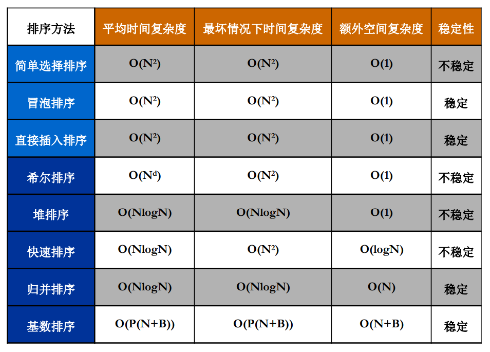

# 排序



* 快排：每趟排序将作为枢纽的元素放到最终位置。枢纽前的所有元素均小于它，枢纽后的元素均大于它
* 堆排 / 冒泡 / 选择：每趟排序可以将最大或最小的元素放到最终位置


### 1. 简单选择排序

* 第 n 次遍历向后找最小（大）的元素
* 找到后，与第 n 个互换位置
* 每次可确定一元素的最终位置
* 时间复杂度 O(n^2)

```javascript
function selectionSort(nums) {
    for(let i = 0;i < nums.length;i ++) {
        let min = i;
        for(let j = i;j < nums.length;j ++) {
            if(nums[j] < nums[min]) {
                min = j;
            }
        }
        [nums[i], nums[min]] = [nums[min], nums[i]];
    }
    return nums;
}

let nums = [1, 6, 4, 2, 8, 7, 3];
console.log(selectionSort(nums));
```

### 2. 冒泡排序

> 这个算法让我想起了小时候在操场排队跑步，老师总是说：“高的站前面，低的站后面”。我们一开始并不一定会站到准确的位置上，接着老师又说：“你比前面的高，和前面的换换，还高，再和前面换换”，就这样找到了自己的位置。

* 比较相邻元素

* 如从小到大排列，则每轮会将最大的元素放到末尾；

  下一轮可到达末尾的位置前移一位

* 时间复杂度 O(n^2)

```javascript
function bubbleSort(nums) {
    for(let i = 0;i < nums.length - 1;i ++) {
        for(let j = 0;j < nums.length - i - 1;j ++) {
            if(nums[j] > nums[j + 1]) {
                [nums[j], nums[j + 1]] = [nums[j + 1], nums[j]];
            }
        }
    }
    return nums;
}

let nums = [5, 9, 1, 9, 5, 3, 7, 6, 1];
console.log(bubbleSort(nums));
```

### 3. 插入排序

> 减治法

* 将数据插入有序元素中
* 将前 i - 1 位视为有序段
* 第 i 位插入有序段，从后往前查找插入位置，同时将数据后移

```javascript
function insertSort(nums) {
    for(let i = 1;i < nums.length;i ++) {
        for(let j = i;j >= 0;j --) {
            if(nums[j] < nums[j - 1]) {
                [nums[j], nums[j - 1]] = [nums[j - 1], nums[j]];
            }
        }
    }
    return nums;
}

let nums = [5, 9, 1, 9, 5, 3, 7, 6, 1];
console.log(insertSort(nums));
```

### 4. 归并排序

> 合并排序，利用分治法
>
> 根据元素位置进行划分，主要工作在于合并子问题的解

* 将待排序元素一分为二
* 对子序列递归排序
* 合并两个有序序列
* 时间复杂度 O(nlogn)

### 5. 快速排序

> 利用分治法
>
> 根据元素的值进行划分，主要工作在于划分

* 每趟可确定一元素的最终位置
* 中轴选择方法：随机元素（随机快速排序）；左中右元素的中位数（三平均划分法）
* 不稳定，运行时间取决于选定的基准值
* 平均时间复杂度 O(nlogn)，最坏情况下 O(n^2)

```javascript
function qsort(nums, left, right) {
    if(left > right) return;
    // 1. 划分
    let i = left, j = right;
    const key = nums[left];
    while (i < j) {
        while (i < j && nums[j] >= key) {
            j--;
        }
        nums[i] = nums[j];
        while(i < j && nums[i] < key) {
            i ++;
        }
        nums[j] = nums[i];
    }
    nums[i] = key;
    // 3. 继续快排
    qsort(nums, left, i - 1);
    qsort(nums, i + 1, right);
}

let nums = [5, 9, 1, 9, 5, 3, 7, 6, 1];
qsort(nums, 0, nums.length - 1);
console.log(nums);
```


### 6. 堆排序

[前端进阶算法9：看完这篇，再也不怕堆排序、Top K、中位数问题面试了](https://github.com/sisterAn/JavaScript-Algorithms/issues/60)

**前置知识**

> 建堆，调整，删除

堆其实可以用一个数组表示，给定一个节点的下标 `i` （i从1开始） ，那么它的父节点一定为 `A[i/2]` ，左子节点为 `A[2i]` ，右子节点为 `A[2i+1]`

* 插入式建堆
* 原地建堆
  * 自下而上式：节点和父节点比
  * 自上而下式：节点和左右子节点比

**基本思想**

* 无序序列建堆

* 取堆顶元素（当前元素中的最大 / 小值）

* 除堆顶元素外，重新调整堆结构

  通常为堆顶和末尾元素换位置，缩小规模大小，重新建堆

* 重复执行，即可得到一有序序列

目标为升序，构建大根堆

目标为降序，构建小根堆

```javascript
function heapSort(items) {
    // 构建大顶堆
    buildHeap(items, items.length - 1)
    // 设置堆的初始有效序列长度为 items.length - 1
    let heapSize = items.length - 1
    for (var i = items.length - 1; i > 1; i--) {
        // 交换堆顶元素与最后一个有效子元素
        swap(items, 1, i);
        // 有效序列长度减 1
        heapSize--;
        // 堆化有效序列(有效序列长度为 currentHeapSize，抛除了最后一个元素)
        heapify(items, heapSize, 1);
    }
    return items;
}

// 原地建堆
// items: 原始序列
// heapSize: 有效序列长度
function buildHeap(items, heapSize) {
    // 从最后一个非叶子节点开始，自上而下式堆化
    for (let i = Math.floor(heapSize / 2); i >= 1; --i) {
        heapify(items, heapSize, i);
    }
}
function heapify(items, heapSize, i) {
    // 自上而下式堆化
    while (true) {
        var maxIndex = i;
        if (2 * i <= heapSize && items[i] < items[i * 2]) {
            maxIndex = i * 2;
        }
        if (2 * i + 1 <= heapSize && items[maxIndex] < items[i * 2 + 1]) {
            maxIndex = i * 2 + 1;
        }
        if (maxIndex === i) break;
        swap(items, i, maxIndex); // 交换 
        i = maxIndex;
    }
}
function swap(items, i, j) {
    let temp = items[i]
    items[i] = items[j]
    items[j] = temp
}

var items = [, 1, 9, 2, 8, 3, 7, 4, 6, 5]
console.log(heapSort(items))
```

```javascript
// 自前往后，自下往上建堆
function buildHeap(items, heapSize) {
    while(heapSize < items.length - 1) {
        heapSize ++
        heapify(items, heapSize)
    }
}

function heapify(items, i) {
    while (Math.floor(i/2) > 0 && items[i] < items[Math.floor(i/2)]) {  
        swap(items, i, Math.floor(i/2));
        i = Math.floor(i/2); 
    }
}  

function swap(items, i, j) {
    let temp = items[i]
    items[i] = items[j]
    items[j] = temp
}
```

