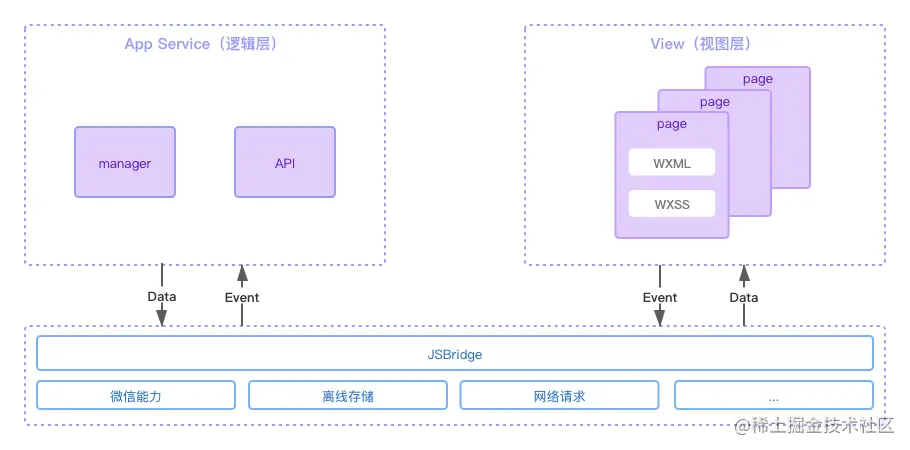
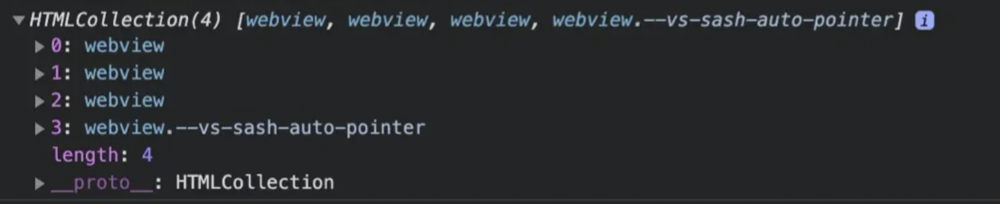
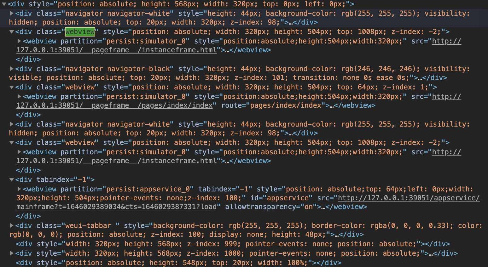
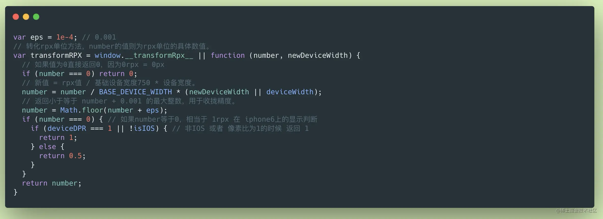
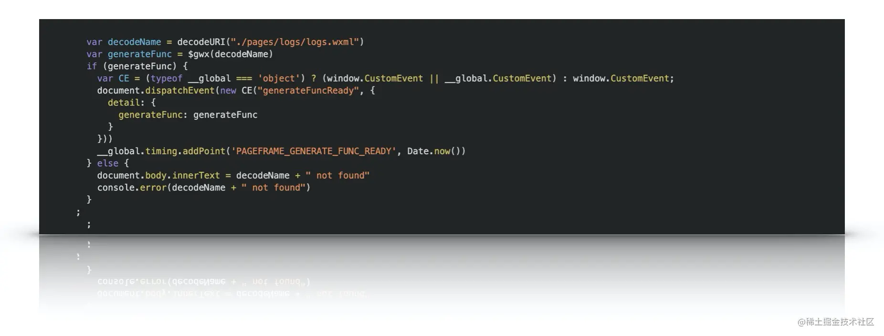
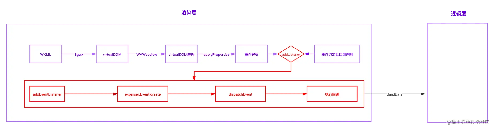
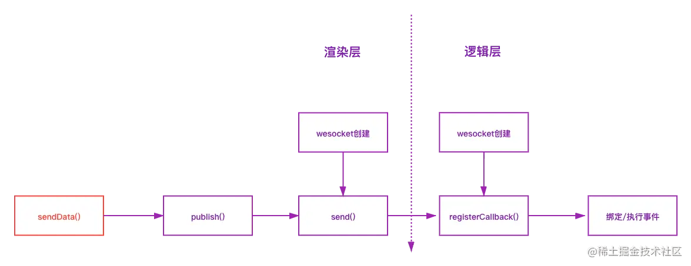

# 小程序

> [微信小程序文档 - 底层框架](https://developers.weixin.qq.com/ebook?action=get_post_info&volumn=1&lang=zh_CN&book=miniprogram&docid=0000e82f924ca0bb00869a5de5ec0a)
>
> [微信小程序底层框架实现原理](https://juejin.cn/book/6982013809212784676)
>
> [微信小程序技术原理分析](https://zhaomenghuan.js.org/note/miniprogram/awesome-miniprogram.html)

> 内嵌 h5 -> JS-SDK -> 微信 Web 资源离线存储 -> 小程序


## 双线程架构

> [微信小程序文档 - 逻辑层和渲染层](https://developers.weixin.qq.com/miniprogram/dev/framework/quickstart/framework.html#%E6%B8%B2%E6%9F%93%E5%B1%82%E5%92%8C%E9%80%BB%E8%BE%91%E5%B1%82)

**是什么**

> `iframe` 为页面中嵌入页面；`webview` 为原生应用中嵌入页面

渲染层与逻辑层分别由两个线程管理，渲染层的界面使用 `webview` 进行渲染；逻辑层采用 `JSCore`运行`JavaScript`代码

**为什么**

> [微信小程序文档：双线程模型 - 技术选型](https://developers.weixin.qq.com/ebook?action=get_post_info&docid=0006a2289c8bb0bb0086ee8c056c0a)

* 为了彻底解决安全问题，**阻止开发者操作 DOM**，动态执行脚本等具有隐患的行为，提供一个沙箱环境来运行开发者的`JavaScript` 代码，只提供纯`JavaScript` 的解释执行环境。逻辑层与视图层进行分离，视图层和逻辑层之间只有数据的通信
* 为了接近原生应用APP的用户体验，渲染层对应存在多个`webview`，也避免了单个`webview`的任务过于繁重
* 多个`webview`架构，不适合使用某个 `webview` 所创建的`ServiceWorker` 管理所有页面，因此使用 `JSCore` 创建一个单独的线程执行 `JavaScript`

**怎么做**

> [微信小程序文档 - WXS 响应事件](https://developers.weixin.qq.com/miniprogram/dev/framework/view/interactive-animation.html)

* 双线程模型导致数据不断改变，影响渲染，会线程与线程之间频繁通讯导致的性能和延时问题，此时最好使用：[WXS](https://developers.weixin.qq.com/miniprogram/dev/reference/wxs/)




## 渲染层

**webview**

> 调试微信开发者工具，至少有四个

* 渲染层（`pageframe/pages/index/index`）
  * 页面的载入是通过创建并插入webview来实现的
  * 为避免带来内存问题，微信小程序限制打开的页面不能超过10个
  * 基础组件的样式初始化，声明全局变量（包含 `webviewId`），小程序/开发者工具配置，引入一些基础库
* 业务逻辑层（`appservice/***`）
  * 在webview中执行，模拟微信端的环境
* 调试器
* 编辑区






### 为什么使用自定义元素渲染

- 管控与安全：web技术可以通过脚本获取修改页面敏感内容或者随意跳转其它页面
- Html 标签能力有限标签众多：小程序提供了10多个内置组件来收敛web标签


### 如何做到快速打开新页面

> 提前准备 + 缓存

* 小程序的每一个页面都独立运行在一个页面层级（webview）上
* `wx.navigateTo` 会创建一个新的页面层级
* `wx.navigateBack` 会销毁一个页面层级
* `wx.redirectTo` 将当前页面层级重新初始化
* 每当一个页面层级被用于渲染页面，微信都会**提前开始准备一个新的页面层级**（如上图所示的 `/__pageframe__/instanceframe.html`）
  * 启动一个`WebView`
  * 在`WebView`中初始化基础库
  * 注入小程序`WXML`结构和`WXSS`样式
* 优化
  * 首页启动时，即第一次通过`pageframe.html`生成内容后，后台服务会**缓存**`pageframe.html`模板首次生成的html内容。
  * 非首次新打开页面时，页面请求的`pageframe.html`内容直接走后台**缓存**
  * 非首次新打开页面时，`pageframe.html`页面引入的外链js资源(如上图所示)走本地**缓存**


### Exparser

> [微信小程序文档 - 组件系统](https://developers.weixin.qq.com/ebook?action=get_post_info&token=935589521&volumn=1&lang=zh_CN&book=miniprogram&docid=0000aac998c9b09b00863377251c0a)
>
> [WebComponent](/language/HTML?id=_9-webcomponent)

**是什么**

微信小程序的组件组织框架，内置在小程序基础库中

参照Shadow DOM模型实现

维护整个页面的节点树相关信息，包括节点的属性、事件绑定等

**怎么做**

> [组件间通信与事件](https://developers.weixin.qq.com/miniprogram/dev/framework/custom-component/events.html)

* 组件的节点树称为`Shadow Tree`，即组件内部的实现；

  最终拼接成的页面节点树被称为`Composed Tree`，即将页面所有组件节点树合成之后的树

* 不同组件实例间的通信：WXML属性值传递（父 -> 子）、事件系统（子 -> 父）、selectComponent等方式


### WXSS

> [wxss](https://developers.weixin.qq.com/miniprogram/dev/framework/view/wxss.html)

**是什么**

一套样式语言

扩展的特性有：尺寸单位、样式导入

**怎么做**

* rpx，可以根据屏幕宽度进行自适应

  > 复制 wcsc 文件，再手动运行它编译 wxss 文件

  ```javascript
  number = number / BASE_DEVICE_WIDTH * (newDeviceWidth || deviceWidth);
  number = Math.floor(number + eps);	
  ```

  * 获取设备信息
  * 将 wxss 中写入的样式，变成了结构化数据，如 1rpx，会变为 [0, 1]
  * 转换单位（`transformRPX`），组装语句，
  * 将代码放到 `style` 中，再插入 `head`
  * 在渲染层，会将这段代码用 `script` 包裹，使用 `eval` 注入

  

* 使用`@import`语句可以导入外联样式表


### 虚拟 DOM 渲染流程

> [WXML](https://developers.weixin.qq.com/miniprogram/dev/framework/view/wxml/)
>
> wcc 编译

* wxml 编译后，主要有 `$gwx` 函数：生成`虚拟dom树`

  * 其中包含一些边界处理，如DOM数量不可以超过16000个
  * 参数为`WXML`文件的业务路径，如`./pages/index/index.wxml`
  * 返回 `generateFunc` 函数，调用后得到虚拟DOM树，可以动态注入数据

  


## 事件系统

> [微信小程序文档 - 事件系统](https://developers.weixin.qq.com/miniprogram/dev/framework/view/wxml/event.html)

**什么是事件**

- 事件是视图层到逻辑层的通讯方式。
- 事件可以将用户的行为反馈到逻辑层进行处理。
- 事件可以绑定在组件上，当达到触发事件，就会执行逻辑层中对应的事件处理函数。
- 事件对象可以携带额外信息，如 id, dataset, touches。

**事件解析**

> 底层基础库 WAWebview.js

* 解析到事件 attr 属性名

* 通过 `addListener` （封装自 `window.addEventListener`）方法进行了事件绑定

  > TODO: 从哪映射的？

  * 事件名称和原生的事件名称存在映射关系
  * tap 事件底层是由 web 的 mouseup 事件转换来的

* `addListener` 回调函数中组装 event 信息，触发sendData方法

  * sendData方法就是向逻辑线程发送event数据的方法

**事件触发**

* 底层为 window 绑定事件，对应小程序中的事件名称
* 用户触发后
  * 返回一些坐标信息、目标元素信息
  * 组装了事件event参数中的几个参数，返回触发目标元素的exparser事件




## 渲染层与逻辑层如何通讯

> [微信小程序文档 - 小程序与客户端通信原理](https://developers.weixin.qq.com/ebook?action=get_post_info&token=935589521&volumn=1&lang=zh_CN&book=miniprogram&docid=0008487094c6b84b0086d68a551c0a)
>
> [深入浅出JSBridge：从原理到使用](https://juejin.cn/post/6936814903021797389)

* 经由Native（微信客户端）做中转，逻辑层发送网络请求也经由Native转发
* `WeixinJSBridge`提供了渲染层与`Native`、`Native`与逻辑层之间消息通信的机制，通过 `<script>` 标记注入
* 在微信开发者工具中则是使用了websocket进行了封装
* 提供的方法有：
  * `invoke` - 调用 `Native API`，以api方式调用开发工具提供的基础能力，并提供对应api执行后的回调。
  * `invokeCallbackHandler` - Native 传递 invoke 方法回调结果
  * `on` - 用来收集小程序开发者工具触发的事件回调
  * `publish` - 渲染层发布消息，用来向逻辑业务层发送消息，也就是说要调用逻辑层的事件方法，如上面提到的 `sendData`
  * `subscribe` - 订阅逻辑层消息
  * `subscribeHandler` - 视图层和逻辑层消息订阅转发
  * `setCustomPublishHandler` - 自定义消息转发




## 生命周期


## 路由

> [微信官方小程序文档 - 页面路由](https://developers.weixin.qq.com/miniprogram/dev/framework/app-service/route.html)
>
> [微信官方小程序文档 - 页面跳转和路由](https://developers.weixin.qq.com/ebook?action=get_post_info&docid=0004eec99acc808b00861a5bd5280a&highline=%E8%B7%AF%E7%94%B1)
>
> 查阅页面路由触发方式及页面生命周期函数的对应关系

* 触发路由的行为是可以从渲染层发出（点击回退，手势），也可以从逻辑层发出（`navigateTo` 等 API）
* 行为都会被发送到`Native`层，由 `Native` 层统一控制路由
* 路由栈维护 `webview` 的层级关系


## 兼容问题

> 基础库版本

- 比较版本号调用 [wx.getSystemInfo](https://link.juejin.cn/?target=https%3A%2F%2Fdevelopers.weixin.qq.com%2Fminiprogram%2Fdev%2Fapi%2Fbase%2Fsystem%2Fwx.getSystemInfo.html) 或者 [wx.getSystemInfoSync](https://link.juejin.cn/?target=https%3A%2F%2Fdevelopers.weixin.qq.com%2Fminiprogram%2Fdev%2Fapi%2Fbase%2Fsystem%2Fwx.getSystemInfoSync.html) 获取到当前小程序运行的基础库的版本号。
- API存在判断：通过判断该API是否存在来判断是否支持用户使用的基础库版本。
- wx.canIUse：通过 [wx.canIUse](https://link.juejin.cn/?target=https%3A%2F%2Fdevelopers.weixin.qq.com%2Fminiprogram%2Fdev%2Fapi%2Fbase%2Fwx.canIUse.html) 来判断是否可以在该基础库版本下直接使用
- 设置最低基础库版本：在小程序管理后台中设置最低基础库版本，如用户低于此版本，则进入不了小程序，并提示需更新微信版本。


## 第三方小程序框架

> Taro：[演讲：小程序跨框架开发的探索与实践](https://mp.weixin.qq.com/s?__biz=MzU3NDkzMTI3MA==&mid=2247483770&idx=1&sn=ba2cdea5256e1c4e7bb513aa4c837834)

* 预编译：`DSL`+ 语法解析 => 小程序的代码
* 半编译半运行
* 运行时
