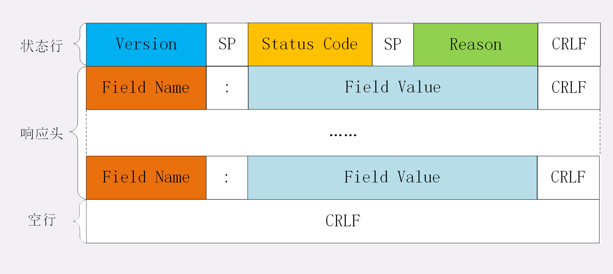

[rfc7231](https://tools.ietf.org/html/rfc7231)

[透视 HTTP 协议 — 极客时间](https://time.geekbang.org/column/article/98128)

[HTTP的前世今生](https://coolshell.cn/articles/19840.html)


## 历史

> 记忆路线：
>
> 0.9 / 1.0 / 1.1：请求方法；起始行；header，字段的变化；连接方式
>
> 2 / 3：目的；手段 => 作用

HTTP 协议始于三十年前蒂姆·伯纳斯 - 李的一篇论文；

**HTTP/0.9** 是个简单的文本协议，只能获取文本资源；

* 请求方法：GET

**HTTP/1.0** 确立了大部分现在使用的技术：[RFC 1945](https://tools.ietf.org/html/rfc1945)

* 请求方法：GET，**POST，HEAD**

* 起始行：请求行中加入 HTTP **版本号**；状态行中加入**状态码**，及原因短语
* header：**引入 header**，共[ 16 个](https://tools.ietf.org/html/rfc1945#section-10)字段。其中，引入实体类型字段 **`Content-Type`**，传输的数据不再仅限于文本
* 连接方式：每请求一个资源就新建一 TCP 连接，且串行请求

**HTTP/1.1** 是目前互联网上使用**最广泛**的协议，功能也非常完善：[RFC 2616](https://tools.ietf.org/html/rfc2616)，[RFC 7231](https://tools.ietf.org/html/rfc7231)

* 请求方法：GET，POST，HEAD，**<u>OPTIONS</u>，PUT，DELETE，PATCH，TRACE，CONNECT**

* header：共 [ 47 个](https://tools.ietf.org/html/rfc2616#section-14)字段

  * 引入通用首部字段 `Connection`，和 `Keep-Alive` 配合使用时，可**重用 TCP 连接**，即建立 TCP 持久连接；设置后，所有连接都是持久的，直到报文显式关闭。默认启动

    ```
    Connection: Keep-Alive
    Keep-Alive: timeout=5, max=1000
    
    Connection:close
    ```

  * 引入通用首部字段 `Transfer-Encoding`，和 `chunks` 配合使用，允许**数据分块传输**，利于大文件上传，设置后会忽略 `Content-Length`；最后用一个长度为 0 的块表示结束，即“0\r\n\r\n”

    ```
    Transfer-Encoding: chunked
    ```

  * 加入通用首部字段 `Cache-Control`，提供**缓存管理**

  * 引入请求首部字段 `Host`，**记录域名信息**，服务器可以区分请求源自哪个网站，要求必须出现

  * 引入 `enconding`，`language` 相关的请求首部字段，实体首部字段，提供协商方式

    ```
    Accept: text/html,application/xml,image/webp,image/png
    Accept-Encoding: gzip, deflate, br
    
    Content-Type: text/html
    Content-Encoding: gzip
    ```

* 连接方式：支持[管道](https://tools.ietf.org/html/rfc2616#section-8.1.2.2)，不等前一个请求的响应回来就可以新发请求。一般用在持久化连接的情况下，非幂等请求不可管道（如 POST）

**HTTP/2** 基于 Google 的 **SPDY** （ [ˈspiːdi] ）协议，注重**性能改善**，但还未普及；

> 主要解决传输效率的问题，改进数据传输

* 从 ASCII 码改为**二进制格式** => 计算机解析无歧义，实现简单，体积小，速度快

* **头部压缩**（HPACK 算法），将多个请求头中重复的字段名用索引号代替 => 减少传输量

* 废弃原有管道及 `keep-Alive`，借助 “流” 实现**多路复用**

* 借助“流”双向传输的特点，实现**服务器推送**，可以提前将可能用到的文件发给客户端 => 减少等待延迟

* 借助“流”乱序收发，使用流 ID 标识顺序的特点，**在应用层解决“队头堵塞”问题**，在传输层依然存在

* 延续了 HTTP/1 的“明文”特点，不强制使用加密通信，但主流浏览器大部分只支持加密的 HTTP/2

  `h2` 表示加密的 HTTP/2，`h2c` 表示明文的 HTTP/2

**HTTP/3** 基于 Google 的 **QUIC** 协议，是将来的发展方向。

> QUIC是一个在UDP之上的伪TCP +TLS +HTTP/2的多路复用的协议
>
> 主要为完全解决“队头堵塞”问题

* 弃用 TCP，使用 **UDP**
* QUIC 基于 UDP，实现可靠传输，引入 “流” 的概念，采用加密通信（使用 TLS 1.3）
* **QUIC 包含 TLS**，非建立在 TLS 之上，内部直接封装节省开销
* HTTP/3 中的**流控制由 QUIC 完成**，帧结构变得更简单


## 一、总览

### 1. 对 HTTP 协议的理解

**是什么**

> HTTP 是一个在计算机世界里专门在两点之间传输文字、图片、音频、视频等超文本数据的约定和规范

超文本传输协议

**特点**

> 超文本，传输，灵活性，连接方式，应用层

* 传输内容不限于文本，支持传输图片，音频，视频等

* <u>双向</u>协议

  我们将发起传输动作的称为请求方，接到传输请求的称为响应方

  传输过程中可以存在也遵循 HTTP 协议的中间人，再添加额外的功能，如认证，数据压缩等

* 灵活可拓展

  可以利用报文结构，添加特定头字段实现特定功能

* 使用的是请求 - 应答通信模式

  > 虽然后来的 HTTP/2、HTTP/3 新增了 Stream、Server Push 等特性，但“请求 - 应答”依然是主要的工作方式

  请求方主动发起请求，而应答方被动回复请求

  服务器不是一定为应发方，作为代理时，可能既是请求方又是应答方

* 有连接无状态

  > HTTP/1.1 中改成了默认启动 keepalive 长连接机制，因此是 “有连接” 的

  顺序发包顺序收包，按照收发的顺序管理报文；

  但每个请求相互独立，不需要客户端或服务端记录请求相关信息，可以轻松实现集群化

* 应用层协议，依赖于很多其他技术

  如依赖 IP 协议实现寻址， TCP协议提供可靠传输，DNS 协议实现域名查找， SSL/TLS 协议实现安全通信等

**问题**

> <u>抛开场景说优缺点都是耍流氓</u>！！

> 无状态，明文，安全（身份，内容），性能

> http协议的状态行、头字段都用的是ASCII码，可以直接看，而tcp的头用的是二进制位，不能直接看

* **无状态**，没有记忆能力，有时需要借 Cookie 实现有状态，如携带身份信息

* **明文**传输，header 部分不使用二进制传输，而使用文本形式，同时也有可能造成数据冗余

* 没有有效手段确**认通信双方真实身份**

* **无完整性校验**，在传输过程中可被篡改，不法验证真伪

* 性能一般

  高并发场景下，不能保证稳定的链接质量，TCP 表现不一定好

  “请求—应答”模式，可能造成 “队头阻塞”情况，即当顺序发送的请求序列中的一个请求因为某种原因被阻塞时，在后面排队的所有请求也一并被阻塞，会导致客户端迟迟收不到数据


### 2. HTTP 报文

HTTP 协议的请求报文和响应报文的结构基本相同，由三大部分组成：

**起始行**（start line）：描述请求或响应的基本信息；

* 请求行由请求方法，请求目标 URI，版本号组成，`GET / HTTP/1.1`
* 响应行由版本号，状态码，原因短语组成，`HTTP/1.1 200 OK`

**头部字段集合**（header）：使用 key-value 形式更详细地说明报文；

* 通用字段：在请求头和响应头里都可以出现；
  * `Cache-Contril`，`Upgrade`，`Transfer-Encoding`
* 请求字段：仅能出现在请求头里，进一步说明请求信息或者额外的附加条件；
  * `Accept`，`Accept-language`，`Accept-Encoding`
  * `Host`，`Referer`
  * `If-Match`，`If-None-Match`，`If-Modified-Since`，`If-Unmodified-Since`
  * `If-Range`，`Range`
* 响应字段：仅能出现在响应头里，补充说明响应报文的信息；
  * `Accept-Ranges`
  * `ETag`，`Age`
  * `Location`
* 实体字段：它实际上属于通用字段，但专门描述 body 的额外信息。
  * `Expires`，`Last-Modified`
  * `Allow`
  * `Content-Encoding`，`Content-Type`，`Content-Range`

**消息正文**（entity）：实际传输的数据，它不一定是纯文本，可以是图片、视频等二进制数据。

HTTP协议可以没有body，但**必须有header**（起始行 + 头部字段集合）。而且header之后必须要有一个空行，也就是 “CRLF”，十六进制的“0D0A”

HTTP/1.1 里唯一要求必须提供的头字段是 **Host**，它**必须出现在请求头**里，标记虚拟主机名




**字段相关**

> **MIME Type**
>
> text：即文本格式的可读数据，我们最熟悉的应该就是 text/html 了，表示超文本文档，此外还有纯文本 text/plain、样式表 text/css 等。
>
> image：即图像文件，有 image/gif、image/jpeg、image/png 等。
>
> audio/video：音频和视频数据，例如 audio/mpeg、video/mp4 等。
>
> application：数据格式不固定，可能是文本也可能是二进制，必须由上层应用程序来解释。常见的有 application/json，application/javascript、application/pdf 等，另外，如果实在是不知道数据是什么类型，就会是 application/octet-stream，即不透明的二进制数据

> **Encoding Type**
>
> gzip：GNU zip 压缩格式，也是互联网上最流行的压缩格式；
>
> deflate：zlib（deflate）压缩格式，流行程度仅次于 gzip；
>
> br：一种专门为 HTTP 优化的新压缩算法（Brotli）。

* 理解 body 数据类型 => MIME type，Encoding type

  请求：Accept，Accept-Encoding

  响应：Content-Type，Content-Encoding

  ```
  Accept: text/html,application/xml,image/webp,image/png
  Accept-Encoding: gzip, deflate, br
  
  Content-Type: text/html
  Content-Encoding: gzip
  ```

* 理解语言类型与字符编码格式

  > 不过现在的浏览器都支持多种字符集，通常不会发送 Accept-Charset，而服务器也不会发送 Content-Language，因为使用的语言完全可以由字符集推断出来

  请求：Accept-language，Accept-Charset

  响应：Content-language

  ```
  Accept-Language: zh-CN, zh, en
  Accept-Charset: gbk, utf-8
  
  Content-Language: zh-CN
  Content-Type: text/html; charset=utf-8
  ```

* 内容协商

  `q=value`，注意此时 `;` 的意义小于 `,` 

  权重的最大值是 1，最小值是 0.01，默认值是 1，如为 0 则表示拒绝

  ```
  Accept: text/html,application/xml;q=0.9,*/*;q=0.8
  ```

**通用首部字段**

> http 1.1


**请求首部字段**


**响应首部字段**


**实体首部字段**：请求和响应里都可以用


## 二、请求方法

> 在 HTTP 协议里，所谓的“安全”是指请求方法不会“破坏”服务器上的资源，即不会对服务器上的资源造成实质的修改。
>
> 按照这个定义，GET，HEAD，OPTIONS 方法是“安全”的

> 幂等，指多次执行相同的操作，结果也都是相同的，即多次“幂”后结果“相等”。
>
> 具有幂等性的请求方法：GET，HEAD，PUT，DELETE

### 1. 有哪些请求方法

[GET](https://tools.ietf.org/html/rfc7231#section-4.3.1)：获取资源，可以理解为读取或者下载数据；

[HEAD](https://tools.ietf.org/html/rfc7231#section-4.3.2)：获取资源的元信息；

[POST](https://tools.ietf.org/html/rfc7231#section-4.3.3)：向资源提交数据，相当于写入或上传数据；

[PUT](https://tools.ietf.org/html/rfc7231#section-4.3.4)：创建或替换目标资源；

PATCH：对资源部分修改

DELETE：删除资源；

CONNECT：建立特殊的连接隧道；

OPTIONS：列出可对资源实行的方法（Nginx 默认不支持，CORS 中发预检请求）；

TRACE：追踪请求 - 响应的传输路径。


### 2. GET 和 POST 区别

[GET 和 POST 到底有什么区别？- 大宽宽](https://www.zhihu.com/question/28586791/answer/767316172)

**浏览器中**（**非**Ajax的HTTP请求）

* 幂等性

  GET 是幂等的，多次读取不会影响被访问的数据，因此可以缓存；

  POST 是非幂等的，不能随意执行多次；

  如将 GET 实现为非幂等是没有必要的，甚至会带来安全问题，但将 POST 实现为幂等的，有利于防范重复提交等潜在的问题

* 携带数据的形式

  GET 携带数据只能依赖于 url 传参（query 或 params）；

  POST 可通过 url 携带数据，更常见的是表单提交，通过 body 传输；

  浏览器发出的POST请求的body主要有两种格式：

  一种是 `application/x-www-form-urlencoded` 用来传输简单的数据，形如：

  ```
  key1=value1&key2=value2
  ```

  另外一种是`multipart/form-data`，用于传文件，相比另一种格式处理二进制数据更高效

**接口中**

```
<METHOD> <URL> HTTP/1.1\r\n
<Header1>: <HeaderValue1>\r\n
<Header2>: <HeaderValue2>\r\n
...
<HeaderN>: <HeaderValueN>\r\n
\r\n
<Body Data....>
```

接口规范代表 [RESTful API](https://restfulapi.cn/)

>    A payload within a GET request message has no defined semantics;
>    sending a payload body on a GET request might cause some existing
>    implementations to reject the request.

* GET，POST 均可以用过 url 或 body 传参

* GET 一般不建议带 body，可能会导致被拒绝请求

  主要原因还是与原有设计语义不符，获取请求和携带大量数据相违背

**安全**

* 两个都不安全
* 私密数据在 body 中也可以被记录， url 避免携带敏感数据，因为会在 log 文件中完整记录
* 通过 https 提高安全性
* 敏感数据选择 POST + body 更合适

**长度限制**

> 只要某个要开发的资源/api的URL长度**有可能达到2000个bytes以上，就必须使用body来传输数据，除非有特殊情况**。至于到底是GET + body还是POST + body可以看情况决定。

> 1个汉字字符经过UTF8编码 + percent encoding后会变成9个字节

* 常说的 “GET数据有长度限制 “其实是指”URL的长度限制“
* HTTP协议本身对URL长度并没有做任何规定。实际的限制是由客户端/浏览器以及服务器端决定的。 
* IE8 的限制为 2048 个字符；Chrome 限制为 2MB
* POST 也是相似的，主要起限制作用的是服务器的处理程序的处理能力


### 3. POST 和 PUT 区别

>    The fundamental difference between the POST and PUT methods is
>    highlighted by the different intent for the enclosed representation.
>    The target resource in a POST request is intended to handle the
>    enclosed representation according to the resource's own semantics,
>    whereas the enclosed representation in a PUT request is defined as
>    replacing the state of the target resource.  Hence, the intent of PUT
>    is **idempotent and visible to intermediaries**, even though the exact
>    effect is only known by the origin server.

都是向服务器提交数据，主要的区别在于**幂等性**

* POST 是非幂等的，如表单提交多次，建立多条记录，存在副作用
* PUT 是幂等的，多次调用与一次调用的结果相同，没有副作用


### 4. GET 和 HEAD 区别

都是请求从服务器获取数据，可被缓存

* GET 请求会返回请求的实体数据，HEAD 不会，只传回响应头
* HEAD 适合用于不需要真的获取资源的情况，如检查文件是否存在，确认 URI 有效性，资源更新日期等


## 三、状态码

[透视 HTTP 协议](https://time.geekbang.org/column/article/102483)

[[FIXED] 403 Forbidden Error on Nginx Web Server](https://www.basezap.com/fixed-403-forbidden-error-on-nginx-web-server/#:~:text=Many%20times%20you%20will%20face%20a%20403%20Forbidden,we%20will%20discuss%20these%20reasons%20one%20by%20one.)

用于表达 HTTP 数据处理的“状态”，并不仅限于错误

**1××：提示信息，表示请求已接收，还需要后续处理**

* 101 Switching Protocols：

  客户端使用 Upgrade 字段，在`HTTP`基础上升级为`WebSocket`，如果服务器同意变更，就会发送状态码 101。

**2××：成功，报文已经收到并被正确处理；**

* 200，OK

  最常见，表示请求处理成功。如果是非 HEAD 请求，通常在响应头后都会有 body 数据

* 204，NO Content

  与 200 相似，但表示响应头后没有 body 数据。实际使用中，常都用 200 处理

* 206，Partial Content

  表示成功处理了资源的一部分。在实现断点续传时会遇到，常和头字段 Content-Range 一起使用

**3××：重定向，资源位置发生变动，需要客户端重新发送请求；**

> 301，302都会在响应头中使用字段 Location，表明要跳转到的 URL
>
> 主要区别在于语义

* 301，Moved Permanently

  永久重定向。如将网站升级到 https 后，在 Nginx 配置时会将 http 的页面使用 301 重定向。浏览器收到 301 后，会做缓存优化，第二次直接访问新地址。

  ```
  return 301 https://$server_name$request_uri;
  ```

* 302，Found

  临时重定向。适合用于如系统维护，显示暂时关闭服务页面的情况，浏览器不会做缓存优化，下次还是访问原来的地址

* 304，Not Modified

  表示资源未修改，客户端可使用本地缓存。处理协商缓存的时候会遇到。

  服务器通过请求头中的 `If-Modified-Since` 或者 `If-None-Match` 这些条件请求字段检查资源是否更新，如未更新，则返回 304

**4××：客户端错误，请求报文有误，服务器无法处理；**

* 400 Bad Request

  通用错误码，表示请求报文有误，但没明确指出原因，比较笼统，尽量避免使用

* 403，Forbidden

  表示服务端禁止访问该资源。在 Nginx 配置过程中，如将文件位置写错，则容易遇到 403 错误，错误访问到内部文件；或在设有多角色的系统时，如低权限请求高权限的数据，也会做返回 403 处理

* 404，Not Found

  资源未找到，4XX 中最常见

* 401 Unauthorized：登录时未携带授权信息

* 405 Method Not Allowed：不允许使用某些方法操作资源，例如不允许 POST 只能 GET；

* 406 Not Acceptable：资源无法满足客户端请求的条件，例如请求中文但只有英文；

* 408 Request Timeout：请求超时，服务器等待了过长的时间；

* 409 Conflict：多个请求发生了冲突，可以理解为多线程并发时的竞态；

* 413 Request Entity Too Large：请求报文里的 body 太大；

* 414 Request-URI Too Long：请求行里的 URI 太大；

* 429 Too Many Requests：客户端发送了太多的请求，通常是由于服务器的限连策略；

* 431 Request Header Fields Too Large：请求头某个字段或总体太大；

**5××：服务器错误，服务器在处理请求时内部发生了错误**

* 500 Internal Server Error：通用错误码
* 501 Not Implemented：请求的功能暂不支持（即将开业，敬请期待）
* 502 Bad Gateway：服务器作为网关或者代理时返回的错误码，表示服务器自身工作正常，访问后端服务器时发生了错误
* 503 Service Unavailable：服务器当前很忙，暂时无法响应服务


## 四、缓存

[浅析HTTP缓存](https://mp.weixin.qq.com/s/dt1_TrjgAwRxz73vqeACiw)

[浏览器缓存机制介绍与缓存策略剖析 - 前端性能优化原理与实践](https://juejin.cn/book/6844733750048210957/section/6844733750106931214)

**为什么**

- 通过缓存机制，可以在相应场景下复用以前获取的资源。
- 显著提高网站的性能和响应速度
- 减少网络流量和等待渲染时间
- 降低服务器压力

**是什么**

从缓存类型看，可以分为：强缓存，协商缓存

从缓存的位置来看，可以分为：浏览器缓存，代理服务器上的缓存代理（如 CDN）

### 强缓存

如果命中缓存，则直接从缓存中获取资源，不与服务端发生通信

主要涉及的字段有 `Expires`，`Cache-Control：max-age=<seconds>`，<u>后者的优先级更高，前者的兼容性更高</u>：

* `Expires`， HTTP/1.0，实体首部字段

  在响应头中使用，为**过期时间的时间戳**，绝对时间，由服务器决定。

  故此方式要求客户端和服务端之间需要保持时间的一致性，避免**时差**。

  ```
  expires: Wed, 11 Sep 2019 16:12:18 GMT
  ```

* `Cache-Control`，HTTP/1.1，通用首部字段

  可以使用 `max-age` 来替代 `expires`，`max-age` 使用相对时间

  ```
  cache-control: max-age=31536000
  ```

### 协商缓存

浏览器需要询问服务端缓存是否有改动，如未发生改动，则会返回 **304**，重定向到浏览器缓存；如发生改动，则返回 200

主要涉及的字段有 `Pragma:no-cache`，`Cache-Control：no-cache` 或 `Cache-Control：max-age=0`

<u>前者的优先级更高，但不能可靠替代后者，只能作为提高兼容性的方案</u>：

* `Pragma:no-cache`， HTTP/1.0，通用首部字段

  没有确切规范

* `Cache-Control：no-cache`，`Cache-Control：max-age=0`，HTTP/1.1，通用首部字段

**协商缓存字段**

主要涉及两对`Last-Modified` 和 `If-Modified-Since`（或 `If-Unmodified-Since`），`ETag` 和 `If-None-Match`（或 `If-Match`），<u>后者的优先级更高</u>：

* `Last-Modified` 和 `If-Modified-Since`（或 `If-Unmodified-Since`）
  * 第一次响应时返回一时间戳，之后请求携带对应字段，通过比对时间戳是否一致，判断资源是否改变
  * 存在无法正确感知文件变化的漏洞：编辑但未修改内容，时间变但实际内容没变；修改速度过快，小于一秒则无法感知
* `ETag` 和 `If-None-Match`（或 `If-Match`）
  * 第一次响应时返回一标识字符串，之后请求携带对应字段，与服务器端进行比对，判断资源是否改变
  * `ETag` 基于文件内容编码，为资源生成唯一标识字符串，能精准感知文件变化
  * `ETag` 的生成过程需要服务器付出额外开销，会影响服务端性能

### Cache-Control

`Cache-Control` 提供的[指令](https://developer.mozilla.org/en-US/docs/Web/HTTP/Headers/Cache-Control)有很多：

涉及对角色限制的字段有：

* `public`：可以被浏览器缓存，也可以被代理服务器缓存
* `private`：只能被浏览器缓存，此为默认值

涉及缓存策略的字段有：

* `max-age`：资源有效期，时间长度
* `max-stale`：最多可接受的过期时间，仅用于客户端的缓存控制
* `min-fresh`：最短可接受的有效时间，仅用于客户端的缓存控制
* `s-maxage`：资源有效期，优先级比 `max-age` 高，仅用于限制代理
* `no-store`：不允许任何缓存，直接向服务器请求
* `no-cache`：可以缓存，但必须询问服务端资源是否过期，即协商缓存
* `no-transform`：不对缓存数据做优化，仅用于代理
* `must-revalidate`：缓存未过期，则继续使用；过期就需要向服务器验证
* `proxy-revalidate`：代理的缓存过期后必须验证，客户端不必回源，仅用于限制代理

```
cache-control: public, max-age=5, s-maxage=10
```

### ETag

Entity Tag，被请求资源的摘要标识

**格式**

带 `w/` 前缀的表示使用弱类型验证，不需要每个字节都一样

```
ETag:W/"xxxxxxxx"
ETag:"xxxxxxx"
```

**生成方式**

> ETag 变，不一定文件内容改变

Nginx 中 ETag 由响应头的`Last-Modified`和`Content-Length`表示为十六进制组合而成


## 五、高频首部

### 1. 如何不改变 GET 请求的参数拿到不一样的数据

* 在 URI 后使用“#”，就可以在获取页面后直接定位到某个标签所在的位置；

* 使用 If-Modified-Since 字段就变成了“有条件的请求”，仅当资源被修改时才会执行获取动作；

* 使用 Range 字段就是“范围请求”，只获取资源的一部分数据。


## 六、扩展

### 1. 如何复用 http 连接

[Keep-Alive - MDN](https://developer.mozilla.org/zh-CN/docs/Web/HTTP/Headers/Keep-Alive)

> HTTP/1.0 中默认是关闭的，http 1.1中默认启用Keep-Alive
>
> 在HTTP/2 协议中， [`Connection`](https://developer.mozilla.org/zh-CN/docs/Web/HTTP/Headers/Connection) 和 [`Keep-Alive`](https://developer.mozilla.org/zh-CN/docs/Web/HTTP/Headers/Keep-Alive) 是被忽略的
>
> 不用一次请求建一次连接，连接次数更少，节省开销

> “连接”其实**是对某个域名的**，而不是某个ip或主机

* 设置 `Connection: Keep-Alive`

```
HTTP/1.1 200 OK
Connection: Keep-Alive
Content-Encoding: gzip
Content-Type: text/html; charset=utf-8
Date: Thu, 11 Aug 2016 15:23:13 GMT
Keep-Alive: timeout=5, max=1000
Last-Modified: Mon, 25 Jul 2016 04:32:39 GMT
Server: Apache
```

需要注意的是：

过多的长连接会占用服务器资源，所以服务器会用一些策略有选择地关闭长连接；

客户端可以在请求头里加上“Connection: close”字段，来关闭连接

服务端，以 Nginx 为例，可以进行相关配置：

* 使用“keepalive_timeout”指令，设置长连接的超时时间，如果在一段时间内连接上没有任何数据收发就主动断开连接，避免空闲连接占用系统资源。
* 使用“keepalive_requests”指令，设置长连接上可发送的最大请求次数。比如设置成 1000，那么当 Nginx 在这个连接上处理了 1000 个请求后，也会主动断开连接。


### 2. 如何传输大文件

> "Transfer-Encoding: chunked” 和 “Content-Length” 这两个字段是互斥的

数据压缩

* 使用 gzip 压缩文本文件，并不适合处理图片、音频视频等多媒体数据

分块

> 分块传输中数据里含有回车换行（\r\n）不影响分块处理

* 在响应报文里用头字段“Transfer-Encoding: chunked”

范围请求

> 应用：视频拖拽进度条，断点续传

* 服务器在响应头里使用字段 “Accept-Ranges: bytes” 表示支持范围请求
* 使用 “Accept-Ranges: none”，或不传递 “Accept-Ranges” 字段表示不支持
* 请求头 Range 是 HTTP 范围请求的专用字段，格式是“bytes=x-y”，其中的 x 和 y 是以字节为单位的数据范围。**针对原文件**。
* 服务器要添加一个响应头字段 Content-Range，告诉片段的实际偏移量和资源的总大小，格式是“bytes x-y/length”，如 “bytes 0-10/100“
* 状态码 206

```
GET /16-2 HTTP/1.1
Host: www.chrono.com
Range: bytes=0-31
```

```
HTTP/1.1 206 Partial Content
Content-Length: 32
Accept-Ranges: bytes
Content-Range: bytes 0-31/96
```


### 4. 如何理解重定向

> 避免滥用及循环跳转

重定向，由服务器来发起的，浏览器使用者无法控制，用户无感知

实际共发送了两次请求

* 在第一次请求的响应字段中会包含 `location`，标记了服务端要求重定向的 URI
* 如果想跳转到站外，必须使用绝对 URL

```
第一次
General
Request URL: http://www.hujingo.top/
Request Method: GET
Status Code: 301 Moved Permanently

Response Header
Location: https://www.hujingo.top/

第二次
General
Request URL: https://www.hujingo.top/
Request Method: GET
Status Code: 200
```


## 七、HTTPS

> HTTPS 与 HTTP 协议相比，最重要的是增加安全性
>
> 这种安全性的实现主要是依赖于两个协议底层依赖的协议是不同的

安全的四大指标：

* 机密性：只能由可信的人访问

* 完整性：数据在传输过程中没有被篡改

* 身份认证：确认对方的真实身份
* 不可否认：不能否认已经发生过的行为


**是什么**

语法语义依然还是 HTTP

只是由原来的直接和 TCP 通信，变为先和 SSL/TLS 通信，再由 SSL/TLS 通信和 TCP 通信

**为什么**

解决原有安全问题：如明文传输，无法进行完整性校验，无法验证身份


### SSL / TSL

> SSL，安全套接层（Secure Sockets Layer），既有会话功能，又能加密解密
>
> TSL，传输层安全（Transport Layer Security），TLS1.0 实际上就是 SSLv3.1

目前应用的最广泛的 TLS 是 1.2

TLS 由记录协议、握手协议、警告协议、变更密码规范协议、扩展协议等几个子协议组成，综合使用了对称加密、非对称加密、身份认证等许多密码学前沿技术

TLS 建立连接时选择的一组加密算法称为密码套件，形如”ECDHE-RSA-AES256-GCM-SHA384“，命名格式比较固定，通常为”密钥交换算法 + 签名算法 + 对称加密算法 + 摘要算法“

* 密钥交换算法，用于握手时进行密钥交换
* 签名算法：用于身份认证 => 身份认证和不可否认性
* 对称加密算法：用于握手后的通信 => 机密性
* 摘要算法：用于消息认证和产生随机数 => 完整性

### 加密与非对称加密

> 对称密钥一般都128位、256位，而rsa一般要2048位

按照密钥的使用方式，加密可以分为两大类：对称加密和非对称加密。

* **对称加密**：加密和解密时使用的密钥都是同一个

  目前常用的只有 **AES 和 ChaCha20**

  分组模式，用于将固定长度密钥加密成任意长度的密文

  常用的是 **GCM、CCM 和 Poly1305**

  <u>运行速度快，但密钥交换过程存在隐患</u>

* **非对称加密**：公钥可以公开给任何人使用，而私钥必须严格保密

  > 基于大数运算，比如大素数或者椭圆曲线等复杂的数学难题

  具有单向性：公钥加密只能由私钥解密，私钥加密后只能用公钥解密

  在 TLS 里只有很少的几种，比如 DH、DSA、**RSA（基于“整数分解”）、ECC（基于“椭圆曲线离散对数”）** 等

  <u>解决密钥交换问题，但运行速度慢</u>

* **混合加密**：

  TLS 里使用的加密方式

  使用非对称加密传递对称密钥

  一次非对称加密后，全部使用对称加密

  一次会话一个私钥

### 数字签名与证书

> 真正的完整性必须要建立在机密性之上

实现完整性的手段主要是**摘要算法**（散列函数、哈希函数）

摘要算法对输入具有“单向性”（加密后的数据无法解密）和“雪崩效应”（输入的微小不同会导致输出的剧烈变化）

TLS 推荐使用的是 SHA-1 的后继者：SHA-2（一系列摘要算法的总称）

常用的有 SHA224、SHA256、SHA384，分别能够生成 28 字节、32 字节、48 字节的摘要


**数字签名**

用于确认身份，出于效率考虑，**私钥只加密原文的摘要、公钥解密**

只要你和网站互相交换公钥，就可以用“签名”和“验签”来确认消息的真实性


**数字证书**

借助第三方 CA（证书认证机构）解决无法确认公钥来源的问题；

数字证书中会包含用于证明公钥的相关信息，包含签名算法，有效期i，使用者，颁发者，证书指纹等


签发的证书分为 DV, OV, EV 三种，可行度依次增加

市面上的免费证书一般都是 DV（阿里云提供一年免费 20 个 DV 证书的额度）

DV 只是域名级别的可信，没有认证拥有者的身份

```
CN = www.hujingo.top
```

```
CN = *.geekbang.org
OU = IT
O = 极客邦控股（北京）有限公司
S = 北京市
C = CN
```

**公钥的分发需要使用数字证书，必须由 CA 的信任链来验证，否则就是不可信的；**

作为信任链的源头 CA 有时也会不可信（被黑客攻击/恶意），解决办法有 CRL（证书吊销列表）、OCSP（在线证书状态协议），还有浏览器终止信任

**证书信任链的验证过程**（三级为例）：

客户端发现当前网站的证书是二级CA，在可信任签发机构中找不到，

就会去拿二级CA的数字证书的签发机构去做检查，发现它是一级CA，

也不在可信任签发机构中，再找一级CA的数字证书的签发机构，发现是受信任的ROOT CA，

至此完成验证。如果到最后一层CA都不受信任，就会警告用户


### TLS 协议的组成

* **记录协议**：规定了 TLS 收发数据的基本单位 —— 记录

* **警报协议**：向对方发出警报信息，如不支持旧版本，证书有问题等
* **握手协议**：浏览器和服务器会在握手过程中协商 TLS 版本号、随机数、密码套件等信息，然后交换证书和密钥参数，最终双方协商得到会话密钥，用于后续的混合加密系统
* **变更密码规范协议**：告诉对方，后续的数据都将使用加密保护


### TLS 握手过程

> TLS1.3 大幅度删减了加密算法，只保留了 ECDHE、AES、ChaCha20、SHA-2 等极少数算法，强化了安全

> 以下为 TLS1.2 

> HTTPS 协议会先与服务器执行 TCP 握手，然后执行 TLS 握手，才能建立安全连接
>
> 握手的目标是安全地交换对称密钥

**第一阶段：C/S两端共享Client Random、Server Random 和 Server Params信息**

客户端--->服务器：“Client Hello” 
客户端的版本号、支持的密码套件，还有一个随机数（Client Random）

服务端--->客户端："Server Hello"
客户端的版本号、选择的客户端列表的密码套件如：TLS_ECDHE_RSA_WITH_AES_256_GCM_SHA384、随机数（Server Random）

服务端--->客户端：
服务端证书（Server Certificate）


服务端--->客户端："Server Key Exchange"
携带椭圆曲线的公钥（Server Params）用以实现密钥交换算法，另附私钥签名


服务端--->客户端：“Server Hello Done”
发送完毕


> 此时为单向认证。如为双向认证，
>
> 客户端还要发送“Client Certificate”消息，服务器收到后也把证书链走一遍，验证客户端的身份


**第二阶段：证书验证**

前验条件：客户端**证书链逐级验证**、证书公钥验证签名，服务端身份验证成功（证书合法）

客户端--->服务端 “Client Key Exchange“

携带椭圆曲线的公钥（Client Params）用以实现秘钥交换算法


**第三阶段：主密钥生成**

客户端、服务端分别使用Client Params、Server Params通过ECDHE算法计算出随机值pre-master，然后用
Client Random、Server Random 和 Pre-Master三个值作为原材料，用PRF伪随机数函数（利用密码套件的摘要算法再次强化结果值maser secert的随机性）计算出主密钥Master Secret，

主密钥并不是会话秘钥，还会再用PRF扩展出更多的密钥，比如客户端发送用的会话密钥（client_write_key）、服务器发送用的会话密钥（server_write_key）

客户端--->服务端:
客户端发一个“Change Cipher Spec”，然后再发一个“Finished”消息，把之前所有发送的数据做个摘要，再加密一下，让服务器做个验证.

服务端--->客户端：
服务器也是同样的操作，发“Change Cipher Spec”和“Finished”消息，双方都验证加密解密 OK，握手正式结束.


### 如何优化

**硬件优化**

> HTTPS 属于计算密集型

* 更快的 CPU
* SSL 加速卡，SSL 加速服务器

**软件优化**

* 软件升级（最可行）

**协议优化**

* 握手时使用的密钥交换协议应当尽量选用椭圆曲线的 **ECDHE** 算法。它不仅运算速度快，安全性高，还支持“False Start”，能够把握手的消息往返由 2-RTT 减少到 1-RTT
* 椭圆曲线也要选择高性能的曲线，最好是 x25519，次优选择是 P-256

**证书优化**

* 证书传输

  证书可以选择椭圆曲线（ECDSA）证书，文件更小，节约带宽，减少客户端的运算量

* 证书验证

  服务器端开启“OCSP Stapling”（OCSP 装订），可以预先访问 CA 获取 OCSP 响应，然后在握手时随着证书一起发给客户端

**会话复用**

> 重复利用主密钥，避免重复计算，空间换时间
>
> 可跳过密钥交换、证书验证等步骤，直接开始加密通信

* “Session ID”：需要服务器来存储会话
* “Session Ticket”：在客户端保存，为了做到“前向安全”，需要经常更换密钥
* PSK：Session Ticket的强化版，也有ticket，但应用数据随ticket一起发给服务器


## 八、HTTP/2

[深入理解http2.0协议，看这篇就够了！](https://mp.weixin.qq.com/s/a83_NE-ww36FZsy320MQFQ)

> 唯一目标就是改进性能

> HTTP 的“无状态”是指对事务处理没有记忆，每个请求之间都是独立的
>
> 流状态转换只是表示一次请求应答里流的状态，都不会记录之前事务的信息
>
> HTTP/2 还是**无状态**的！

> http/1里的请求都是排队处理的，所以有队头阻塞
>
> http/2的请求是乱序的，彼此不依赖，所以没有队头阻塞

* HTTP 协议取消了小版本号，所以 HTTP/2 的正式名字不是 2.0；
* HTTP/2 在“语义”上兼容 HTTP/1，保留了请求方法、URI 等传统概念；

**连接前言**

* TLS 握手成功之后，客户端必须要发送一个“连接前言”（connection preface），用来确认建立 HTTP/2 连接

  ```
  PRI * HTTP/2.0\r\n\r\nSM\r\n\r\n
  ```

**头部压缩**

* 使用“HPACK”算法**压缩头部**信息，消除冗余数据节约带宽
* 在客户端和服务端各自维护一份“索引表”，压缩和解压缩就是查表和更新表
* 废除原有起始行，将原有起始行中的字段变为伪头部字段，即在名称前加 `:`
* 报文头全变为了 "Key-Value" 形式，常用的头字段定义在静态表中，只有 `Key` 没有 `Value` 

**二进制帧**

* HTTP/2 的消息不再是“Header+Body”的形式，而是分散为多个**二进制“帧”**，报头里最重要的字段是流标识符，标记帧属于哪个流；
* 帧类型，大致可以分成数据帧和控制帧两类
* 帧标志，携带简单控制信息，如 END_HEADERS 表示头数据结束，END_STREAM 表示单方向数据发送结束


**流**

> 从传输的角度来看流是不存在的，只是看到了一个个帧，所以说流是虚拟的

* HTTP/2 使用虚拟的**“流”**传输消息。流是**二进制帧的双向传输序列**，相当于 HTTP/1 里的一次“请求 - 应答”
* 流是**可并发**的，一个 HTTP/2 连接上可以同时发出多个流传输数据，也就是并发多请求，实现“**多路复用**”；
* 客户端和服务器都可以创建流，双方互不干扰；服务器可新建“流”主动向客户端发送消息，“**服务器推送**”
* 流是**双向**的，一个流里面客户端和服务器都可以发送或接收数据帧，也就是一个“请求 - 应答”来回；
* 流之间没有固定关系，彼此**独立**，但**流内部的帧是有严格顺序**的，在**应用层解决队头阻塞**问题（TCP 中依然存在）；；
* 流可以设置**优先级**，让服务器优先处理，比如先传 HTML/CSS，后传图片，优化用户体验；
* 流 ID 不能重用，只能顺序递增，**客户端发起的 ID 是奇数，服务器端发起的 ID 是偶数**；
* 在流上发送“RST_STREAM”帧可以随时终止流，取消接收或发送；
* 第 0 号流比较特殊，不能关闭，也不能发送数据帧，只能发送控制帧，用于流量控制。

**安全**

* HTTP/2 也增强了安全性，要求至少是 TLS1.2，而且禁用了很多不安全的密码套件。


## 九、HTTP/3

[HTTP3.0和QUIC协议那些事](https://blog.csdn.net/qq_44537414?spm=1001.2101.3001.5343)

### QUIC

> 早期 Google 发明的 QUIC，被称为 gQUIC，混合了 UDP、TLS、HTTP，是一个应用层的协议
>
> 目前常说的 QUIC，指 IETF 将它进行分离后的结果，指 iQUIC，是一个传输层的协议

* QUIC 的基本数据传输单位是包（packet）和帧（frame），一个包由多个帧组成，包面向的是“连接”，帧面向的是“流”

* QUIC 的帧里有多种类型，PING、ACK 等帧用于管理连接，而 STREAM 帧专门用来实现流
* HTTP/2 里的流都是双向的，而 QUIC 则分为双向流和单向流
* 客户端的流 ID 是偶数，从 0 开始计数
* QUIC 内含了 TLS1.3，只能加密通信，支持 0-RTT 快速建连
* QUIC 的连接使用“不透明”的连接 ID，不绑定在“IP 地址 + 端口”上，支持“连接迁移”
* QUIC 本身已经支持了加密、流和多路复用


### HTTP/3

> HTTP/3在QUIC层定义流、帧，真正解决队头阻塞，HTTP/2流、帧是在TCP层上抽象出的逻辑概念。
> 相同点是在逻辑理解上是基本一致的，流由帧组成，多个流可以并发传输互不影响。

HTTP/3 基于 QUIC 协议，完全解决了“队头阻塞”问题，弱网环境下的表现会优于 HTTP/2；

HTTP/3 没有指定默认的端口号

浏览器需要先用 HTTP/2 协议连接服务器，然后服务器可以在启动 HTTP/2 连接后发送一个“Alt-Svc”帧，包含一个“h3=host:port”的字符串，告诉浏览器在另一个端点上提供等价的 HTTP/3 服务。

浏览器收到“Alt-Svc”帧，会使用 QUIC 异步连接指定的端口，如果连接成功，就会断开 HTTP/2 连接，改用新的 HTTP/3 收发数据。


## 十、WebSocket

> “WebSocket”是一种基于 TCP 的轻量级网络通信协议，在地位上是与 HTTP“平级”的
>
> REC 6455

**为什么**

针对 HTTP 采用的”请求-应答“模式，服务器无法主动向客户端发送数据，只能由客户端进行轮询，

但反复发送无效请求会耗费大量带宽和 CPU 资源，效率低，不适合实时通信应用

**特点**

> 侧重“实时通信”

* 默认端口 80,443
* 协议名 `ws`（明文），`wss`（加密）
* 全双工，客户端和服务端都可以向对方发送数据
* 采用二进制帧，长度不固定，最少 2 个字节，最多 14 字节
* WebSocket 的帧头就四个部分：“结束标志位 + 操作码 + 帧长度 + 掩码
* 连接不能通过中间人来转发，必须是直接连接
* 虽然是在应用层，但使用方式却与“TCP Socket”差不多，过于“原始”，用户必须自己管理连接、缓存、状态，开发上比 HTTP 复杂的多


**握手**

> WebSocket 利用 HTTP 协议实现连接握手，发送 GET 请求要求“协议升级”，握手过程中有个非常简单的认证机制，目的是防止误连接

**GET 请求**

“Connection: Upgrade”，表示要求协议“升级”

“Upgrade: websocket”，表示要“升级”成 WebSocket 协议

"Sec-WebSocket-Key"：一个 Base64 编码的 16 字节随机数，作为简单的认证密钥；

"Sec-WebSocket-Version"：协议的版本号，当前必须是 13

服务端收到后，会构造一个特殊的“101 Switching Protocols”响应报文

**认证密钥比对方式**

服务端把收到的请求头里“Sec-WebSocket-Key”的值，加上一个专用的 UUID “258EAFA5-E914-47DA-95CA-C5AB0DC85B11”，再计算 SHA-1 摘要

客户端收到后，同样的方式计算，比对值是否相等


**应用场景**

* 实时就完事儿了！
* 站内信，股价波动实时推送等等

**与 HTTP/2 做比较**

* WebSocket 主要解决双向通信、全双工问题，HTTP/2 主要解决传输效率的问题
* WebSocket 可以发送任意数据，是真的全双工；HTTP/2 的服务端推送不是实时的，且不能推送任意数据
* 在二进制帧的格式上也不太一样
* websocket里面有帧的概念，却没有http2.0里的虚拟流的概念，也不存在优先级，多路复用

**HTTP，TCP，WebSocket 关系辨析**

* HTTP是基于TCP的，通过TCP收发的消息用HTTP的应用层协议解析。

* WebSocket是首先通过HTTP协议把TCP链接建好，然后通过Upgrade字段进行协议转换，

* 在收到服务器的101 Switching Protocols应答之后，后续的TCP消息就通过WebSocket协议解析。