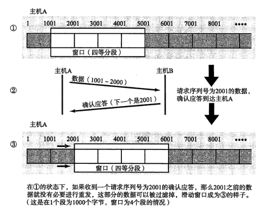

# TCP/IP

## 1. TCP/IP 协议四层模型

> TCP/IP 协议实际上是一系列网络通信协议的统称，其中最核心的两个协议是 TCP 和 IP，其他的还有 UDP、ICMP、ARP 等等

分为四层：

* 链接层：使用 MAC 地址标识设备
* 网络层：使用 IP 地址标识设备
* 传输层
* 应用层

**评价**

* TCP/IP参考模型在服务、接口与协议的区别上不很清楚。按照软件工程的思想，一个好的软件系统设计应该将功能与实现方法区分
  开，TCP/IP参考模型恰恰没有做到这点
* TCP/IP参考模型的主机—网络层本身并不是实际的一层，它定义了网络层与数据链路层的接口。物理层与数据链路层的划分是必要和合理的，一个好的参考模型应该将它们区分开，而TCP/IP参考模型恰恰也没有做到这点

## 2. TCP 报文格式

* 报头长度 20 ~ 60 B，固定部分长度为 20 B
* 序号，对应后文的 seq，表示字节序号，范围为 0 到 （2^32 - 1）
* 确认号，对应后文的 ack，表示已正确接收了序号为 N - 1 的字节，发送端下一个应该发送序号为 N
* 控制字段：
  * 紧急 URG：报文优先级最好，需要尽快发送，结合紧急指针使用
  * 确认 ACK：连接建立之后，所有报文段的 ACK 位都要置 1
  * 推送 PSH：希望立即得到对方响应
  * 复位 RST：主机崩溃等导致 TCP 连接出错，需要释放连接再重建；或拒绝释放一连接
  * 同步 SYN：连接建立时用来同步序号
  * 终止 FIN：释放 TCP 连接

## 3. UDP 报文格式

## 4. TCP 与 UDP 的区别及应用场景

[面试官：说说UDP和TCP的区别及应用场景](https://segmentfault.com/a/1190000021815671)

[TCP 协议简介](http://www.ruanyifeng.com/blog/2017/06/tcp-protocol.html)

> 字节流，将大块的数据分割成以文段为单位的数据包进行管理.
>
> TCP 协议为了更容易传输大数据才把数据分割，而且 TCP 协议能够确认数据最终是否送达到对方
>
> —— 《图解 HTTP》

> 1位=1比特；8位=1字节；16位=1字；1字=2字节

* 首先（**连接性**），TCP 是面向连接的，再传输数据前，需要三次握手建立连接；

  而 UDP 是无连接的，在传输报文前不需要通信双方建立连接

* 其次（**可靠性**），TCP 通过超时重传，流量控制等机制，保证了可靠性；

  而 UDP 只提供了一种可选的校验和来保证数据传输的可靠性，如检测到分组出错时，会直接丢弃，且不通知发送端要求重传，因此是不可靠的

* 再者（**传输形式**），TCP 面向字节流，可拆分，可合并，如当客户端连续发送数据时，会在缓冲区允许范围内一次性接收，是无界的；UDP 面向报文，一次发送一个完整报文，不合并也不拆封，是有界的，发几次收几次

* 同时（**有序性**），由于 TCP 会为每个包编号，接收后会进行重排序；UDP 不会，数据包接收时可能是乱序的

* 还有一点（**头部大小** => 传输速度/效率），TCP 头部最少为 20 字节，UDP 最少为 8 字节，结合上述连接性的特点，TCP 的传输速度会比 UDP 慢，传输效率会更低

* 从**双工性**说，TCP 只支持点对点的全双工通信，即允许数据在两个方向上同时传输；

  而 UDP 支持一对一、一对多、多对一和多对多的交互通信

* 所以（**适用场景**），TCP 适合用于准确性要求高，对效率要求不高的情况，如传输文件，邮件；UDP 适合用于响应快，对准确性要求不高的情况，如传输视频，实时通信。

## 5. TCP 如何保证可靠性

[图解 TCP/IP P203]()

[TCP校验和的原理和实现](https://blog.csdn.net/zhangskd/article/details/11770647)

[TCP的seq和ack号计算方法](https://blog.csdn.net/HappyRocking/article/details/78198776)

[TCP 快速重传为什么是三次冗余 ACK，这个三次是怎么定下来的？- 车小胖](https://www.zhihu.com/question/21789252)

> **可靠传输就是保证接收方收到的字节流和发送方发出的字节流是完全一样的**

> MSS，Maximum Segment Size，最大消息长度
>
> TCP 在传送大量数据时，是以 MSS 的大小将数据进行分割发送。进行重发时也是以 MSS  为单位
>
> MSS 在三次握手的时候，在两端主机之间被计算得出。两端的主机在发出建立连接的请求时，会在 TCP 首部中写入 MSS  选项，告诉对方自己的接口能够适应的 MSS 的大小。然后会在两者之间选择一个较小的值投入使用。

TCP通过**检验和、序列号、确认应答、重发控制、连接管理以及窗口控制**等机制实现可靠性传输。

### 校验和

`TCP` 的校验和为必填项，由发送端根据首部及数据信息计算校验和，由接收端验证，是一个端到端的检验和。其目的是为了发现TCP首部和数据在发送端到接收端之间是否有改动。如果接收方检测到校验和有差错，则TCP段会被直接丢弃。

**通过校验和，TCP 能够识别内是否有改变，从而保证可靠性**

### 序列号与确认应答

> 序列号是按顺序给发送数据的每-一个字节(8 位字节)都标上号码的编号，接收端查询接收数据TCP首部中的序列号和数据的长度，将自己下一步应该接收的序号作为确认应答返送回去。

TCP 会为每个包编号，接受方会对数据包进行排序，把有序数据传送给应用层。

接收方在收到 TCP 报文段后会返回一确认包（ack：期望收到对方下个报文段的第一个数据字节的序号，序号之前的已接收）。

**通过序列号和确认应答号，TCP 能够识别是否已经接收数据，又能够判断是否需要接收，从而实现可靠传输**

### 重传机制

> TCP 不会为没有数据的 ACK 超时重传

* 超时重传

  > 超时周期相对较长，时间驱动

  > [停止等待协议](https://github.com/JasonJe/notes/issues/109)也是为了 `TCP` 协议传输稳定可靠，它的基本原理就是每发完一个分组就停止发送，等待对方确认。在收到确认后再发下一个分组。

  如发送方在规定的超时重传时间内未收到来自接收方的确认报文，可能为报文段丢失或 ACK 确认报文丢失，两种情况都会重传该报文段。超时重传时间一般略大于报文传输往返时间。

  如数据重发后依然收不到确认应答，则再次发送，同时重传超时时间加倍。

  达到一定重发次数之后，如果仍没有任何确认应答返回，就会判断为网络或对端主机发生了异常，强制关闭连接，并且通知应用通信异常强行终止。

  > **RTO**（Retransmission Timeout） 超时重传时间
  >
  > **RTT**（Round-Trip Time） 往返时延

  

* 快速重传

  > 超时周期相对较短，数据驱动

  > 三个冗余 ACK 不一定是丢包，但丢包一定会发三个冗余 ACK

  每当接收方收到比期望序号大的失序报文段到达时，就向发送方发送一个**冗余 ACK**，指明下一个期待字节的序号。当接收方收到三个 冗余 ACK 时，即会认为该序号的报文段丢失，报文重发。

  这种重传机制通常和滑动窗口配合使用。

  

### 连接管理

TCP 是面向连接的，会先进行三次握手建立连接，确保数据能到达对方；断开连接时会进行四次挥手。

### 滑动窗口

> 如果每发送一个段进行一次确认应答，才能进行下一次通信，那这样的传输方式有一个缺点，就是包的往返时间（RTT）越长通信性能就越低

> 因为 TCP 协议是全双工的，会话的双方都可以同时接收和发送，那么就需要各自维护一个「发送窗口」和「接收窗口」。

为提高通信效率，确认应答以窗口为单位进行确认，替代原有的以分段为单位进行确认。

发送端主机，在发送了一个段以后不必要一直等待确认应答，而是继续发送。

* 发送端主机在收到确认应答前，需要设置缓存保留这些可能被重传的数据，直到收到他们的确认应答
* 当收到确认应答，不需要重传时，数据可从缓冲区清除
* 收到确认应答的情况下，将窗口滑动到确认应答中的序列号的位置

### 流量控制

> 窗口大小就是指无需等待确认应答 ACK 而继续发送数据的最大值

> 流量控制是点到点之间的问题，主要是为来得及收，有处放

TCP 提供流量控制机制，让发送端根据接收端的实际接收能力，控制发送的数据量。

* 接收端主机根据自己可缓冲区可接受的大小，将其作为窗口大小，存入 TCP 首部，向发送端主机通知自己可以接受的数据大小
* 发送端发送不超过该限度（即窗口大小）的数据
* 如果接收到窗口大小的值为 0，那么发送方将停止发送数据。并定期的向接收端发送窗口探测数据段，提醒接收端把窗口大小告诉发送端。

流量控制通常和滑动窗口配合使用。

### 拥塞控制

> 慢开始，拥塞避免，快重传，快恢复

> 拥塞控制是一个网络的问题，主要是为别堵塞

为避免通信刚开始就发送大量数据，造成网络拥堵，网络瘫痪，报文大量丢失的情况，TCP 有拥塞控制机制。

* 在通信开始前，进行**慢开始，拥塞窗口值从 1（2^0）开始，往返次数每增加1，拥塞窗口值加倍一次（2^（n + 1））**
* 当拥塞窗口值增长到设置的阈值时，进入**拥塞避免，往返次数每增加 1，拥塞窗口值加 1**
* 当触发**超时重传时，阈值会调整为当前拥塞窗口值的一半，拥塞窗口值重置为 1**。进入慢开始。
* 当触发**快速重传**时（拥堵情况比超时轻一些），进入快恢复，**拥塞窗口值会调整为当前拥塞窗口值**（已发送但为收到确认应答的数据量）**的一半，继续线性增加**。进入拥塞避免

## 6. TCP 三次握手

[计算机网络]()

[TCP 为什么是三次握手，而不是两次或四次？ - 车小胖](https://mp.weixin.qq.com/s/NIjxgx4NPn7FC4PfkHBAAQ)

[关于三次握手和四次挥手，面试官想听到怎样的回答？- 车小胖](https://www.zhihu.com/question/271701044/answer/398114686)

[TCP三次握手的原因及缺陷](https://gj1e.github.io/posts/2019/11/tcp三次握手的原因及缺陷/)

> SYN, ACK 为控制位
>
> seq 标记第一个字节的序号
>
> ack 标记期望收到对方下个报文段的第一个数据字节的序号

**目的**：使用三次握手，确保数据能到达对方

### 过程

> C连接建立请求 => S连接建立请求确认 => C连接建立请求确认

> TCP规定，SYN=1的报文段不能携带数据，但要消耗掉一个序号

1. 客户端处于 CLOSE  => SYN-SENT, 服务端处于 LISTEN

   客户端向服务端发送 “连接建立请求报文”，**“SYN=1,seq=x”**

   为避免在连接中断时，由于序号重复，造成将新发送的报文误认为重发的报文等问题，此时序号值 seq 为非 0 的随机数。

   连接建立时，客户端和服务端产生的第一个序号，也称为初始序号 ISN

   > ISN，发送方的字节数据编号的原点，让对方生成一个**合法的接收窗口**
   >
   > 动态随机，以增强安全性

   > <u>三次握手的第一次可以携带数据吗？</u>
   >
   > 不可以，三次握手还没有完成。
   >
   > 如果数据缓存下来，会放大SYN FLOOD攻击。
   >
   > 如果攻击者伪造了成千上万的握手报文，携带了1K+ 字节的数据，而接收方会开辟大量的缓存来容纳这些巨大数据，内存会很容易耗尽，从而拒绝服务。

2. 客户端处于 SYN-SENT, 服务端处于 LISTEN => SYN-REVD

   服务端接收到 “连接建立请求报文”后，如同意建立连接，则向客户端发送”连接建立请求确认报文“，**”SYN=1, ACK=1, seq=y, ack=x+1“**

3. 客户端处于 SYN-SENT => ESTABLISHED, 服务端处于 SYN-REVD => ESTABLISHED

   客户端接收到“连接建立请求确认报文“后，发送“连接建立请求确认报文”，**“ACK=1, seq=x+1, ack=y+1”**

   TCP 协议规定此处的报文序号 seq 仍然为 x + 1

   > <u>那第三次可以携带数据吗？为何？</u>
   >
   > 可以。
   >
   > 因为伪造IP的主机是不会接收到第二次报文的。
   >
   > 所以，能够发出第三次握手报文的，应该是合法的用户。
   >
   > 尽管服务器侧的状态还没有“established”，接收到第三次握手的瞬间，状态就会切换为“established”，里面携带的数据按照正常流程走就好。

### 为什么三次

> 为了避免死循环，一律不允许 ACK 对方的裸 ACK 报文

TCP 的核心是保证数据传输的可靠性，及提高传输效率

TCP连接握手，握的是通信双方数据原点的序列号

**四次握手**

1. A 发送 SYN 报文给 B，这是第一次报文交互。

2. B 发送ACK确认 A 的 SYN 报文，这是第二次报文交互

3. B 发送自己的 SYN 报文给 A，这是第三次报文交互

4. A 需要 ACK 确认B的 SYN 报文，这是第四次报文交互

传输效率低了，可以合并了 2 和 3，变成三次握手，提高连接效率

**两次握手**

> TCP的设计者将**SYN这个同步标志位SYN设计成占用一个字节的编号（FIN标志位也是）**，既然是一个字节的数据，按照TCP对有数据的TCP segment 必须确认的原则，所以在这里A必须给B一个确认，以确认A已经接收到B的同步信号。

1. A 发送 SYN 报文给 B，这是第一次报文交互。
2. B 发送自己的 SYN 报文给A，并 ACK 确认 A 的 SYN 报文，这是第二次报文交互。

此时，A 与 B 就 A 的初始序列号（x）达成了一致，但 A 和 B 就 B 的初始序列号（y）将无法达成一致

同时，存在已失效的请求报文段，突然传送到了服务端而产生连接的误判，易浪费服务端资源

### 三次握手过程中发生丢包

**第一个包，即 A 发给 B 的 SYN 中途被丢，没有到达 B**

A 会周期性<u>超时重传</u>，直到收到B的确认

**第二个包，即 B 发给 A 的 SYN + ACK 中途被丢，没有到达 A**

B 会周期性<u>超时重传</u>，直到收到A的确认

**第三个包，即 A 发给 B 的 ACK 中途被丢，没有到达 B**

A 发完 ACK，单方面认为 TCP 为 Established 状态，而 B 显然认为 TCP 为 Active 状态：

a. 假定此时双方都没有数据发送，B 会周期性<u>超时重传</u>，直到收到 A 的确认，收到之后 B 的 TCP 连接也为 Established 状态，双向可以发包。

b. 假定此时 A 有数据发送，B 收到 A 的 Data + ACK，自然会切换为 established 状态，并接受 A 的 Data。

c. 假定 B 有数据发送，数据发送不了，会一直周期性<u>超时重传</u> SYN + ACK，直到收到 A 的确认才可以发送数据。

### 缺陷

SYN- Flood攻击是当前网络上最为常见的**DDoS攻击**，也是最为经典的拒绝服务攻击

它就是利用了TCP协议实现上的一个缺陷，通过向网络服务所在端口发送大量 的伪造源地址的攻击报文，就可能造成目标服务器中的半开连接队列被占满，从而阻止其他合法用户进行访问。

**原理**

攻击者首先伪造地址对 服务器发起SYN请求，服务器回应(SYN+ACK)包，而真实的IP会认为，我没有发送请求，不作回应。服务 器没有收到回应，这样的话，服务器不知 道(SYN+ACK)是否发送成功，默认情况下会重试5次（tcp_syn_retries）。这样的话，对于服务器的内存，带宽都有很大的消耗。攻击者 如果处于公网，可以伪造IP的话，对于服务器就很难根据IP来判断攻击者，给防护带来很大的困难。

## 7. TCP 四次挥手

[在TCP的四次分手当中，被动关闭方是如何知道数据已经接收完了?](https://www.zhihu.com/question/37013999/answer/117724134)

### 过程

> 客户端和服务端都可以提出连接释放请求

1. 客户端处于 ESTABLISHED  => FIN-WAIT-1, 服务端处于 ESTABLISHED

   客户端主动提出释放连接，向服务端发送 “连接释放请求报文”，**“FIN=1,seq=u”**

   u 为客户端发送的最后一个字节的序号加 1

2. 客户端处于 FIN-WAIT-1, 服务端处于 ESTABLISHED => （半关闭）

   服务端接收到 “连接释放请求报文”后，如同意建立连接，则向客户端发送”连接释放请求确认报文“，**”ACK=1, seq=v, ack=u+1“**

   v 为服务端发送的最后一个字节的序号加 1

   > 此时客户端到服务端的 TCP 连接断开，但服务端到客户端的 TCP 连接还没有断开
   >
   > <u>如服务器还有数据报文需要发送，可以继续发送直至完毕</u>

   客户端处于 FIN-WAIT-1 => FIN-WAIT-2, 服务端处于 （半关闭） => CLOSE-WAIT

   客户端接收到“连接释放请求确认报文“

3. 客户端处于 FIN-WAIT-2, 服务端处于 CLOSE-WAIT => LAST-ACK

   服务端高层应用的数据发送完毕，向客户端发送”连接释放请求报文“，**”FIN=1, ACK=1, seq=w, ack=u+1“**

   如在半关闭状态期间，未发送过数据，w 与前面的 v 一致

   如发过，则为服务端发送的最后一个字节的序号加 1

4. 客户端处于 FIN-WAIT-2 => TIME-WAIT => CLOSE, 服务端变为 LAST-ACK => CLOSE => LISTEN

   客户端接收到 “连接释放请求报文”后，向服务端发送”连接释放请求确认报文“，**”ACK=1, seq=u+1, ack=w+1“**

