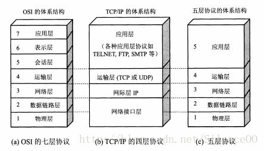
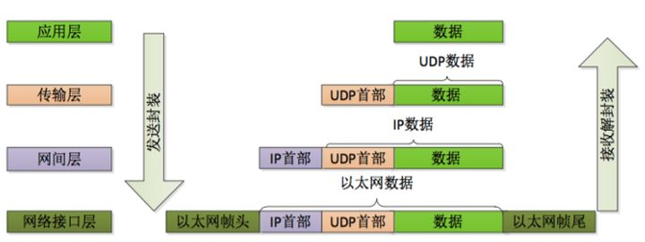
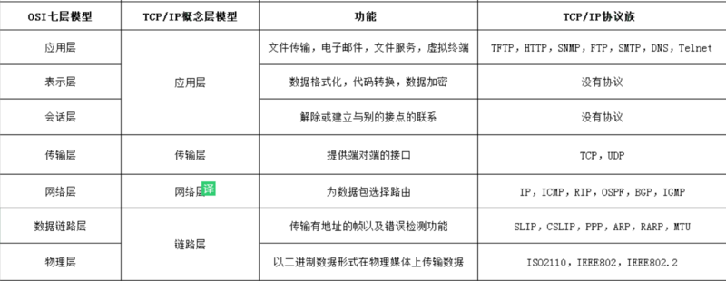
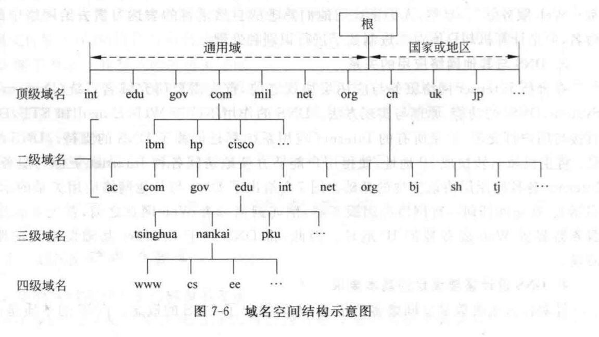
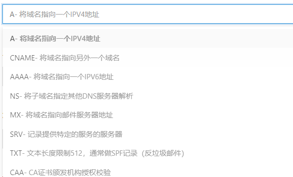
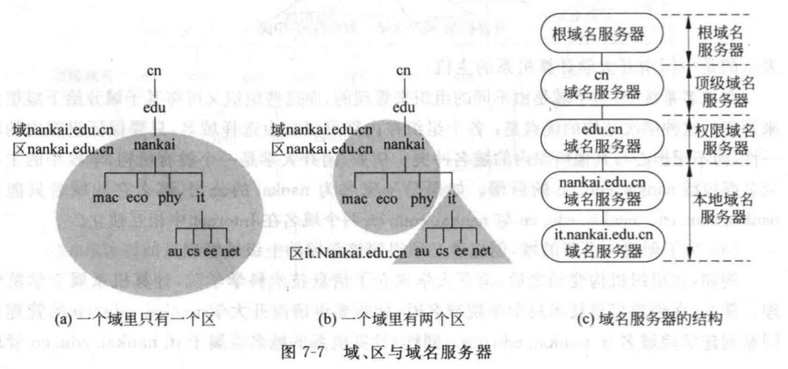
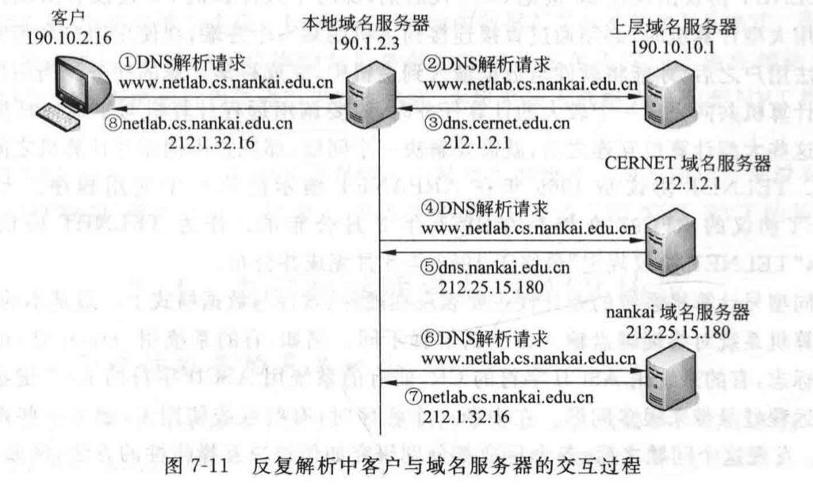
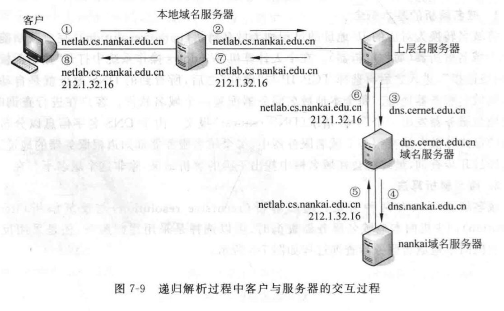

## 1. OSI 网络模型及各层的协议

> 不同主机的同层使用协议进行通信
>
> 同一主机的相邻层使用接口通信

* 物理层
  * 数据传输单元：比特
  * 网络的物理形式，例如电缆、光纤、网卡、集线器等等
* 数据链路层
  * 数据传输单元：帧
  * 采用差错控制法和流量控制法，使有差错的物理线路变成无差错的数据链路
* 网络层
  * 数据传输单元：分组 / 包
  * 路由选择算法为分组选择最佳传输路径
* 传输层
  * 数据传输单元：段
  * 提供可靠的端到端连接及数据传输服务
* 会话层
  * **维护两个会话主机间连接的建立，管理和终止，及数据的交换**
* 表示层
  * **负责数据格式变换，数据加密解密，数据压缩恢复**
  * **把数据转换为合适、可理解的语法和语义**
* 应用层
  * 应用程序间的通信







> 不同的应用程序有大同小异的会话、表示需求，**这些代码不完全能够抽象到独立的会话层、表示层**

**评价**

* 会话层很少使用，表示层几乎是空的。数据链路层与网络层有很多子层插入，每个子层都有不同的功能
* 将“服务”与“协议”的定义相结合，这就使参考模型结构变得相当复杂，实现起来很困难
* **寻址、流量与差错控制在多个层次中重复出现，系统运行效率低**
* 参考模型的设计不适应于计算机与软件的工作方式参考模型与协议结构复杂，实现周期长，运行效率低，缺乏市场与商业推动力


## 2. URI 与 URL

URI，统一资源标识符

URL，统一资源定位符

**URL 是 URI 常用的一种表现形式**

```
http://nginx.org/en/download.html
```

URI 由三部分组成：协议名 `http`，主机名 `nginx.org`，资源在主机上的位置 `/en/download.html`


## 3. 代理的分类

> 代理，“中转站”

匿名代理：完全“隐匿”了被代理的机器，外界看到的只是代理服务器；

透明代理：顾名思义，它在传输过程中是“透明开放”的，外界既知道代理，也知道客户端；

正向代理：靠近客户端，代表客户端向服务器发送请求；

反向代理：靠近服务器端，代表服务器响应客户端的请求；


## 4. IPv4 与 IPv6 的区别

* IPv4  采用 32 位地址，IPv6 采用128 位地址，解决 IPv4 地址位不足的问题。
* IPv4 使用 ARP 协议获取 IP 地址和 MAC 地址的对应关系，存在 ARP 欺骗；IPv6 使用邻居发现协议（Neighbor Discovery Protocol）


## 5. DNS

[计算机网络（第 4 版） P332]()

[CDN与DNS知识汇总](http://hpoenixf.com/DNS%E4%B8%8ECDN%E7%9F%A5%E8%AF%86%E6%B1%87%E6%80%BB.html#more)

[什么情况下DNS会使用TCP传输协议？](https://ephen.me/2017/dns_tcp/)

[从理论到实践，全方位认识DNS（理论篇）](https://www.cloudxns.net/Support/detail/id/737.html)

> DNS 是同时占用 UDP 和 TCP 的 53 端口传输数据的；
>
> 当解析配置过于复杂，或记录值过长，导致 UDP 无法承载时，会使用 TCP 传输
>
> UDP是按照数据包来传输的，整个包最大只能 512 字节；
>
> **DNS 解析查询优先使用 UDP ，当 UDP 完成不了的情况下，则转换 TCP 查询**

> DNS 服务器是具有层次的，合理组织的服务器集群

**是什么**

域名系统，提供将主机域名转换为 IP 地址的能力；

借助分布式数据库，存储域名和 IP 地址映射关系

**为什么**

IP 地址记不住，域名更好记。

早期在网络信息中心维护一 hosts 文件，再将文件传送到各主机实现

但网络规模不断扩大，存在网络中心主机负载过重，主机名称冲突，主机文件难以维护的问题

**怎么做的**

包含域名空间，域名服务器，域名解析程序三部分

1. 域名空间

   * 采用 “域” 与 “子域” 的层次结构，分布式数据库存储数据。
   * 每个域自己控制如何分配它下面的域

   

   * 记录(映射关系)类型

     设置二级域名，CNAME；设置 SSL 时，添加 TXT

   

2. 域名服务器

   保存域名树结构和对应信息的服务器

   共有 13 个根域名服务器

   

3. 域名解析

   使用域名解析器将域名转为 IP 地址。包含递归解析，反复解析两种方式

   

   

### DNS 缓存

> 新建解析记录时，设置 TTL，指域名的解析记录在 DNS 服务器上生存的时间

> 手动清除 DNS 缓存：`ipconfig /flushdns`

* 浏览器缓存
* 操作系统检查本地 hosts 文件
* 本地 DNS 解析器缓存


### DNS 查询过程

以浏览器输入www.example.com为例：

1. 检查浏览器缓存
2. 检查操作系统缓存，常见的如hosts文件（现在基本默认为空）
3. 检查路由器缓存
4. 如果前几步都没没找到，会向ISP(网络服务提供商)的LDNS服务器查询
5. 如果LDNS服务器没找到，会向跟域名服务器(Root Server)请求解析，分为以下几步：
   1. 跟服务器返回顶级域名(TLD)服务器如.com，.cn，.org等的地址，全球只有13台，该例子中会返回.com的地址
   2. 接着向TLD发送请求，然后会返回次级域名(SLD)服务器的地址，本例子会返回.example的地址
   3. 接着向SLD域名服务器通过域名查询目标IP，本例子会返回www.example.com的地址
   4. Local DNS Server会缓存结果，并返回给用户，缓存在系统中。


### DNS 安全问题

1. DNS 反射/放大攻击

   向大量开放 DNS 服务器发送大范围域名查询的 DNS 请求，并将该 DNS 请求的源 IP 地址伪造成想要攻击的目标 IP 地址。由于请求数据比响应数据小得多，攻击者可以利用该技术放大掌握的带宽资源和攻击流量。

2. DDOS 攻击可能造成域名解析瘫痪

3. DNS 域名劫持
   在劫持的网络范围内拦截域名解析的请求，分析请求的域名，返回假的 IP 地址或者使请求失去响应。DNS 劫持通过篡改 DNS 服务器上的数据返回给用户一个错误的查询结果来实现的。

4. DNS 污染
   DNS 污染是一种让一般用户由于得到虚假目标主机 IP 而不能与其通信的方法，指的是用户访问一个地址，国内的服务器(非 DNS )监控到用户访问的已经被标记地址时，服务器伪装成 DNS 服务器向用户发回错误的地址的行为。
   DNS 污染与 DNS 劫持的区别在于，DNS 劫持修改了DNS 的解析结果，DNS 污染是不经过 DNS 服务器，返回错误信息

5. DNS 信息黑客被修改


### DNS 优化

**复制**

在本地 DNS 服务器上保存地理位置较近的根服务器的副本

**缓存**

在本地 DNS 服务器及主机中使用缓存，保存查询记录

**在实际使用中**

* 启动预解析

  - 在服务器中响应设置`X-DNS-Prefetch-Control`的值为`on`启动预解析
  - HTML中，`<meta http-equiv="x-dns-prefetch-control" content="on">`
  - 对特定域名预解析`<link rel=”dns-prefetch” href=”//fonts.googleapis.com”>`

* 减少请求次数 => 减少使用的域名数量

  如静态资源放在一个域名下


## 6. CDN

[前端性能优化原理与实践 — 修言](https://juejin.cn/book/6844733750048210957/section/6844733750111109127)

**是什么**

内容分发网络，一组分布在各个地区的服务器，服务器中会存放数据副本。

由分发服务系统，负载均衡系统，运营管理系统组成

**为什么**

提升首次请求响应能力；分担网络流量，减轻压力

**怎么做的**

> 静态资源本身具有访问频率高、承接流量大的特点
>
> **CDN 往往被用来存放静态资源**，如 JS、CSS、图片等**不需要业务服务器进行计算即得的资源**

CDN 的核心点有两个

* 缓存：将资源复制一份到 CDN 服务器
* 回源：CDN 无该资源或缓存数据过期，向根服务器获取新资源

CDN 使用的域名通常与业务服务器使用的域名不一致，这样可以在请求静态资源时不携带 Cookie，减少开销


### CDN 资源获取过程

> 用户访问资源时，CDN 会根据用户的 IP地址、请求的资源等，返回最近的缓存服务器 IP 地址来提供资源，如资源不存在或已过期，则会向源服务器获取。

1. 当用户点击网站页面上的内容URL，经过本地DNS系统解析，DNS系统会最终将域名的解析权交给CNAME指向的CDN专用DNS服务器。
2. CDN的DNS服务器将CDN的全局负载均衡设备IP地址返回用户。
3. 用户向CDN的全局负载均衡设备发起内容URL访问请求。
4. CDN全局负载均衡设备根据用户IP地址，以及用户请求的内容URL，选择一台用户所属区域的区域负载均衡设备，告诉用户向这台设备发起请求。
5. 区域负载均衡设备会为用户选择一台合适的缓存服务器提供服务，选择的依据包括：根据用户IP地址，判断哪一台服务器距用户最近；根据用户所请求的URL中携带的内容名称，判断哪一台服务器上有用户所需内容；查询各个服务器当前的负载情况，判断哪一台服务器尚有服务能力。基于以上这些条件的综合分析之后，区域负载均衡设备会向全局负载均衡设备返回一台缓存服务器的IP地址。
6. 全局负载均衡设备把服务器的IP地址返回给用户
7. 用户向缓存服务器发起请求，缓存服务器响应用户请求，将用户所需内容传送到用户终端。如果这台缓存服务器上并没有用户想要的内容，而区域均衡设备依然将它分配给了用户，那么这台服务器就要向它的上一级缓存服务器请求内容，直至追溯到网站的源服务器将内容拉到本地。