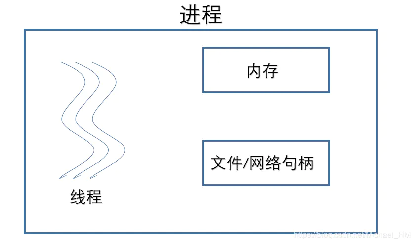

[DDD 仙女的屁屁踢]()

## 1. 进程和线程的区别

[一篇让你明白进程与线程之间的区别与联系](https://juejin.cn/post/6844903801321685000)

> 进程与线程之间有什么区别；
>
> 进程、线程都各有什么特点；
>
> 什么是缓冲区溢出：输入数据大小超出给数据存储的内存区
>
> 进程之间如何进行交互；TCP/IP 端口
>
> 线程之间如何进行交互：指针指向同块内存

> 进程在执行过程中，需要协作同步。不同进程的线程间要利用消息通信的办法实现同步。

* 启动一个程序的时候，操作系统会为该程序创建一块内存，用来存放代码、运行中的数据和一个执行任务的主

  线程，我们把这样的一个运行环境叫进程。线程并不能单独存在，是由进程来启动和管理的。

* <u>一个线程只能属于一个进程，而一个进程可以有多个线程</u>，至少有一个线程（通常说的主线程）

* 从资源的拥有情况看：

  **进程是拥有资源的基本单位**，而线程只拥有隶属于进程的资源

* 从 CPU 调度的角度看：

  **线程是调度的基本单位**，同进程中线程切换不引起进程切换，不同进程的线程切换时会引起进程切换

* 从并发的角度看：

  一个进程间的多个线程可并发；一个线程可以创建和撤销另一个线程

* 从内存回收角度看：

  当一个进程退出时，操作系统会回收该进程所申请的所有资源；即使其中任意线程因为操作不当导致内存泄漏，当进程退出时，这些内存也会被正确回收

* 从系统的开销上看：

  进程切换的开销比线程切换的开销要大得多

  进程的处理机资源和其他资源是一起分配的，进程切换的时候会整体切换，开销很大；而线程切换不会涉及资源分配，因此开销更小

* 从健壮性角度看：

  进程之间内容相互隔离，一个崩溃不会影响其他进程；一个线程出错会使整个进程崩溃

## 2. 进程状态

* **new** (新建):  The process is being created
* **running** (运行):  Instructions are being executed
* **waiting** (等待或被阻塞):  The process is waiting for some event to occur
* **ready**  (就绪):  The process is waiting to be assigned to a processor
* **terminated** (终止):  The process has finished execution

## 3. 进程间如何通信

[进程间通信IPC](https://www.jianshu.com/p/c1015f5ffa74)

[【操作系统】进程间的通信方式](https://imageslr.github.io/2020/02/26/ipc.html)

> IPC, Inter-Process Communication
>
> 进程间通信

| 方式     | 传输的信息量       | 使用场景       | 关键词                                                       |
| -------- | ------------------ | -------------- | ------------------------------------------------------------ |
| 信号     | 少量               | 任何           | 硬件来源、软件来源 / 信号队列                                |
| 匿名管道 | 大量               | 亲缘进程间     | 单向流动 / 内核缓冲区 / 循环队列 / 没有格式的字节流 / 操作系统负责同步 |
| 命名管道 | 大量               | 任何           | 磁盘文件 / 访问权限 / 无数据块 / 内核缓冲区 / 操作系统负责同步 |
| 信号量   | N                  | 任何           | 互斥同步 / 原子性 / P 减 V 增                                |
| 共享内存 | 大量               | 多个进程       | 内存映射 / 简单快速 / 操作系统不保证同步                     |
| 消息队列 | 比信号多，但有限制 | 任何           | 有格式 / 按消息类型过滤 / 操作系统负责同步                   |
| 套接字   | 大量               | 不同主机的进程 | 读缓存区 / 写缓冲区 / 操作系统负责同步                       |

* 匿名管道

  > **无名管道阻塞问题**：
  >
  > 无名管道无需显示打开，创建时直接返回文件描述符，在读写时需要确定对方的存在，否则将退出。
  >
  > 如果当前进程向无名管道的一端写数据，<u>必须确定另一端有某一进程</u>。
  >
  > 如果写入无名管道的数据<u>超过其最大值</u>，写操作将阻塞，如果管道中<u>没有数据</u>，读操作将阻塞.
  >
  > 如果管道发现另一端<u>断开</u>，将自动退出。

  * 管道是半双工的，<u>单向数据流</u>
  * 管道实质为内核缓冲区，先进先出存取数据
  * <u>缓冲区有限</u>，如读空或写满，有一定规则控制读/写进程进入等待队列。等有新数据写入/读出时，唤醒等待队列继续读写
  * <u>无格式字节流</u>，需要双方实现约定格式
  * 匿名，<u>只能用于亲缘关系</u>的进程通信
  * 存在于内存中的文件

* 有名管道

  > **有名管道阻塞问题**：
  >
  > 有名管道在打开时需要确实对方的存在，否则将阻塞。
  >
  > 即以读方式打开某管道，在此之前必须一个进程以写方式打开管道，否则阻塞。
  >
  > 此外，可以以读写（O_RDWR）模式打开有名管道，即当前进程读，当前进程写，不会阻塞

  * <u>先进先出</u>存取数据
  * 以磁盘文件形式存在，可以实现本机<u>任意两个进程</u>通信

* 信号
  * 主要来源：硬件（无效存储访问，`ctrl c`），软件（其他进程调用 `kill`，终止进程信号）
  * 可以在<u>任何时候</u>发给某一进程，而<u>无需</u>知道该进程的状态
  * 如果该进程当前并未处于执行状态，则该信号就由内核保存起来，知道该进程回复执行并传递给它为止
  * 如果一个信号被进程设置为阻塞，则该信号的传递被延迟，直到其阻塞被取消是才被传递给进程。

* **消息队列**：在协作进程间交换消息来实现通信

  > 目前主要有两种类型的消息队列：POSIX消息队列以及System V消息队列。
  >
  > 系统V消息队列目前被大量使用。系统V消息队列是随内核持续的，只有在内核重起或者人工删除时，该消息队列才会被删除

  * 适用于交换较少数据的情况（不需要避免冲突）
  * 通常用系统调用实现，需要更多内核介入的时间消耗
  * 存放在<u>内核</u>中，只有当内核重启或显示删除时，消息队列才会被删除。
  * 通信数据<u>先进先出</u>，但可实现消息的<u>随机查询</u>
  * 具有<u>特定格式</u>，由消息队列标识符标识，无大小限制
  * 在某个进程往一个队列写入消息之前，并不需要另外某个进程在该队列上等待消息的到达

* **共享内存**：建立起一块供协作进程共享的内存区域，进程通过向此内存区域读写数据来交换信息

  > 由于多个进程共享一段内存，因此需要依靠某种同步机制（如信号量）来达到进程间的同步及互斥。

  * <u>通信速度最快</u>

  * <u>多个进程</u>可直接读写同一块内存空间

  * 仅在建立共享内存时需要系统调用，一旦建立共享内存，所有的访问都被处理为常规的内存访问

  * 共享内存方式有：

    System V共享内存（`shmget()`、`shmat()`、`shmdt()`）

    POSIX共享方式（`shm_open()`、`mmap()`、`shm_unlink()`）

    mmap共享方式：进程之间通过映射一个普通的文件实现共享内存

  

* 信号量

  > P，V 操作
  >
  > 互斥量用于线程的互斥，<u>信号量用于线程的同步</u>
  >
  > 互斥：资源的排他性和唯一性，但无法限制访问顺序，无序访问
  >
  > 同步：互斥基础上，通过其他机制实现<u>有序</u>访问

  * 计数器，用于多进程对共享数据的访问
  * 主要用于进程间同步
  * 原子操作，在内核中实现的

* 套接字（socket）

  * 可以让不在同一台计算机但通过网络连接计算机上的进程进行通信
  * 套接字是支持TCP/IP的网络通信的基本操作单元，可以看做是不同主机之间的进程进行双向通信的端点
  * 套接字的特性由3个属性确定，它们分别是：域、端口号、协议类型

## 4. CPU 调度

> 调度的根本原因：请求数量大于资源数量
>
> 并发的核心是进程能让出 CPU

FCFS，**先来先服务调度**：调度顺序就是任务到达就绪队列的顺序 

* 适合批处理系统

* <u>护航效果</u>：所有进程都在等一个大进程释放 CPU
* <u>短作业等待时间长，不适合交互系统</u>

SJF，**最短作业（进程）优先调度**：从就绪队列中找预计运行时间最短的

* 适合批处理系统

* 如遇到长度相等的进程，使用 FCFS 调度

* 平均等待时间最小

* <u>对长作业不利，可能被饿死；长短根据用户提供的估计 CPU 区间长度决定，估计不准；未考虑紧迫性</u>

* 按是否抢占，还可以分为：

  * 抢占式 SJF（**最短剩余时间优先调度**，SRTF）

    当进程执行时，如到达比当前进程更短的进程，则可抢占当前运行的进程

  * 非抢占式 SJF

**优先级调度**

* 适合分时系统
* 如具有相同优先级，使用 FCFS 调度
* 低优先权的进程可能被饿死 => 随时间增加提高进程优先权
* 优先级倒置：如涉及共享资源，可能会出现由于低优先级进程抢不到执行执行时间释放资源，高优先级进程获取不到资源
  * 设置优先级上限
  * 优先级继承
  * 临界区禁止中断
* 按是否抢占，还可以分为：
  * 抢占式优先级调度
  * 非抢占式优先级调度

RR，**时间片轮转法**

* 适合多交互，分时系统
* 平均等待时间通常较长，但响应度高
* 上下文切换次数较多，增加额外开销
* 时间片的长度应折中，设置过长，会导致响应时间边长；过短，会导致吞吐量变小，周转时间变长

**多级队列调度**

* 适合分时系统
* 根据进程的属性（如内存，优先级，类型）将就绪队列分成相对独立的队列
* 不同队列有固定优先级
* 不同队列内部可以给不同时间片，采用不同的调度方法

* 进程进入系统时会被永久的分配到一个队列
* 低调度开销，但不够灵活

**多级反馈队列调度**

* 适合分时系统
* 任务可以在队列之间移动，任务区分更细致 => 可以阻止 “饥饿”
* 根据 CPU 区间特点以区分进程
* 如果使用过多 CPU 时间，会被转移到更低优先级队列
* 在较低优先级队列的等待时间过长的进程会被转移到更高优先级队列

## 5. 死锁

**是什么**

多个进程因循环等待资源而造成无法执行的现象

* 造成进程无法执行
* 无法释放资源，造成系统资源的浪费

**必要条件**

> 与调度相关，具有不确定性
>
> 有环不一定存在死锁

* 资源互斥访问：一对一
* 占用并等待：占有资源，再去申请
* 不可抢占：资源只能自愿放弃
* 循环等待：资源分配图中存在环路

**解决方式**

共有四条方向来解决死锁问题：

1. 预防：破坏必要条件

   * 互斥
     * 能共享，就共享不互斥
     * 不能共享，设置互斥条件
   * 不占有/不等待
     * 没有，才能去申请
     * 要有就全部有
     * 资源利用率低，饥饿
   * 抢占

   * 破坏循环等待

2. 避免：进行检测，如会造成死锁，则拒绝

   > 判断当次请求是否会造成死锁
   >
   > 银行家算法：找安全序列

   * 请求的比需要的少
   * 请求的比可用的少
   * 假装分配

3. 检测 + 恢复：检测到死锁出现，剥夺一些资源

   > 如果经常发生死锁才使用，每个请求都适用死锁检测开销太大

   银行家算法找死锁进程组并恢复

4. 忽略

## 6. I/O 多路复用

[【操作系统】I/O 多路复用，select / poll / epoll 详解](https://imageslr.github.io/2020/02/27/select-poll-epoll.html) 

> I/O 多路复用相当于将「遍历所有文件描述符、通过非阻塞 I/O 查看其是否就绪」的过程从用户线程移到了内核中，由内核来负责轮询。

阻塞 I/O，是指进程发起调用后，会被挂起（阻塞），直到收到数据再返回，需要使用**多线程**来处理多个文件描述符。

非阻塞 I/O 不会将进程挂起，调用时会立即返回成功或错误，因此可以在**一个线程**里*轮询*多个文件描述符是否就绪。每次发起系统调用，只能检查**一个**文件描述符是否就绪。当文件描述符很多时，系统调用的成本很高。

 I/O 多路复用，可以**通过一次系统调用，检查多个文件描述符的状态**。这是 I/O 多路复用的主要优点，相比于非阻塞 I/O，在文件描述符较多的场景下，避免了频繁的用户态和内核态的切换，减少了系统调用的开销。

I/O 多路复用引入了一些额外的操作和开销，性能更差。但是好处是用户可以在一个线程内同时处理多个 I/O 请求。如果不采用 I/O 多路复用，则必须通过多线程的方式，每个线程处理一个 I/O 请求。