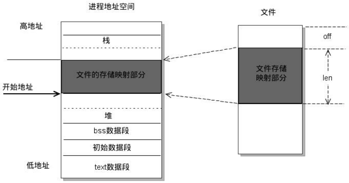

## 1. 进程和线程的区别

[一篇让你明白进程与线程之间的区别与联系](https://juejin.cn/post/6844903801321685000)

> 进程与线程之间有什么区别；
>
> 进程、线程都各有什么特点；
>
> 什么是缓冲区溢出：输入数据大小超出给数据存储的内存区
>
> 进程之间如何进行交互；TCP/IP 端口
>
> 线程之间如何进行交互：指针指向同块内存

> 进程在执行过程中，需要协作同步。不同进程的线程间要利用消息通信的办法实现同步。

* <u>一个线程只能属于一个进程，而一个进程可以有多个线程</u>，至少有一个线程（通常说的主线程）

* 从资源的拥有情况看：

  **进程是拥有资源的基本单位**，而线程只拥有隶属于进程的资源

* 从 CPU 调度的角度看：

  **线程是调度的基本单位**，同进程中线程切换不引起进程切换，不同进程的线程切换时会引起进程切换

* 从并发的角度看：

  一个进程间的多个线程可并发；一个线程可以创建和撤销另一个线程

* 从系统的开销上看：

  进程会带来更大的开销，需要分配内存；线程只占据一部分调用栈

## 2. 进程状态

* **new** (新建):  The process is being created
* **running** (运行):  Instructions are being executed
* **waiting** (等待或被阻塞):  The process is waiting for some event to occur
* **ready**  (就绪):  The process is waiting to be assigned to a processor
* **terminated** (终止):  The process has finished execution

## 3. 进程间如何通信

[进程间通信IPC](https://www.jianshu.com/p/c1015f5ffa74)

> IPC, Inter-Process Communication
>
> 进程间通信

* 匿名管道

  > **无名管道阻塞问题**：
  >
  > 无名管道无需显示打开，创建时直接返回文件描述符，在读写时需要确定对方的存在，否则将退出。
  >
  > 如果当前进程向无名管道的一端写数据，<u>必须确定另一端有某一进程</u>。
  >
  > 如果写入无名管道的数据<u>超过其最大值</u>，写操作将阻塞，如果管道中<u>没有数据</u>，读操作将阻塞.
  >
  > 如果管道发现另一端<u>断开</u>，将自动退出。

  * 管道是半双工的，<u>单向数据流</u>
  * 管道实质为内核缓冲区，先进先出存取数据
  * <u>缓冲区有限</u>，如读空或写满，有一定规则控制读/写进程进入等待队列。等有新数据写入/读出时，唤醒等待队列继续读写
  * <u>无格式字节流</u>，需要双方实现约定格式
  * 匿名，<u>只能用于亲缘关系</u>的进程通信
  * 存在于内存中的文件

* 有名管道

  > **有名管道阻塞问题**：
  >
  > 有名管道在打开时需要确实对方的存在，否则将阻塞。
  >
  > 即以读方式打开某管道，在此之前必须一个进程以写方式打开管道，否则阻塞。
  >
  > 此外，可以以读写（O_RDWR）模式打开有名管道，即当前进程读，当前进程写，不会阻塞

  * <u>先进先出</u>存取数据
  * 以磁盘文件形式存在，可以实现本机<u>任意两个进程</u>通信

* 信号
  * 主要来源：硬件（无效存储访问，`ctrl c`），软件（其他进程调用 `kill`，终止进程信号）
  * 可以在<u>任何时候</u>发给某一进程，而<u>无需</u>知道该进程的状态
  * 如果该进程当前并未处于执行状态，则该信号就由内核保存起来，知道该进程回复执行并传递给它为止
  * 如果一个信号被进程设置为阻塞，则该信号的传递被延迟，直到其阻塞被取消是才被传递给进程。

* **消息队列**：在协作进程间交换消息来实现通信

  > 目前主要有两种类型的消息队列：POSIX消息队列以及System V消息队列。
  >
  > 系统V消息队列目前被大量使用。系统V消息队列是随内核持续的，只有在内核重起或者人工删除时，该消息队列才会被删除

  * 适用于交换较少数据的情况（不需要避免冲突）
  * 通常用系统调用实现，需要更多内核介入的时间消耗
  * 存放在<u>内核</u>中，只有当内核重启或显示删除时，消息队列才会被删除。
  * 通信数据<u>先进先出</u>，但可实现消息的<u>随机查询</u>
  * 具有<u>特定格式</u>，由消息队列标识符标识，无大小限制
  * 在某个进程往一个队列写入消息之前，并不需要另外某个进程在该队列上等待消息的到达

* **共享内存**：建立起一块供协作进程共享的内存区域，进程通过向此内存区域读写数据来交换信息

  > 由于多个进程共享一段内存，因此需要依靠某种同步机制（如信号量）来达到进程间的同步及互斥。

  * <u>通信速度最快</u>

  * <u>多个进程</u>可直接读写同一块内存空间

  * 仅在建立共享内存时需要系统调用，一旦建立共享内存，所有的访问都被处理为常规的内存访问

  * 共享内存方式有：

    System V共享内存（`shmget()`、`shmat()`、`shmdt()`）

    POSIX共享方式（`shm_open()`、`mmap()`、`shm_unlink()`）

    mmap共享方式：进程之间通过映射一个普通的文件实现共享内存

  

* 信号量

  > P，V 操作
  >
  > 互斥量用于线程的互斥，<u>信号量用于线程的同步</u>
  >
  > 互斥：资源的排他性和唯一性，但无法限制访问顺序，无序访问
  >
  > 同步：互斥基础上，通过其他机制实现<u>有序</u>访问

  * 计数器，用于多进程对共享数据的访问
  * 主要用于进程间同步
  * 原子操作，在内核中实现的

* 套接字（socket）

  * 可以让不在同一台计算机但通过网络连接计算机上的进程进行通信
  * 套接字是支持TCP/IP的网络通信的基本操作单元，可以看做是不同主机之间的进程进行双向通信的端点
  * 套接字的特性由3个属性确定，它们分别是：域、端口号、协议类型

