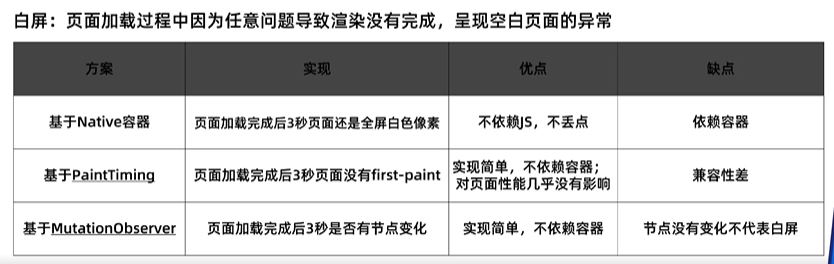
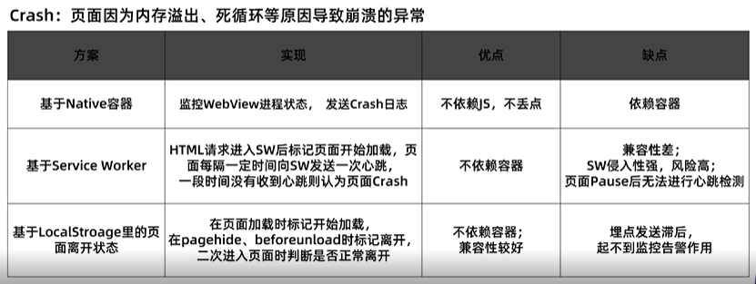
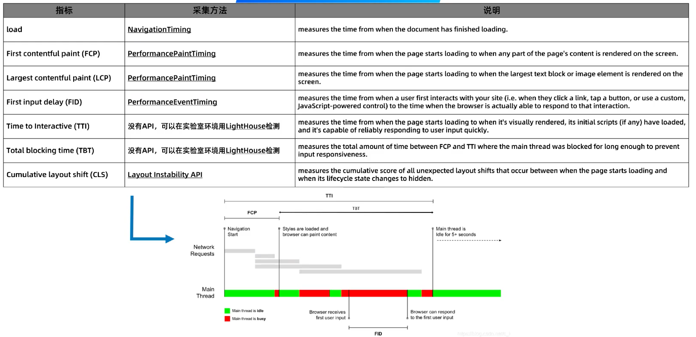
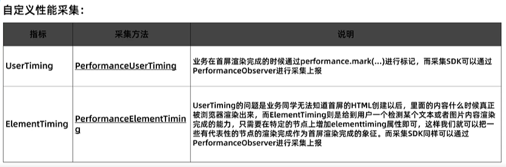
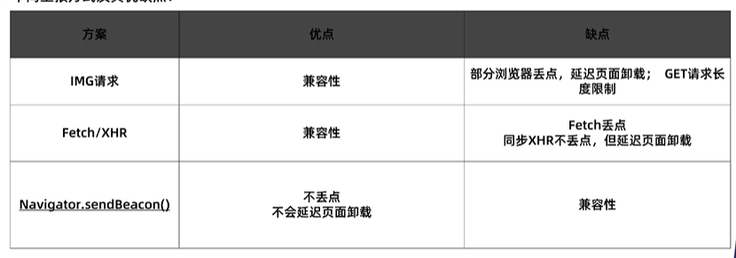

# 监控

[由校： 实现一个监控系统](https://file.hujingo.top/ali/wvpYVNSLzasbil8pJW1_293429812333___hd.mp4)  

[web 埋点实现原理了解一下](https://segmentfault.com/a/1190000014922668)

[前端监控和前端埋点方案设计](https://juejin.cn/post/6844903650603565063)

[前端工程实践之数据埋点分析系统（一）](https://www.zoo.team/article/data-analysis-one)

> 监控包含：数据采集（埋点），数据处理，数据展示
>
> 主要目的为：获取用户行为以及跟踪产品在用户端的使用情况，并以监控数据为基础，指明产品优化的方向。

### 相关名词

* APM，对应用系统的性能和故障进行系统化的管理
* 丢点：丢了当次埋点数据（？）
* PV：**Page View**，页面浏览量或点击量
* UV：**Unique visitor**，通过互联网访问、浏览这个网页的自然人。访问您网站的一台电脑客户端为一个访客

* FP：First Paint，首次绘制
* **FCP**：First Contentful Paint，首次内容绘制
* **LCP**：Largest Contentful Paint，可视区“内容”最大的可见元素开始出现在屏幕上的时间点
* **TTI**：Time to Interactive，可交互时间
* **TBT**：Total Blocking Time，页面阻塞总时长
* **FID**：First Input Delay，首次输入延迟
* **CLS**：Cumulative Layout Shift，累积布局偏移


### 监控（指标）分类

> 用户体验的指标可以分为：
>
> 主观的：用户声音（反馈，舆情等），用户调研（问卷，访谈等）
>
> 客观的：用户行为（点击率，转化率等），系统表现（稳定性，流畅性等）

网上常见的分类方式为：

* 数据监控：PV/UV；从什么入口来访问等
* 性能监控：首屏加载时间；白屏时间；页面渲染时间等
* 异常监控：JS 异常；样式丢失异常

从稳定性，流畅性角度来分类：

* 稳定性：脚本异常，接口异常，资源异常，白屏，Crash
* 流畅性：页面加载速度，响应速度，动画流畅性，滚动流畅性，卡顿


### 埋点方式

结合实际选择适合的方案，通常是多种方式的组合

#### 1. 代码埋点

在需要埋点的节点调用接口直接上传埋点数据

**优点**：<u>流量可控</u>，<u>使用灵活</u>，采集信息也<u>完全由业务方来控制</u>。

**缺点**：业务方来写死方法，如果采集方案变了，业务方也需要重新修改代码，重新发布，<u>上线后难修改</u>，<u>工作量大</u>

**代表**：[友盟](https://link.zhihu.com/?target=https%3A//www.umeng.com/)、[百度统计](https://link.zhihu.com/?target=https%3A//tongji.baidu.com/web/welcome/login)等第三方数据统计服务商

#### 2. 可视化埋点

可视化工具配置采集节点，在前端自动解析配置并上报埋点数据

**优点**：业务方工作量少

**缺点**：技术上推广和实现起来有点难（业务方前端代码规范是个大前提），<u>开发成本高</u>，并不能覆盖所有埋点需求

**代表**：国外 [Mixpanel](https://link.zhihu.com/?target=https%3A//mixpanel.com/)；国内 [TalkingData](https://link.zhihu.com/?target=https%3A//www.talkingdata.com/)、[诸葛 IO](https://link.zhihu.com/?target=https%3A//zhugeio.com/)，[MTA](https://link.zhihu.com/?target=https%3A//mta.qq.com/) 

#### 3. 无埋点

前端自动采集全部事件并上报埋点数据，在后端数据计算时过滤出有用数据

**优点**：前端只要加载埋点脚本

**缺点**：流量和采集的数据过于庞大，服务器性能巨大


### 常用指标收集方式

#### 脚本异常

全局监听 error，unhandledrejection

```javascript
window.addEventListener('error', () => {})
window.addEventListener('unhandledrejection', () => {})
```

#### 接口异常

重写 XMLHttpRequest 和 fetch 原生方法来实现

#### 资源异常

在捕获类型的 error 事件里可以拿到资源加载失败的回调

```javascript
window.addEventListener('error', function(e) {
  if(!(e instanceof ErrorEvent)) {
    // 资源路径
    e.target.src || e.target.href
    // 资源类型
    e.target.tagName
  }
}, true)
```

#### 白屏



#### Crash



#### 页面加载

[Performance API: timing](https://www.caniuse.com/mdn-api_performance_timing)：兼容性更好，IE 支持到 9，但已经从标准中移除

[Performance API: timeOrigin](https://www.caniuse.com/?search=timeOrigin)：兼容性较差

[Navigation Timing](https://www.caniuse.com/?search=Navigation%20Timing)：兼容性较好，IE 支持到 9







### 上报方式




### 埋点数据格式

* **who**: appid(系统或者应用的id),userAgent(用户的系统、网络等信息)

* **when**: timestamp(上报的时间戳)

* from **where**: currentUrl(用户当前url)，fromUrl(从哪一个页面跳转到当前页面)，type(上报的事件类型),element(触发上报事件的元素）

* **what**: 上报的自定义扩展数据data:{},扩展数据中可以按需求定制，比如包含uid等信息

```
{   
    ----------------上报接口本身提供--------------------
    currentUrl,  
    fromUrl,
    timestamp,
    userAgent:{
       os,
       netWord,
    }
    ----------------业务代码配置和自定义上报数据------------
    type,
    appid,
    element,
    data:{
        uid,
        uname
    }
}
```


### 可视化思路

> 热力图，漏斗模型

对于单个用户来说需要展示的监控信息为：

- 单个用户，在交互过程中触发各个埋点事件的次数
- 单个用户，在某个时间周期内，访问本网页的入口来源
- 单个用户，在每一个子页面的停留时间

对于全体用户需要展示的信息为：

- 某一个时间段内网页的PV和UV
- 全体用户访问网页的设备和操作系统分析
- 某一个时间段内访问本网页的入口来源分析
- 全体用户在访问本网页时，在交互过程中触发各个埋点事件的总次数
- 全体用户在访问本网页时，网页上报异常的集合

删选功能集合：

- 时间筛选：提供今日（00点到当前时间）、本周、本月和全年
- 用户删选：提供根据用户id删选出用户行为的统计信息
- 设备删选：删选不同系统的整体展示信息